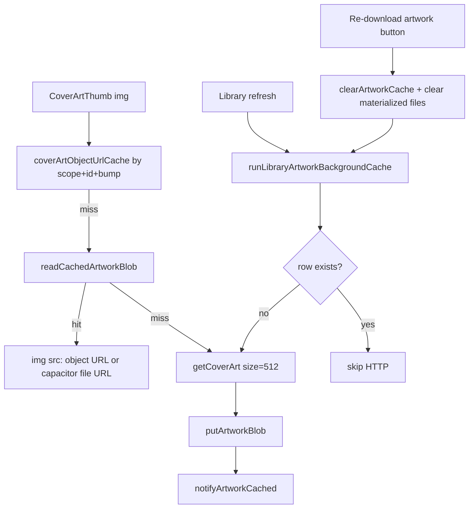

# Cover art improvements (512px canonical + full scope)

## Goal

**One 512px fetch per cover ID, reused everywhere.** Display size (40–512px) is CSS-only; disk and network always target one canonical blob.

## Cache migration policy

**No migration from old builds.** The app is early-stage; stale or wrong-resolution artwork from prior builds is acceptable to discard. Recovery path:

1. Ship section 11 **Re-download artwork** per library scope.
2. After deploying this change, use that action once per library (or `clearArtworkCache` during dev) to purge and refill at 512px.
3. No `byteLength` upgrade heuristics, no automatic backfill of legacy 48px/320px blobs, no app-version migration hooks.



---

## 1. Canonical 512px constant

**Add** in [`packages/core/src/library/constants.ts`](packages/core/src/library/constants.ts):

```ts
export const CANONICAL_COVER_ART_SIZE = 512;
```

Export via [`packages/core/src/index.ts`](packages/core/src/index.ts).

**Persist policy**: direct `putArtworkBlob` on every successful 512px fetch (no upgrade/downgrade guards). With network always at 512px and `size` removed from the object-URL key, new writes are always canonical.

---

## 2. Network: always fetch 512px

| Location                                                                                                     | Change                                                                                                                                              |
| ------------------------------------------------------------------------------------------------------------ | --------------------------------------------------------------------------------------------------------------------------------------------------- |
| [`runLibraryArtworkBackgroundCache.ts`](packages/core/src/library/runLibraryArtworkBackgroundCache.ts)       | `size: CANONICAL_COVER_ART_SIZE`; before HTTP, **skip if `readArtworkBlob` returns a row** (existence only)                                         |
| [`CoverArtThumb.tsx`](packages/ui/src/shared/CoverArtThumb.tsx)                                              | On cache miss, `api.getCoverArt({ id, size: CANONICAL_COVER_ART_SIZE })` — **ignore `size` prop for network**; persist with direct `putArtworkBlob` |
| [`usePlayerFullScreenTrackActions.ts`](packages/ui/src/player/fullScreen/usePlayerFullScreenTrackActions.ts) | Use `CANONICAL_COVER_ART_SIZE` instead of local `REFRESH_COVER_ART_SIZE`                                                                            |

**`size` prop**: keep for API compatibility but document as display-only; CSS/`sx` controls rendered dimensions.

---

## 3. In-memory cache: one object URL per cover

[`packages/ui/src/shared/coverArtObjectUrlCache.ts`](packages/ui/src/shared/coverArtObjectUrlCache.ts):

- Remove `size` from `buildCoverArtCacheKey`: `[ownerKey, coverArtId, bump]`
- Update [`CoverArtThumb.tsx`](packages/ui/src/shared/CoverArtThumb.tsx) call site and effect deps

---

## 4. Unify disk reads via `readCachedArtworkBlob`

**Add UI helper** [`packages/ui/src/shared/createResolveCachedArtwork.ts`](packages/ui/src/shared/createResolveCachedArtwork.ts) wrapping `readCachedArtworkBlob` + `offlineLookupScopes`.

**Wire everywhere** that calls `readArtworkBlob` directly:

- [`LibraryBrowser.tsx`](packages/ui/src/views/home/library/LibraryBrowser.tsx)
- [`DownloadedSongListView.tsx`](packages/ui/src/views/offline/DownloadedSongListView.tsx)
- [`DownloadingSongListView.tsx`](packages/ui/src/views/offline/DownloadingSongListView.tsx)

Refactor [`resolvePlayerCachedArtwork.ts`](packages/ui/src/player/shared/resolvePlayerCachedArtwork.ts) to use the same factory.

---

## 5. Shared scoped hook (reduce wiring drift)

Add [`packages/ui/src/shared/useScopedCoverArt.ts`](packages/ui/src/shared/useScopedCoverArt.ts):

```ts
// Input: scope + account identity (serverUrl, username, libraryId)
// Output: { resolveCachedArtwork, persistCachedArtwork, artworkCacheKey, artworkCacheBump }
```

**Adopt in** player components and detail lists missing `artworkCacheKey` ([`PlaylistSongListView`](packages/ui/src/views/home/library/detail/PlaylistSongListView.tsx), [`ArtistAllSongListView`](packages/ui/src/views/home/library/detail/ArtistAllSongListView.tsx), [`AlbumSongListView`](packages/ui/src/views/home/library/detail/AlbumSongListView.tsx)).

---

## 6. iOS read path: file materialization instead of base64 bridge

### Native (Swift)

New plugin method in [`AsmusicNativePlugin.swift`](ios/App/App/AsmusicNativePlugin.swift):

`libraryCacheMaterializeArtworkFile({ serverKey, libraryId, coverArtId })` → `{ localFilePath, mimeType } | null`

- Read BLOB from `library_artworks`
- Write to `Caches/asmusic-artwork/{serverKey}/{libraryId}/{coverArtId}.{ext}`
- Skip rewrite if file exists and `updated_at` matches DB row
- Return absolute path

### TypeScript bridge

- Add to [`asmusicNativePlugin.ts`](packages/platform-capacitor/src/asmusicNativePlugin.ts) + stub in [`asmusicNativePluginWeb.ts`](packages/platform-capacitor/src/asmusicNativePluginWeb.ts)

### Storage + UI fast path

Extend [`LibraryCacheStorage`](packages/core/src/library/storage/LibraryCacheStorage.ts) optionally:

```ts
readArtworkLocalFile
  ? (scope, coverArtId)
  : Promise<{ localFilePath: string; mimeType: string } | null>;
```

Update [`CoverArtThumb.tsx`](packages/ui/src/shared/CoverArtThumb.tsx):

1. Try `readArtworkLocalFile` → `Capacitor.convertFileSrc(path)` as `img src`
2. Else bytes → Blob → object URL (web / fallback)

**Lock screen** ([`PlayerManager.resolveTrackNowPlayingArtwork`](packages/ui/src/player/core/PlayerManager.ts)): read bytes from materialized file on iOS when available to avoid SQLite+base64.

---

## 7. Cover ID policy (unify player vs lists)

**Problem**: player uses `song.coverArt` ([`playerQueueItemFromChild.ts`](packages/ui/src/player/core/playerQueueItemFromChild.ts)); lists use album-derived IDs ([`coverArtIdFromAlbumsForCachedSong`](packages/core/src/library/libraryIndexFromSongs.ts)); background prefetch only collects album IDs ([`collectCoverArtIdsFromAlbums`](packages/core/src/library/libraryIndexFromSongs.ts)).

**Decision**: prefer **track `coverArt` when present**, else **album-derived** (same visual intent as Subsonic: track art overrides album art).

**Add in** [`packages/core/src/library/libraryIndexFromSongs.ts`](packages/core/src/library/libraryIndexFromSongs.ts):

```ts
export function resolveCoverArtIdForCachedSong(
  song: Child,
  albums: AlbumID3[],
): string | undefined {
  const track = song.coverArt?.trim();
  if (track) return track;
  return coverArtIdFromAlbumsForCachedSong(song, albums);
}

export function collectCoverArtIdsFromSongs(
  songs: Child[],
  albums: AlbumID3[],
): string[] {
  const ids = new Set<string>(collectCoverArtIdsFromAlbums(albums));
  for (const song of songs) {
    const id = resolveCoverArtIdForCachedSong(song, albums);
    if (id) ids.add(id);
  }
  return [...ids];
}
```

**Update call sites**:

- [`playerQueueItemFromChild.ts`](packages/ui/src/player/core/playerQueueItemFromChild.ts) — accept optional `albums` or pre-resolved `coverArtId`; callers pass resolved ID from `resolveCoverArtIdForCachedSong`
- All list views using `coverArtIdFromAlbumsForCachedSong` → `resolveCoverArtIdForCachedSong`
- [`LibraryBrowseCacheContext.tsx`](packages/ui/src/contexts/LibraryBrowseCacheContext.tsx) + [`useRefreshLibraryRow.ts`](packages/ui/src/views/servers/librarySelector/useRefreshLibraryRow.ts) — `collectCoverArtIdsFromSongs(songs, derivedAlbums)` for background prefetch

---

## 8. `artworkVersionById` pruning

**Problem**: version map grows unbounded in [`LibraryBrowseCacheContext.tsx`](packages/ui/src/contexts/LibraryBrowseCacheContext.tsx).

**Add** in flush logic (`flushPendingArtworkVersions`):

- Constant `MAX_ARTWORK_VERSION_ENTRIES` (e.g. 2000)
- Track `lastTouched` per key on bump
- After merge, if `Object.keys(next).length > MAX`, delete oldest keys until under cap
- Scope reset (existing `scopesKey` effect) still clears all

---

## 9. Lock-screen network fallback: `size=512`

[`getCoverArtUrl`](packages/ui/src/contexts/ServerAndLibraryContext.tsx) builds URL without size; lock-screen falls back here on cache miss ([`PlayerManager.resolveTrackNowPlayingArtwork`](packages/ui/src/player/core/PlayerManager.ts)).

**Change**: add `size: String(CANONICAL_COVER_ART_SIZE)` to `URLSearchParams` so network fallback matches canonical cache quality.

---

## 10. iOS write path: avoid JSON batch envelope

**Problem**: [`capacitorIosSqliteLibraryCacheStorage.putArtworkBlob`](packages/platform-capacitor/src/capacitorIosSqliteLibraryCacheStorage.ts) wraps each write as `JSON.stringify([{ coverArtId, mimeType, base64 }])` — parse + alloc overhead on every persist.

**Add native method** `libraryCachePutArtworkBlob` in [`AsmusicNativePlugin.swift`](ios/App/App/AsmusicNativePlugin.swift):

```
{ serverKey, libraryId, coverArtId, mimeType, base64 } → void
```

- Reuse existing `LibraryCacheSQLiteStore.putArtworkBatch` internally with a single-entry array, or add a dedicated single-row insert
- **Invalidate** materialized file for that `(scope, coverArtId)` after write

**Update** [`capacitorIosSqliteLibraryCacheStorage.ts`](packages/platform-capacitor/src/capacitorIosSqliteLibraryCacheStorage.ts) to call the new method for single-blob writes.

Keep `libraryCachePutArtworkBatch` for any future bulk paths; background cache can call single-blob method per id (already sequential with rate limit).

---

## 11. `clearArtworkCache`: re-download artwork action

**Primary recovery path** for stale/wrong artwork after this rollout (replaces any automatic migration).

**Wire** existing [`clearArtworkCache`](packages/core/src/library/storage/LibraryCacheStorage.ts) into user-facing flow.

**Add** `redownloadArtworkForScope` in [`LibraryBrowseCacheContext.tsx`](packages/ui/src/contexts/LibraryBrowseCacheContext.tsx) or [`useRefreshLibraryRow.ts`](packages/ui/src/views/servers/librarySelector/useRefreshLibraryRow.ts):

1. `await host.libraryCache.clearArtworkCache(scope)`
2. Delete iOS materialized files for that scope (native helper `libraryCacheClearArtworkFiles` or extend existing `libraryCacheClearArtwork`)
3. `collectCoverArtIdsFromSongs(songs, albums)` → `runLibraryArtworkBackgroundCache(...)` with `onArtworkCached`
4. Bump `artworkVersionById` for that scope so all thumbnails reload

**UI**: add action on library row in [`LibrarySelectorList.tsx`](packages/ui/src/views/servers/librarySelector/LibrarySelectorList.tsx) (e.g. menu item “Re-download artwork”) with i18n keys in [`en-US.ts`](packages/i18n/src/messages/en-US.ts) + other locales.

**Do not** call `clearArtworkCache` on normal library sync — only on explicit user action.

**Post-deploy**: tap Re-download artwork once per library to purge legacy blobs from pre-512 builds.

---

## Test plan

1. **Fresh install**: library sync → background art at 512px; album grid + song rows match; no network after re-open offline.
2. **Object URL sharing**: album grid + mini player same track → one fetch, one in-memory entry.
3. **iOS scroll**: list scroll uses `capacitor://` file URLs, no base64 in bridge on read.
4. **Multi-library**: same `coverArtId` string in two libraries → distinct `artworkCacheKey`.
5. **Lock screen**: cached track shows art offline; network fallback URL includes `size=512`.
6. **Cover ID policy**: track with unique `song.coverArt` shows same art in list and player; ID included in background prefetch.
7. **Version prune**: bulk prefetch on large library does not grow version map past cap.
8. **Re-download artwork**: action clears scope art + materialized files, refills at 512px, UI bumps and reloads thumbnails (validates purge-and-refill workflow for legacy cache).
9. **iOS write**: persist from CoverArtThumb uses single-blob native path; materialized file invalidated and refreshed on next read.

---

## Implementation order

1. Core constant + cover ID helpers (sections 1, 7)
2. **Re-download artwork UI** (section 11) — ship early so dev/testing can purge legacy cache immediately
3. Network 512 + object URL key + lock-screen URL (sections 2, 3, 9)
4. Unify disk reads + scoped hook (sections 4, 5)
5. iOS read file bridge (section 6)
6. iOS write bridge + file invalidation (section 10)
7. Version pruning (section 8)
