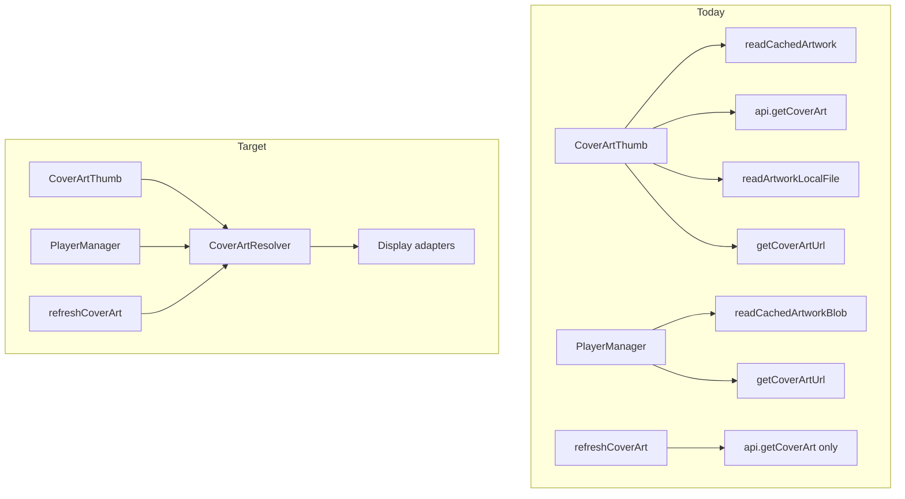
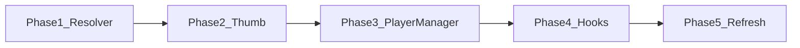

# CoverArt Resolver Refactor

## Problem

Cover art resolution is duplicated across at least two independent paths:

- **UI**: [`packages/ui/src/shared/CoverArtThumb.tsx`](packages/ui/src/shared/CoverArtThumb.tsx) — disk → API fetch → local file → authenticated URL, with blob URL creation
- **Lock screen**: [`packages/ui/src/player/core/PlayerManager.ts`](packages/ui/src/player/core/PlayerManager.ts) `resolveTrackNowPlayingArtwork` — disk (iOS base64 only) → `getCoverArtUrl`, no local-file path

This drift already caused “lock screen works, player doesn’t.” A third partial path exists in [`usePlayerFullScreenTrackActions.ts`](packages/ui/src/player/fullScreen/usePlayerFullScreenTrackActions.ts) `refreshCoverArt`.



## Goals

- **One resolution policy** shared by player UI and lock screen
- **Injectable dependencies** (storage, API, URL builder) — no React inside resolver
- **Smaller `CoverArtThumb`** — keeps intersection observer, object-URL cache, placeholder UI
- **Consolidated hooks** — one wiring path for library lists and player chrome

## Non-goals (keep as-is)

- [`coverArtObjectUrlCache.ts`](packages/ui/src/shared/coverArtObjectUrlCache.ts) — UI perf layer for blob URL sharing
- [`runLibraryArtworkBackgroundCache.ts`](packages/core/src/library/runLibraryArtworkBackgroundCache.ts) — proactive prefetch
- [`LibraryCacheStorage`](packages/core/src/library/storage/LibraryCacheStorage.ts) + platform implementations
- iOS [`AsmusicNativePlugin.swift`](ios/App/App/AsmusicNativePlugin.swift) now-playing transport
- Cover ID derivation in [`libraryIndexFromSongs.ts`](packages/core/src/library/libraryIndexFromSongs.ts) (already canonical)

## New module layout

Create `packages/ui/src/shared/coverArt/`:

| File                      | Role                                                                                                 |
| ------------------------- | ---------------------------------------------------------------------------------------------------- |
| `types.ts`                | `CoverArtRequest`, `CoverArtSources`, `CoverArtResolved`, failure types                              |
| `resolveCoverArt.ts`      | Pure async resolver: ordered IDs × ordered sources                                                   |
| `toThumbDisplayUrl.ts`    | Convert `CoverArtResolved` → `string \| null` for `` (blob URL, capacitor URL, network URL) |
| `toNowPlayingArtwork.ts`  | Convert `CoverArtResolved` → `{ artworkUrl?, artworkDataBase64?, artworkPlaceholderDataBase64 }`     |
| `buildCoverArtSources.ts` | Factory from `LibraryCacheStorage` + scope + optional `SubsonicAPI` + `getCoverArtUrl`               |
| `index.ts`                | Re-exports                                                                                           |

Move (not duplicate) existing helpers into this folder:

- [`defaultCoverArtPlaceholder.ts`](packages/ui/src/shared/defaultCoverArtPlaceholder.ts) → `coverArt/placeholder.ts`
- [`artworkDisplayMimeType.ts`](packages/ui/src/shared/artworkDisplayMimeType.ts) → `coverArt/mimeType.ts` (update imports)

## Resolver API (core design)

```ts
// types.ts
export type CoverArtSources = {
  readDisk: (coverArtId: string) => Promise<LibraryArtworkCacheRow | null>;
  fetchNetwork?: (
    coverArtId: string,
  ) => Promise<{ data: Uint8Array; mimeType: string } | null>;
  readLocalFile?: (
    coverArtId: string,
  ) => Promise<{ localFilePath: string; mimeType: string } | null>;
  buildNetworkUrl?: (coverArtId: string) => string | null;
  persistNetwork?: (
    coverArtId: string,
    row: { data: Uint8Array; mimeType: string },
  ) => Promise<void>;
};

export type CoverArtResolved =
  | { kind: "disk"; coverArtId: string; data: Uint8Array; mimeType: string }
  | {
      kind: "network_fetch";
      coverArtId: string;
      data: Uint8Array;
      mimeType: string;
    }
  | {
      kind: "local_file";
      coverArtId: string;
      localFilePath: string;
      mimeType: string;
    }
  | { kind: "network_url"; coverArtId: string; url: string }
  | { kind: "placeholder" }
  | { kind: "unavailable"; failures: CoverArtLoadFailure[] };

export async function resolveCoverArt(
  idsToTry: string[],
  sources: CoverArtSources,
  options?: { validateNetworkBytes?: boolean },
): Promise<CoverArtResolved>;
```

### Unified source priority (single constant)

```ts
export const COVER_ART_SOURCE_ORDER = [
  "disk",
  "network_fetch",
  "local_file",
  "network_url",
] as const;
```

Policy details to encode once:

- **Disk**: use bytes when `byteLength > 0` (no strict sniff — matches lock screen)
- **Network fetch**: validate with `isValidImageBytes` before persist; best-effort `persistNetwork`
- **Local file**: return path only after disk + fetch miss
- **Network URL**: authenticated `getCoverArt.view` fallback
- **Logging**: call `logCoverArtUnavailable` once on `unavailable`; include per-id failure detail
- **Placeholder**: return `{ kind: 'placeholder' }` when all IDs exhausted

### Display adapters

**`toThumbDisplayUrl(resolved)`**

- `disk` / `network_fetch` → `URL.createObjectURL(blob)`
- `local_file` → `Capacitor.convertFileSrc(path)`
- `network_url` → url string
- else → `null`

**`toNowPlayingArtwork(resolved, hostKind)`**

- `disk` / `network_fetch` on `ios-capacitor` → `artworkDataBase64`
- `network_url` (or `local_file` skipped on native) → `artworkUrl`
- `placeholder` / `unavailable` → placeholder base64 (existing canvas/embedded PNG)
- Always attach `artworkPlaceholderDataBase64`

## Consumer changes

### 1. `CoverArtThumb` (thin wrapper)

[`CoverArtThumb.tsx`](packages/ui/src/shared/CoverArtThumb.tsx) keeps:

- Intersection observer / `loadImmediately`
- `coverArtObjectUrlCache` acquire/release
- Placeholder UI + `onError` recovery (retry `network_url` via resolver before failing)

Replace inline load loop (~lines 208–287) with:

```ts
const resolved = await resolveCoverArt(idsToTry, sources);
return toThumbDisplayUrl(resolved);
```

Props simplify over time: accept a prebuilt `CoverArtSources` object instead of 5 separate callbacks.

### 2. `PlayerManager`

Replace `resolveTrackNowPlayingArtwork` body with:

```ts
const idsToTry = [coverArtId, fallbackId].filter(...);
const sources = buildCoverArtSources({
  libraryCache: this.host.libraryCache,
  scope: offlineLookupScopes(...),
  getCoverArtUrl: (id) => this.deps.getCoverArtUrl(item.serverId, id),
});
const resolved = await resolveCoverArt(idsToTry, sources);
return toNowPlayingArtwork(resolved, this.host.kind);
```

Delete local `uint8ArrayToBase64` if only used here (move to adapter).

### 3. `refreshCoverArt`

In [`usePlayerFullScreenTrackActions.ts`](packages/ui/src/player/fullScreen/usePlayerFullScreenTrackActions.ts), replace hand-rolled fetch loop with resolver using `fetchNetwork` + `persistNetwork` only (or a dedicated `refetchCoverArtFromNetwork(ids, sources)` helper that reuses the same network/persist branch).

### 4. Hook consolidation

Extend [`useScopedCoverArt.ts`](packages/ui/src/shared/useScopedCoverArt.ts):

```ts
return {
  sources: CoverArtSources, // new — for CoverArtThumb
  artworkCacheKeyFor,
  artworkCacheBumpFor,
  buildNetworkUrl: (coverArtId) => getCoverArtUrl(serverId, coverArtId), // when serverId known
};
```

Add [`usePlayerCoverArt.ts`](packages/ui/src/player/shared/usePlayerCoverArt.ts) — replaces wiring in:

- [`PlayerMiniBarCoverArt.tsx`](packages/ui/src/player/miniBar/PlayerMiniBarCoverArt.tsx)
- [`PlayerCoverArtBelt.tsx`](packages/ui/src/player/shared/PlayerCoverArtBelt.tsx)
- [`PlayerFullScreenDisplayBelt.tsx`](packages/ui/src/player/fullScreen/PlayerFullScreenDisplayBelt.tsx)

```ts
export function usePlayerCoverArt(item: PlayerQueueItem | null) {
  // returns { sources, artworkCacheKey, artworkCacheBump, thumbProps }
}
```

Delete [`usePlayerCoverArtNetworkUrl.ts`](packages/ui/src/player/shared/usePlayerCoverArtNetworkUrl.ts) after migration.

Keep [`resolvePlayerCachedArtwork.ts`](packages/ui/src/player/shared/resolvePlayerCachedArtwork.ts) for **ID list** helpers (`resolveCoverArtIdsToTryForQueueItem`, `playerQueueItemArtworkScope`) — or move ID list builder into `coverArt/ids.ts` re-exporting core helpers.

## Migration phases (low risk)



1. **Phase 1** — Add `coverArt/` module + unit-test resolver policy (no consumer changes)
2. **Phase 2** — Switch `CoverArtThumb` to resolver; verify library grids + player UI
3. **Phase 3** — Switch `PlayerManager`; verify lock screen matches player
4. **Phase 4** — `usePlayerCoverArt` + `useScopedCoverArt` sources; remove duplicate props/hooks
5. **Phase 5** — Align `refreshCoverArt`; delete dead code

Each phase should compile and be shippable independently.

## Tests

Add `packages/ui/src/shared/coverArt/resolveCoverArt.test.ts` (vitest):

- Disk hit on second ID after first ID misses
- Network fetch persists only valid bytes
- Local file skipped when disk succeeds
- Network URL used when fetch unavailable
- Unified logging on total failure
- `toNowPlayingArtwork` returns base64 on iOS for disk, URL for `network_url`
- `toThumbDisplayUrl` produces blob URL for disk bytes

Manual smoke:

- Play track with cached art: player + lock screen match
- Play track with network-only art: player + lock screen match
- Cover art refresh from full-screen player menu
- Library Virtuoso scroll still lazy-loads (non-player thumbs unchanged)

## Files touched (summary)

**New**

- `packages/ui/src/shared/coverArt/*`

**Refactor**

- [`CoverArtThumb.tsx`](packages/ui/src/shared/CoverArtThumb.tsx)
- [`PlayerManager.ts`](packages/ui/src/player/core/PlayerManager.ts)
- [`useScopedCoverArt.ts`](packages/ui/src/shared/useScopedCoverArt.ts)
- Player cover components (3 files)
- [`usePlayerFullScreenTrackActions.ts`](packages/ui/src/player/fullScreen/usePlayerFullScreenTrackActions.ts)

**Delete after Phase 4**

- [`usePlayerCoverArtNetworkUrl.ts`](packages/ui/src/player/shared/usePlayerCoverArtNetworkUrl.ts)

**Unchanged**

- `coverArtObjectUrlCache.ts`, core storage/prefetch, iOS native plugin
