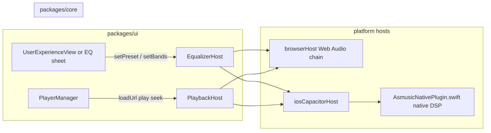

# Equalizer — global EQ for streaming + offline

## Scope decisions (locked)

| Decision | Choice |
|---|---|
| **Sources** | Subsonic **streaming** and **offline downloads** — both must be EQ'd |
| **Scope** | **One global EQ** — same settings for headphones, speaker, CarPlay, etc. |
| **Per-track / per-genre EQ** | Out of scope for v1 |
| **Server-side / download-time processing** | Out of scope — EQ is real-time only |
| **Platforms (v1)** | Browser dev host + iOS Capacitor shell |
| **Platforms (later)** | Android, desktop — same `EqualizerHost` contract |

## Product behavior

- User enables/disables EQ globally (**true bypass** when off — no filter overhead, not "all bands at 0 dB").
- User picks a **preset** (Flat, Bass boost, Rock, Vocal, etc.) or adjusts **custom band gains**.
- Settings persist across app restarts and apply immediately to current playback (no track restart required if platform supports live band updates).
- Gain range capped (recommended **±12 dB**) with optional soft limiter on native to avoid clipping on large boosts.
- EQ does **not** affect waveform peak generation (`decodeWaveformPeaks.ts`) — visualization stays source-accurate.

## Current state (repo facts)

- **Browser playback**: plain `HTMLAudioElement` in [`packages/platform-web/src/browserHost.ts`](packages/platform-web/src/browserHost.ts) — no Web Audio in the transport path.
- **iOS playback**: native `AVPlayer` in [`ios/App/App/AsmusicNativePlugin.swift`](ios/App/App/AsmusicNativePlugin.swift), bridged via [`packages/platform-capacitor/src/iosCapacitorHost.ts`](packages/platform-capacitor/src/iosCapacitorHost.ts).
- **Queue / transport**: [`packages/ui/src/player/core/PlayerManager.ts`](packages/ui/src/player/core/PlayerManager.ts) calls `host.playback.loadUrl()` — does not need EQ awareness if DSP lives inside each platform host.
- **Offline**: resolved via `resolvePlaybackSource` → local file path or stream URL; both paths must hit the same EQ pipeline on each platform.
- **Extension point**: [`PlatformHost`](packages/core/src/host/types.ts) — same pattern as `SleepTimerHost` ([`.cursor/plans/sleep_timer_platformhost_baa20f33.plan.md`](.cursor/plans/sleep_timer_platformhost_baa20f33.plan.md)).
- **AudioContext usage today**: offline waveform decode only ([`packages/core/src/offline/decodeWaveformPeaks.ts`](packages/core/src/offline/decodeWaveformPeaks.ts)), not playback.

## Architecture



- **Authoritative contract:** `EqualizerHost` on `PlatformHost` — React never implements DSP.
- **Policy in TS:** preset → band gain mapping, persistence keys, validation (clamp gains, band count).
- **Playback integration:** each platform applies EQ **inside** its audio pipeline so streaming and offline share one code path per platform.

## 1) Core interface — `packages/core/src/host/types.ts`

Add **`EqualizerHost`** to **`PlatformHost`**:

```typescript
export type EqualizerBand = {
  frequencyHz: number;
  gainDb: number;
  q?: number;
};

export type EqualizerState = {
  enabled: boolean;
  presetId: string | null; // null = custom
  bands: EqualizerBand[];
};

export type EqualizerHost = {
  /** True bypass — disable all filtering. */
  setEnabled(enabled: boolean): Promise<void>;
  /** Named preset; host or shared TS maps presetId → band gains. */
  setPreset(presetId: string): Promise<void>;
  /** Custom graphic/parametric bands (full band list). */
  setBands(bands: EqualizerBand[]): Promise<void>;
  getState(): Promise<EqualizerState>;
  /** Optional: fired when platform reapplies EQ after track load. */
  onStateChange?(cb: (state: EqualizerState) => void): () => void;
};
```

**Semantics:**

- `setEnabled(false)` = bypass (recommended: disconnect filters or set bypass flag on native unit).
- `setPreset(id)` sets `presetId` and derived bands; `setBands` sets `presetId: null`.
- Default bands: **10-band graphic** at 31, 62, 125, 250, 500, 1k, 2k, 4k, 8k, 16k Hz, all **0 dB**, `enabled: false`.
- Export preset IDs and band layout from `@asmusic/core` so UI and hosts share one source of truth.

## 2) Presets (v1 proposal)

| presetId | Label | Intent |
|---|---|---|
| `flat` | Flat | All 0 dB |
| `bass_boost` | Bass boost | +6 dB low, taper to 0 |
| `treble_boost` | Treble boost | +6 dB high |
| `vocal` | Vocal | Mid boost, slight low cut |
| `rock` | Rock | V-shape |
| `electronic` | Electronic | Sub + air emphasis |
| `custom` | Custom | User sliders (internal only) |

Exact curves live in a shared module (e.g. `packages/core/src/equalizer/presets.ts`).

## 3) Persistence

| Platform | Storage | Key (example) |
|---|---|---|
| Browser | `localStorage` via existing secureStorage or dedicated prefs | `eq.global.v1` |
| iOS | UserDefaults (non-secret) | same key namespace |

Hydrate on app start: read persisted state → `host.equalizer.setEnabled` / `setPreset` / `setBands`.

## 4) Browser — `packages/platform-web/src/browserHost.ts`

Refactor playback graph:

```text
HTMLAudioElement
  → MediaElementAudioSourceNode
  → BiquadFilterNode × N  (type: peaking, per band)
  → GainNode (optional limiter headroom)
  → AudioContext.destination
```

**Requirements:**

- Single long-lived `AudioContext`; resume on first user play if suspended.
- On `loadUrl`: keep element as source; do not recreate filter chain unless needed.
- On `setBands` / `setEnabled`: update `BiquadFilterNode.gain` or bypass chain.
- Handle `seek` / `ended` / `error` without leaking nodes.
- Works for **stream URLs** and **blob/file URLs** (offline) — same element path.

**Dev value:** validate presets and UI before iOS native work.

## 5) iOS Capacitor — TypeScript bridge

Extend [`packages/platform-capacitor/src/asmusicNativePlugin.ts`](packages/platform-capacitor/src/asmusicNativePlugin.ts):

- `equalizerSetEnabled({ enabled: boolean })`
- `equalizerSetBands({ bandsJson: string })` — or typed array in call options
- `equalizerGetState(): Promise<{ enabled, presetId, bandsJson }>`

Implement no-op / in-memory stub in [`asmusicNativePluginWeb.ts`](packages/platform-capacitor/src/asmusicNativePluginWeb.ts).

Add **`buildEqualizer()`** in [`iosCapacitorHost.ts`](packages/platform-capacitor/src/iosCapacitorHost.ts) on `PlatformHost`.

## 6) iOS native — streaming + offline (critical path)

**Constraint:** `AVPlayer` (current implementation) has **no built-in EQ**. Both stream and offline must be EQ'd → native work is required.

### Option A — `AVAudioEngine` + `AVAudioUnitEQ` (preferred for maintainability)

```text
Audio source (stream buffer or file)
  → AVAudioPlayerNode / custom scheduler
  → AVAudioUnitEQ
  → mainMixerNode → output
```

- Use `AVAudioUnitEQ` bands mapped 1:1 to JS band list.
- **Offline:** schedule file segments on `AVAudioPlayerNode` — straightforward.
- **Streaming:** requires buffering/decoding HTTP stream into engine (more work than `AVPlayer(url:)`).
- Must preserve: `AVAudioSession`, background audio, `MPNowPlayingInfoCenter`, remote commands, seek accuracy.

### Option B — `MTAudioProcessingTap` on `AVPlayerItem` (keep AVPlayer)

- Insert tap on audio mix; apply biquad filters in real time.
- **Pros:** keeps existing streaming + Now Playing code largely intact.
- **Cons:** complex C/AudioToolbox, format/sample-rate edge cases, higher maintenance.

### Option C — Third-party SDK (e.g. Superpowered)

- Production-grade; license + binary size cost.

**Recommendation:** Spike **Option B** if minimal playback refactor is priority; commit to **Option A** if long-term control and testability matter more. **v1 must support both `playbackLoadUrl` stream and `localFilePath` offline.**

On band change: update `AVAudioUnitEQ` parameters live (no track restart).

## 7) UI — settings

Add under [`settings.ux.section.playback`](packages/ui/src/views/settings/UserExperienceView.tsx) (or dedicated EQ sheet from player):

- Master **Enable EQ** switch (bypass).
- **Preset** dropdown (Flat, Bass boost, …).
- **Custom** mode: vertical sliders per band (−12…+12 dB), reset to Flat.
- i18n keys in `packages/i18n`.

`PlayerManager` unchanged unless we add a quick "EQ" entry in full-screen player later.

## 8) Android / desktop (backlog)

| Platform | Approach |
|---|---|
| **Android** | ExoPlayer `AudioProcessor` / equalizer in future Capacitor host |
| **Electron / desktop** | Web Audio (if Chromium audio path) or native via host adapter |

Same `EqualizerHost` on `PlatformHost`; no Android/Electron code in v1.

## Phased rollout

| Phase | Deliverable |
|---|---|
| **1** | Core types, presets module, persistence, stub hosts, settings UI (no audible change on iOS) |
| **2** | Browser Web Audio EQ — full dev/test loop |
| **3** | iOS native EQ — stream + offline, Now Playing parity |
| **4** | Polish — limiter, preset tuning, accessibility |

## Risks and open items

- [ ] **iOS streaming architecture choice** (A vs B) — blocks estimate for Phase 3.
- [ ] **Latency** — Web Audio latency on iOS WKWebView irrelevant (native path); measure on device for chosen native approach.
- [ ] **Clipping** — bass boost on already-loud masters; native limiter or gain staging.
- [ ] **CarPlay** — global EQ should apply transparently if audio goes through same engine (verify when CarPlay returns).
- [ ] **Preset tuning** — subjective; may iterate after dogfooding.

## Testing checklist

- [ ] Stream: EQ off vs on — audible difference on bass boost preset.
- [ ] Offline: downloaded track — same preset applies identically.
- [ ] Toggle EQ during playback — immediate effect, no crash.
- [ ] Change preset during playback — smooth update.
- [ ] Seek / skip track / queue next — EQ persists, no stale nodes.
- [ ] Background + lock screen — playback and EQ continue; Now Playing unchanged.
- [ ] App restart — persisted preset restored and applied to next play.
- [ ] Browser dev: tab background / return — EQ state consistent.
- [ ] Extreme gains — no harsh clipping (or limiter engages).

## Related docs

- [Sleep timer PlatformHost plan](.cursor/plans/sleep_timer_platformhost_baa20f33.plan.md) — host extension pattern
- [Web shell migration](.cursor/plans/web_shell_migration_040e5d6f.plan.md) — PlatformHost architecture
- [Offline media architecture](.cursor/plans/offline_media_architecture_038f2918.plan.md) — local file playback path
