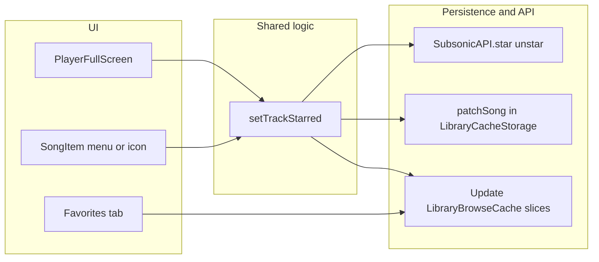

# Favorites / star parity with legacy iOS

## What legacy does (reference)

- **Server API**: Subsonic [`star.view`](https://www.subsonic.org/pages/api.jsp#star) / [`unstar.view`](https://www.subsonic.org/pages/api.jsp#unstar) via `AsNavidromeKit` ([`MusicPlayerController+Queue.swift`](legacy-swiftui-ios/AsMusic/Managers/MusicPlayerController+Queue.swift) `setCurrentTrackStarred`).
- **Favorites list**: [`FavoritesView.swift`](legacy-swiftui-ios/AsMusic/Views/Library/LibraryView/FavoritesView.swift) loads cached songs and filters `song.starred != nil`, sorted by title.
- **Player**: [`PlayerSheetView.swift`](legacy-swiftui-ios/AsMusic/Views/PlayerView/PlayerSheetView/PlayerSheetView.swift) toggles star for the current track.

## Current app state

- Library data is already `Child` from `subsonic-api`, which includes optional [`starred`](https://raw.githubusercontent.com/explodingcamera/subsonic-api/v3.3.0/src/types.ts) on tracks ([`fetchAllLibrarySongs`](packages/core/src/library/fetchAllLibrarySongs.ts) uses `search3`; responses should carry `starred` when the server supports it).
- [`LibraryBrowseCacheContext`](packages/ui/src/contexts/LibraryBrowseCacheContext.tsx) builds `songEntriesSorted` from cached slices but has **no** favorites view or mutation path.
- [`SubsonicAPI`](packages/core/src/api/client.ts) (from `subsonic-api` v3.x) exposes **`star` / `unstar`** with `{ id: string | string[] }` (same semantics as legacy).
- [`LibraryCacheStorage`](packages/core/src/library/storage/LibraryCacheStorage.ts) only has full [`replaceSongList`](packages/platform-web/src/indexedDbLibraryCacheStorage.ts) — efficient **single-song** persistence needs a small extension.

## Recommended architecture

1. **Truth source**: starred state on each cached `Child` (same as legacy). After a successful API call, update that `Child` in memory **and** on disk so behavior matches “filter cache” without waiting for the next full sync.

2. **Storage: add `patchSong(scope, song: Child)`** to [`LibraryCacheStorage`](packages/core/src/library/storage/LibraryCacheStorage.ts):
   - **Web**: [`indexedDbLibraryCacheStorage.ts`](packages/platform-web/src/indexedDbLibraryCacheStorage.ts) — songs are already one row per `songId`; `get` + merge + `put` the `song` blob (no album/artist index rebuild needed for a lone `starred` change).
   - **iOS**: [`LibraryCacheSQLiteStore.swift`](ios/App/App/LibraryCacheSQLiteStore.swift) — table `library_songs` is keyed by `(server_key, library_id, song_id)`; add `UPDATE library_songs SET song_json = ? WHERE …` (parse/stringify only that row’s JSON, not the whole library).
   - **Bridge**: extend [`AsmusicNativePlugin`](ios/App/App/AsmusicNativePlugin.swift) + [`asmusicNativePlugin.ts`](packages/platform-capacitor/src/asmusicNativePlugin.ts) with one method (e.g. `libraryCachePatchSong`) parallel to existing replace/read.

3. **Browse cache layer**: expose a single imperative helper from [`LibraryBrowseCacheProvider`](packages/ui/src/contexts/LibraryBrowseCacheContext.tsx), e.g. `setTrackStarred({ serverId, libraryId, trackId, starred })`:
   - Resolve `SubsonicAPI` via existing `getApiForServer` / `apiForServer`.
   - `await api.star({ id: trackId })` or `api.unstar({ id: trackId })`.
   - Find the `Child` in the matching slice, clone with `starred` set to `new Date().toISOString()` or `undefined`.
   - `await host.libraryCache.patchSong(scope, nextChild)` then `setSlices` map-update that slice’s `songs` array (or call existing `reloadCachedSongsFromDisk` only if you skip `patchSong` — **don’t** rely on full reload alone without persistence).

4. **Favorites UI** (parity with legacy list):
   - Extend [`LibraryBrowserTab`](packages/ui/src/components/libraryNavigationUrl.ts) with `'favorites'` and wire [`parseLibraryBrowserView`](packages/ui/src/components/libraryNavigationUrl.ts) / [`mergeLibraryBrowserSearchParams`](packages/ui/src/components/libraryNavigationUrl.ts) / [`useLibraryBrowserTabBar`](packages/ui/src/components/useLibraryBrowserTabBar.ts) (deep-link behavior consistent with album/artist: leaving favorites clears album/artist params).
   - Add a fourth toggle on [`HomePage.tsx`](packages/ui/src/pages/HomePage.tsx): “Favorites”.
   - In [`LibraryBrowser.tsx`](packages/ui/src/components/LibraryBrowser.tsx), when `tab === 'favorites'`, derive entries from `slices` the same way as “all songs” but **filter** `song.starred != null && String(song.starred).trim() !== ''` and sort by title (match legacy).
   - Reuse [`SongListView`](packages/ui/src/components/SongListView.tsx) + [`SongItem`](packages/ui/src/components/SongItem.tsx) patterns used for the songs tab.

5. **Per-row star** in [`SongItem.tsx`](packages/ui/src/components/SongItem.tsx):
   - Add optional callbacks or a trailing `IconButton` (heart/star) when `onToggleStar` + `isStarred` are provided — keep default behavior unchanged for screens that do not pass them.
   - Wire from library lists and favorites list.

6. **Player** ([`PlayerFullScreen.tsx`](packages/ui/src/player/PlayerFullScreen.tsx)):
   - Add a toolbar icon (filled/outline star) when `state.currentItem` is set, calling `setTrackStarred` for that `serverId` / `libraryId` / `trackId`.
   - Extend [`PlayerQueueItem`](packages/ui/src/player/types.ts) + [`playerQueueItemFromChild`](packages/ui/src/player/playerQueueItemFromChild.ts) with optional `starred?: boolean` (or `starredAt`) so the full player reflects the snapshot at enqueue time; after a successful toggle, update the current queue item in [`PlayerManager`](packages/ui/src/player/PlayerManager.ts) (small method mirroring legacy’s in-memory overlay) so the icon updates without re-enqueueing.

7. **Core helper** (optional but keeps UI clean): e.g. `isChildStarred(child: Child): boolean` exported from [`@asmusic/core`](packages/core/src/index.ts) near other library helpers.

## Out of scope / follow-ups (call out explicitly)

- **Lock screen / CarPlay like & dislike**: legacy wires `MPRemoteCommandCenter` like/dislike to star ([`MusicPlayerController+Remote.swift`](legacy-swiftui-ios/AsMusic/Managers/MusicPlayerController+Remote.swift)). The Capacitor shell would need native audio session / Now Playing integration — treat as a **separate** task unless you want it in the same PR.
- **Album/artist starring**: Subsonic supports starring albums/artists too; legacy UI here is **song-only** — match that unless you explicitly want album rows starred.

## Verification

- Star a track from Songs tab → appears under Favorites; restart app → still starred (proves `patchSong`).
- Unstar from Favorites → row disappears after success.
- Star from full player while playing → icon toggles; library favorites count/list updates without full library refresh.
- Multi-library: favorites list shows starred tracks from each active slice with correct server/artwork scope (reuse existing `SongListEntry` / `artworkScope` patterns).
