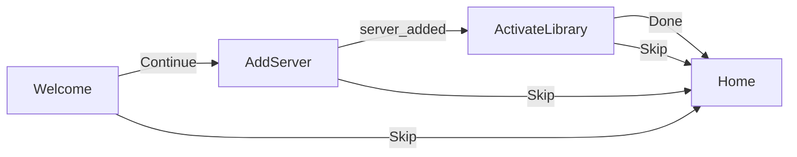

# First-run server and library onboarding

## Current behavior

- [`ServerAndLibraryProvider`](packages/ui/src/contexts/ServerAndLibraryContext.tsx) loads servers from `PlatformHost.secureStorage` and active libraries from `localStorage` (`asmusic-active-libraries-v1`).
- [`LibraryBrowser`](packages/ui/src/components/LibraryBrowser.tsx) (home main content) shows a short message + icon when `scopesToLoad.length === 0` (no active libraries), with a link to [`/settings/servers-libraries?tab=libraries`](packages/ui/src/App.tsx). It does **not** distinguish “no servers yet” vs “servers exist but no library checked.”
- [`ServersAndLibrariesView`](packages/ui/src/pages/ServersAndLibrariesView.tsx) already composes [`ServerManagerView`](packages/ui/src/pages/ServerManagerView.tsx) and [`LibrarySelectorView`](packages/ui/src/pages/LibrarySelectorView.tsx) with `embedded`—ideal building blocks for a wizard.
- Legacy SwiftUI [`OnboardingView`](legacy-swiftui-ios/AsMusic/Views/Onboarding/OnboardingView.swift) uses steps (welcome → add server → choose library), **Skip**, and `AppStorage` for completion—useful UX reference, not code to port literally.

## Recommended UX

1. **New route** `GET /onboarding` — full-screen flow (clear back stack behavior via `replace` where appropriate), safe-area friendly like other pages (`playerDockPaddingBottomSx` pattern from [`ServersAndLibrariesView`](packages/ui/src/pages/ServersAndLibrariesView.tsx)).
2. **Steps (local React state)**  
   - **Welcome**: short value prop + **Continue** + **Skip** (trailing toolbar or footer).  
   - **Add server**: reuse `<ServerManagerView embedded />` (same add form + saved list as settings). Advance to next step when `servers.length` increases (mirror SwiftUI `onChange` of server count), with a manual **Next** if a server already existed before entering this step.  
   - **Activate library**: reuse `<LibrarySelectorView embedded />`. When `activeLibraryRefs.length >= 1`, show **Done** (or auto-navigate after a short confirmation) to `/` and mark onboarding complete.
3. **Persistence**: new `localStorage` key (e.g. `asmusic-onboarding-completed-v1`), implemented as a small module under [`packages/ui/src/preferences/`](packages/ui/src/preferences/) following the same pattern as [`appearanceMode.ts`](packages/ui/src/preferences/appearanceMode.ts) (`get` / `set` / `useSyncExternalStore` optional—simple `get`/`set` is enough if only `OnboardingPage` reads it).
4. **Entry / gate** (pick one—recommended first):  
   - **Auto-redirect (recommended)**: After `isRestoring === false`, if onboarding is not completed **and** (`servers.length === 0` **or** `activeLibraryRefs.length === 0`), redirect from `/` to `/onboarding` with `replace: true` so the wizard is the default first experience. Users who **Skip** set completed and land on `/` (empty state remains available).  
   - **Softer variant**: No auto-redirect; only a prominent CTA on home—less “guided,” easier to miss.

5. **Do not** block deep links to `/settings/*`, `/offline`, `/about`, etc.—only the home `/` gate redirects (or show a dismissible banner on home instead if you choose the softer variant).

## Files to add or touch

| Area | Action |
|------|--------|
| [`packages/ui/src/preferences/onboardingCompleted.ts`](packages/ui/src/preferences/onboardingCompleted.ts) | New: read/write completion flag + optional hook. |
| [`packages/ui/src/pages/OnboardingPage.tsx`](packages/ui/src/pages/OnboardingPage.tsx) | New: step state machine, MUI layout, Skip/Done, embed server + library views. |
| [`packages/ui/src/App.tsx`](packages/ui/src/App.tsx) | Register `<Route path="/onboarding" element={<OnboardingPage />} />`. |
| New small component e.g. [`packages/ui/src/OnboardingHomeRedirect.tsx`](packages/ui/src/OnboardingHomeRedirect.tsx) | `useEffect` + `useLocation`/`useNavigate`: when path `/` and gate conditions + not completed → `/onboarding`. Render `null` or `children`. Place **inside** `ServerAndLibraryProvider` so it can read `servers`, `activeLibraryRefs`, `isRestoring`. |
| [`packages/ui/src/pages/OnboardingPage.tsx`](packages/ui/src/pages/OnboardingPage.tsx) (or redirect) | On **Skip**: `setOnboardingCompleted(true)` + `navigate('/')`. |
| Optional polish | [`LibraryBrowser`](packages/ui/src/components/LibraryBrowser.tsx) empty state: align copy with onboarding (“Get started” vs “Settings → …”) and/or primary `Button` to `/onboarding` when not completed—reduces confusion after Skip. |

## Completion rules (avoid loops)

- Set **completed** when: user taps **Done** after at least one active library, **or** taps **Skip** (matches legacy “exit without finishing”).  
- Do **not** infer completion only from `activeLibraryRefs.length > 0` without a flag—otherwise users who clear all libraries later might be forced through the wizard again unless you explicitly want that.

## Testing (manual)

- Fresh profile: open app → lands on onboarding → add server → step advances → check one library → home shows library UI / sync.  
- Skip from welcome: lands on home, no redirect loop.  
- Complete onboarding, clear active libraries in settings: still no forced wizard (flag still complete).  
- Optional: reset flag in devtools and confirm wizard reappears.

