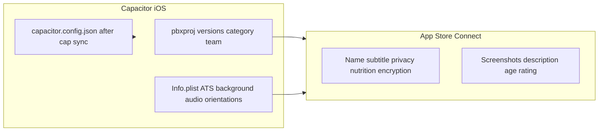

# iOS Capacitor release readiness

## Current state (Capacitor shell)

| Item                   | Current (`[ios/App/App.xcodeproj/project.pbxproj](ios/App/App.xcodeproj/project.pbxproj)`, `[apps/web/capacitor.config.ts](apps/web/capacitor.config.ts)`, `[ios/App/App/Info.plist](ios/App/App/Info.plist)`) |
| ---------------------- | -------------------------------------------------------------------------------------------------------------------------------------------------------------------------------------------------------------- |
| **Minimum iOS**        | **15.0** (project + target). Matches **Capacitor 8** docs (iOS 15+).                                                                                                                                           |
| **App Store category** | `INFOPLIST_KEY_LSApplicationCategoryType = public.app-category.music` on the target (good).                                                                                                                    |
| **Display name**       | `AsMusic` in `Info.plist` (`CFBundleDisplayName`); `appName: 'AsMusic'` in Capacitor config (aligned).                                                                                                         |
| **Marketing / build**  | `MARKETING_VERSION = 1.0`, `CURRENT_PROJECT_VERSION = 1` (initial; bump for each store submission).                                                                                                            |
| **Bundle ID**          | `com.angdasoft.Asmusic` (same in Capacitor `appId`).                                                                                                                                                           |
| **Devices**            | `TARGETED_DEVICE_FAMILY = 1,2` (iPhone + iPad).                                                                                                                                                                |
| **Team / signing**     | `DEVELOPMENT_TEAM = ML8TXBYB3Y`, `CODE_SIGN_STYLE = Automatic` (verify in Xcode that this is the intended distribution team).                                                                                  |
| **Background audio**   | `UIBackgroundModes` → `audio` in `[Info.plist](ios/App/App/Info.plist)` (aligned with music playback).                                                                                                         |
| **ATS**                | `NSAllowsArbitraryLoads = true` in `Info.plist` (same permissive stance as legacy; App Store review may ask for justification—consider documenting or narrowing later).                                        |

## Legacy reference (`[legacy-swiftui-ios](legacy-swiftui-ios)`)

| Item                             | Legacy                                                                                                                                                                                                                                                                        |
| -------------------------------- | ----------------------------------------------------------------------------------------------------------------------------------------------------------------------------------------------------------------------------------------------------------------------------- |
| **Bundle ID**                    | `com.angdasoft.AsMusic` (**capital `M`** in `Music`) — **differs from Capacitor** (`Asmusic`).                                                                                                                                                                                |
| **Version**                      | `MARKETING_VERSION = 1.0.2` (ahead of Capacitor’s `1.0`).                                                                                                                                                                                                                     |
| **Deployment target in pbxproj** | `26.0` in legacy project file — treat as **Xcode/SDK-era default**, not something you must copy; Capacitor 8’s **15.0** floor is the meaningful constraint.                                                                                                                   |
| **Local network**                | `INFOPLIST_KEY_NSLocalNetworkUsageDescription` with user-facing text for LAN servers — **present in legacy, absent in Capacitor**. Subsonic/Navidrome users on **RFC1918 / `.local` hosts** typically need this on modern iOS when the WebView triggers local-network access. |
| **Export compliance plist**      | `ITSAppUsesNonExemptEncryption = false` in `[legacy-swiftui-ios/AsMusic-Info.plist](legacy-swiftui-ios/AsMusic-Info.plist)` — **not in Capacitor `Info.plist`** (add for parity / simpler defaults with App Store Connect encryption questionnaire).                          |
| **File sharing**                 | `UIFileSharingEnabled` in legacy plist — optional for Capacitor unless you want users browsing app documents in Files.                                                                                                                                                        |
| **CarPlay**                      | `UISupportsCarPlay` in legacy — **do not** add to Capacitor unless you actually implement CarPlay entitlements + UI (would risk rejection).                                                                                                                                   |

## Decisions / edits to make before archive

1. **Bundle identifier (blocking product choice)**
  - **Same listing as legacy:** set `PRODUCT_BUNDLE_IDENTIFIER` and `[apps/web/capacitor.config.ts](apps/web/capacitor.config.ts)` `appId` to `**com.angdasoft.AsMusic`**, then `pnpm run cap:sync` so generated `[ios/App/App/capacitor.config.json](ios/App/App/capacitor.config.json)` matches.  
  - **New app:** keep current ID but document that it is a different product from the SwiftUI app.
2. **Versioning**
  - Set `MARKETING_VERSION` to your public release (e.g. continue from legacy **1.0.3+** or reset to **1.0.0** if this is treated as a new product line).  
  - Increment `CURRENT_PROJECT_VERSION` for **every** upload (even same marketing version).
3. `**Info.plist` parity with legacy where appropriate**
  - Add `**NSLocalNetworkUsageDescription`** (same string as legacy or slightly updated copy). Easiest: `**INFOPLIST_KEY_NSLocalNetworkUsageDescription`** on the target in `project.pbxproj` (matches how legacy set it).  
  - Add `**ITSAppUsesNonExemptEncryption**` = `false` if the app does not use custom non-exempt crypto (matches legacy).  
  - **Optional:** `UIFileSharingEnabled` only if you want Files-app visibility of documents.
4. `**CAPACITOR_DEBUG` for Release**
  - Debug uses `[ios/debug.xcconfig](ios/debug.xcconfig)` → `CAPACITOR_DEBUG = true`. **Release** has **no** xcconfig, so `$(CAPACITOR_DEBUG)` may be empty in archived builds. Add a `**release.xcconfig`** with `CAPACITOR_DEBUG = false` (or set `CAPACITOR_DEBUG` in Release target build settings) and wire it as the Release base configuration—mirror the Debug pattern in `[project.pbxproj](ios/App/App.xcodeproj/project.pbxproj)`.
5. **Device capabilities / orientations**
  - `[Info.plist](ios/App/App/Info.plist)` lists `**armv7`** under `UIRequiredDeviceCapabilities`; consider modernizing to `**arm64`** (or rely on Xcode defaults) so you are not implying 32-bit-only requirements.  
  - Capacitor allows **iPhone landscape**; legacy locked iPhone to **portrait** via `INFOPLIST_KEY_UISupportedInterfaceOrientations_iPhone`. Align orientations with the product you want (portrait-only vs current).
6. **Pre-upload verification (manual)**
  - Xcode: **Product → Archive** with **Release**, install on device, smoke-test login + playback + **LAN server** (confirm local-network prompt appears once, then works).  
  - App Store Connect: description, screenshots, **Privacy Nutrition** labels, age rating, and encryption answers consistent with plist + actual behavior.  
  - CI (`[.github/workflows/build-ios.yml](.github/workflows/build-ios.yml)`) already builds **unsigned** `iphoneos`; keep using that as a gate; distribution still happens locally or via a separate signed workflow if you add one later.

## Out of scope (but not forgotten)

- **ATS policy** (`NSAllowsArbitraryLoads`): acceptable short-term if you can justify user-provided server URLs; longer-term, prefer domain-scoped exceptions.  
- **CarPlay / file sharing**: only if you explicitly want feature parity with legacy beyond music playback.

