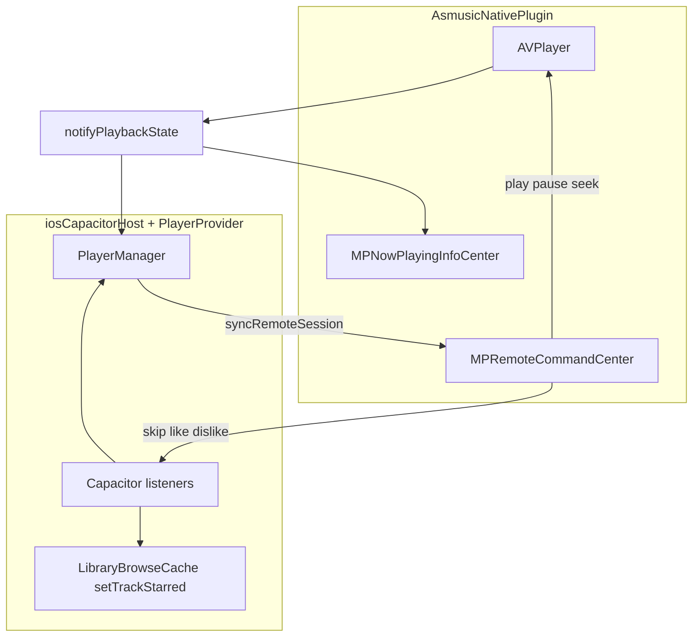

# iOS Control Center / lock screen playback controls

## Goals

- **Transport**: Correct elapsed time and playback rate on the lock screen / Control Center (fixes “dead” UI).
- **Scrubbing**: `changePlaybackPositionCommand` seeks native `AVPlayer`.
- **Queue**: **Next** and **previous** remote commands advance the in-app queue (same behavior as in-app buttons, including `loopQueue` edge cases handled by existing [`PlayerManager.skipNext` / `skipPrevious`](packages/ui/src/player/PlayerManager.ts)).
- **Artwork**: Show cover art on the lock screen when `artworkUrl` is provided (already passed from [`iosCapacitorHost.loadUrl`](packages/platform-capacitor/src/iosCapacitorHost.ts); Swift currently ignores it).
- **Favorite / like**: Control Center / headphone “like” affordances map to **Subsonic star** (same as [`PlayerFullScreen`](packages/ui/src/player/PlayerFullScreen.tsx): `setTrackStarred` + `patchCurrentQueueItemStarred`). Use **like** = add to favorites, **dislike** = remove (matches [`MusicPlayerController+Remote.swift`](legacy-swiftui-ios/AsMusic/Managers/MusicPlayerController+Remote.swift) pattern with `isActive` reflecting starred state).

## Current state

- iOS uses native `AVPlayer` via [`AsmusicNativePlugin.swift`](ios/App/App/AsmusicNativePlugin.swift); [`Info.plist`](ios/App/App/Info.plist) already has `audio` background mode.
- Remote **play / pause / toggle** exist; **Now Playing** metadata omits **elapsed time** and **playback rate** (main transport bug).
- **Next / previous / scrub / like / artwork** are not wired on the Capacitor path.

## 1. Now Playing transport (Swift)

In `notifyPlaybackState()`, when `MPNowPlayingInfoCenter.default().nowPlayingInfo != nil`, merge:

- `MPNowPlayingInfoPropertyElapsedPlaybackTime`
- `MPNowPlayingInfoPropertyPlaybackRate` (`1.0` / `0.0`)

## 2. Scrubbing + main thread (Swift)

- Register `changePlaybackPositionCommand` → seek → `notifyPlaybackState()`.
- Run all `MPRemoteCommandCenter` targets and `AVPlayer` mutations on the **main** queue (`DispatchQueue.main.async` / `@MainActor`), matching legacy.

## 3. Artwork (Swift)

- Read `artworkUrl` from `playbackLoadUrl` call options (already in TS interface).
- Kick off async `URLSession` download; on success create `MPMediaItemArtwork(boundsSize:requestHandler:)` (or fixed-size image) and set `MPMediaItemPropertyArtwork` on now playing info.
- Cancel or supersede prior download when a new track loads; non-fatal on failure (leave artwork unset).

## 4. Next / previous (Swift + TS + core)

- **Swift**: In `installRemoteCommandsIfNeeded()`, add `nextTrackCommand` and `previousTrackCommand` targets that `notifyListeners("playbackRemoteSkipNext", …)` / `playbackRemoteSkipPrevious` (payload empty or minimal). Set **`isEnabled`** from cached flags updated by JS (see §6), default disabled until first sync.
- **Capacitor**: Extend [`asmusicNativePlugin.ts`](packages/platform-capacitor/src/asmusicNativePlugin.ts) event map; add `playbackSyncRemoteSession` plugin method (see §6) to `pluginMethods` in Swift.
- **core**: Extend [`PlaybackHost`](packages/core/src/host/types.ts) with optional `syncRemoteSession(...)` and `onRemoteSkipNext` / `onRemoteSkipPrevious` (no-op unsubscribe on web).
- **iosCapacitorHost**: Register listeners once; expose subscriptions used by React.

## 5. Like / favorite (Swift + TS + React)

- **Swift**: Enable `likeCommand` and `dislikeCommand` (localized titles can mirror legacy: e.g. “Add to favorites” / “Remove from favorites”). Targets emit `playbackRemoteFavoriteStar` / `playbackRemoteFavoriteUnstar`. Set `likeCommand.isActive` / `dislikeCommand.isActive` from **JS-driven sync** (not only from event echo), so the Control Center heart matches app state.
- **When to disable**: If there is no “current library track” for starring (e.g. no item / offline edge cases — align with when the full player would hide or disable the star button), set both commands `isEnabled = false`. Otherwise enable both when favorites apply.

## 6. JS → native: session sync (flags + favorite UI)

Add a single Capacitor method, e.g. **`playbackSyncRemoteSession`**, with arguments:

- `hasNext: boolean`
- `hasPrevious: boolean`
- `favoriteControlsEnabled: boolean` — true when starring is meaningful for the current item (same conditions as star button availability in UI).
- `starred: boolean` — current snapshot; drives `likeCommand.isActive` / `dislikeCommand.isActive` (starred → like active, dislike inactive, per legacy `refreshRemoteFeedbackState`).

**Caller**: [`PlayerManager.emit()`](packages/ui/src/player/PlayerManager.ts) (after `rebuildSnapshot`) when `host.kind === 'ios-capacitor'`, debounced or throttled lightly (e.g. coalesce with existing transport throttle) so we do not hammer the bridge every 200ms — **only when** `hasNext`, `hasPrevious`, `favoriteControlsEnabled`, or `starred` **change**, or on track load (cheap string compare of a small snapshot).

**PlaybackHost**: `syncRemoteSession?: (s: RemoteSessionPayload) => Promise<void>`.

## 7. React wiring ([`PlayerProvider`](packages/ui/src/contexts/PlayerContext.tsx))

- `useEffect` (depends on `host`, `manager`): if `host.playback.onRemoteSkipNext` exists, subscribe and call `void manager.skipNext()` / `skipPrevious()`.
- For favorites: use **`useLibraryBrowseCache()`** (provider already wraps `PlayerProvider`) and mirror `PlayerFullScreen` logic — read `manager.getSnapshot().currentItem`, bail if missing, then `setTrackStarred({ serverId, libraryId, trackId, starred })` then `manager.patchCurrentQueueItemStarred(starred)` on success. On failure, optional `console.warn` (no toast unless you add a small snackbar later).

## 8. Web / stubs

- [`asmusicNativePluginWeb.ts`](packages/platform-capacitor/src/asmusicNativePluginWeb.ts): no-op `playbackSyncRemoteSession`.
- [`browserHost`](packages/platform-web/src/browserHost.ts): omit new `PlaybackHost` fields (optional) or no-op implementations.

## 9. Verification

- Background app: play/pause, progress bar, scrub.
- Next/prev with and without `loopQueue`; buttons disabled when queue has no next/prev.
- Artwork visible for tracks with `artworkUrl`.
- Star from Control Center updates server + in-app star icon; in-app toggle updates Control Center heart state via `playbackSyncRemoteSession`.
