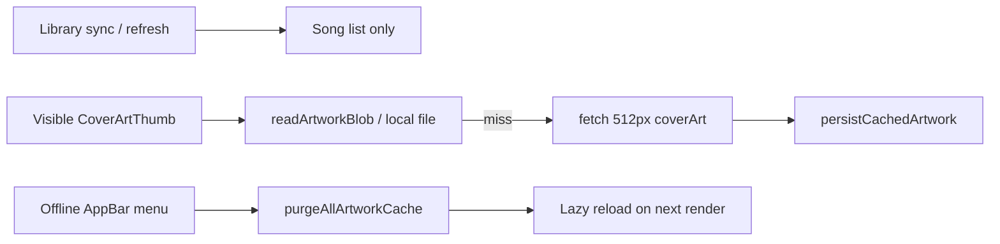

# Lazy artwork cache: remove bulk prefetch, add global purge

## Problem

The per-library re-download button in [LibrarySelectorList.tsx](packages/ui/src/views/servers/librarySelector/LibrarySelectorList.tsx) calls `redownloadArtworkForScope`, which **awaits** `runLibraryArtworkBackgroundCache` over every unique cover ID in a library — unbearably slow at 10k+ tracks.

Bulk prefetch also runs after every library sync/refresh in [LibraryBrowseCacheContext.tsx](packages/ui/src/contexts/LibraryBrowseCacheContext.tsx) and [useRefreshLibraryRow.ts](packages/ui/src/views/servers/librarySelector/useRefreshLibraryRow.ts).

## Target behavior



- **Sync/refresh**: metadata + song lists only (no artwork HTTP).
- **Display**: existing `CoverArtThumb` path (disk → network → persist) when player or Virtuoso lists render a thumbnail.
- **Recovery**: one menu action that **purges** all artwork bytes (no re-download).

## 1. Remove bulk artwork prefetch

**[LibraryBrowseCacheContext.tsx](packages/ui/src/contexts/LibraryBrowseCacheContext.tsx)**

- In `runRefresh`, delete the block that derives albums, collects cover IDs, and calls `runLibraryArtworkBackgroundCache`.
- Remove `redownloadArtworkForScope` entirely.
- Remove `artworkAbortRef` (only used to cancel bulk prefetch).
- Drop unused imports: `collectCoverArtIdsFromSongs`, `runLibraryArtworkBackgroundCache`, `albumsFromCachedSongs` (if no longer needed in this file).

**[useRefreshLibraryRow.ts](packages/ui/src/views/servers/librarySelector/useRefreshLibraryRow.ts)**

- After `refreshLibraryCache`, only call `reloadCachedSongsFromDisk()` — remove `albumsFromCachedSongs`, `collectCoverArtIdsFromSongs`, `runLibraryArtworkBackgroundCache`, and `artworkAbortRef`.
- Remove `redownloadLibraryArtwork`, `redownloadingKey`, and `redownloadArtworkForScope` usage.

**[refreshLibraryCache.ts](packages/core/src/library/refreshLibraryCache.ts)** — update the doc comment that says cover art is filled separately via `runLibraryArtworkBackgroundCache`.

Keep `runLibraryArtworkBackgroundCache` exported from core (unused by UI) unless you prefer deleting it in a follow-up.

## 2. Remove Settings re-download button

**[LibrarySelectorList.tsx](packages/ui/src/views/servers/librarySelector/LibrarySelectorList.tsx)**

- Remove the `Image` icon button, `redownloadingKey` / `onRedownloadArtwork` props, and related disabled-state logic.

**[LibrarySelectorView.tsx](packages/ui/src/views/servers/librarySelector/LibrarySelectorView.tsx)**

- Stop wiring `redownloadingKey` / `redownloadLibraryArtwork`.

**i18n** — remove unused keys from all locale files:

- `servers.libraries.redownloadArtwork`
- `servers.libraries.redownloadArtworkAria`
- `servers.libraries.redownloadArtworkFailed`

## 3. Fast global artwork purge (storage layer)

Add `purgeAllArtworkCache(): Promise<void>` to [LibraryCacheStorage.ts](packages/core/src/library/storage/LibraryCacheStorage.ts).

| Backend                                                                                                                                                                                               | Implementation                                                                                                                |
| ----------------------------------------------------------------------------------------------------------------------------------------------------------------------------------------------------- | ----------------------------------------------------------------------------------------------------------------------------- |
| Web [indexedDbLibraryCacheStorage.ts](packages/platform-web/src/indexedDbLibraryCacheStorage.ts)                                                                                                      | `objectStore('artworks').clear()` in one transaction                                                                          |
| iOS [capacitorIosSqliteLibraryCacheStorage.ts](packages/platform-capacitor/src/capacitorIosSqliteLibraryCacheStorage.ts) + [LibraryCacheSQLiteStore.swift](ios/App/App/LibraryCacheSQLiteStore.swift) | `DELETE FROM library_artworks` + remove entire `Caches/asmusic-artwork/` directory (covers all scopes and materialized files) |

Wire through [AsmusicNativePlugin.swift](ios/App/App/AsmusicNativePlugin.swift) as `libraryCachePurgeAllArtwork` (or similar).

This is faster and more complete than looping `clearArtworkCache(scope)` over known library rows.

## 4. Context API: `clearAllArtworkCache`

**[LibraryBrowseCacheContext.tsx](packages/ui/src/contexts/LibraryBrowseCacheContext.tsx)**

Replace `redownloadArtworkForScope` with:

```ts
clearAllArtworkCache: () => Promise<void>;
```

Implementation:

1. `await host.libraryCache.purgeAllArtworkCache()`
2. Call new `clearCoverArtObjectUrlCache()` in [coverArtObjectUrlCache.ts](packages/ui/src/shared/coverArtObjectUrlCache.ts) (revoke all blob URLs, clear in-memory map)
3. `clearArtworkVersionThrottle()` + `setArtworkVersionById({})`
4. Increment `artworkCacheEpoch` so all thumbnails invalidate without enumerating cover IDs

Expose `getArtworkCacheBump(coverArtId, scope)` returning `(artworkVersionById[key] ?? 0) + artworkCacheEpoch`, and migrate ~10 bump sites to use it:

- [usePlayerCoverArtCacheBump.ts](packages/ui/src/player/shared/usePlayerCoverArtCacheBump.ts)
- [useScopedCoverArt.ts](packages/ui/src/shared/useScopedCoverArt.ts)
- [LibraryBrowser.tsx](packages/ui/src/views/home/library/LibraryBrowser.tsx) and list/detail views that compute `artworkVersionById[key] ?? 0`

## 5. Offline AppBar menu item

Target: [OfflineDownloadedView.tsx](packages/ui/src/views/offline/OfflineDownloadedView.tsx) — this is the **Offline page AppBar** with the existing `MoreVert` storage dropdown (not [HomePageAppBar.tsx](packages/ui/src/views/home/HomePageAppBar.tsx), which only navigates to `/offline`).

Add a new `MenuItem` below the download-storage rows:

- Label: **Clear artwork cache** (`offline.clearArtworkCache`)
- Opens a confirmation `Dialog` (same pattern as `clearActive` / `clearAll` downloads)
- On confirm: `await clearAllArtworkCache()` from `useLibraryBrowseCache()`
- No follow-up bulk download; visible `CoverArtThumb` instances refetch lazily

**i18n** (en-US, zh-CN, zh-TW, es-ES, ja-JP):

- `offline.clearArtworkCache`
- `offline.clearArtworkCache.confirmTitle`
- `offline.clearArtworkCache.confirmBody` — explain that cached cover images are removed and will reload when browsed/played; does **not** delete downloaded audio
- `offline.clearArtworkCache.busy`

## 6. Lazy load verification (no new loading code)

Existing on-demand path is already wired:

- [CoverArtThumb.tsx](packages/ui/src/shared/CoverArtThumb.tsx): `resolveCachedArtwork` → `resolveArtworkLocalFile` → network `getCoverArt` at 512px → `persistCachedArtwork`
- Player: [PlayerCoverArtBelt.tsx](packages/ui/src/player/shared/PlayerCoverArtBelt.tsx), mini bar, full screen
- Lists: Virtuoso song/album rows via `SongItem` / `CoverArtThumb`

After this change, that path is the **only** artwork fetch mechanism.

## Test plan

- Settings → Server and Library: confirm no image/re-download button; refresh still syncs song metadata only.
- Library sync on 10k+ library: completes without background cover-art HTTP storm.
- Offline page → `⋮` menu → Clear artwork cache: completes quickly; thumbnails show placeholders then reload as rows scroll into view.
- Player cover art reloads after purge when a track plays.
- Downloaded audio unaffected after artwork purge.
- iOS: materialized artwork files under `asmusic-artwork/` are removed on purge.
