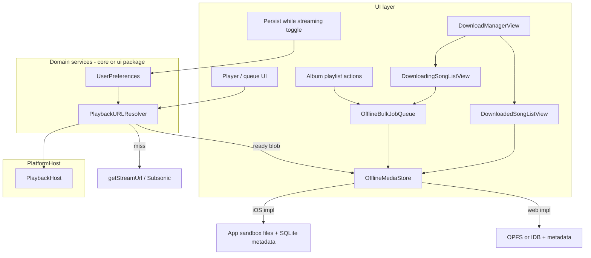

# Offline streaming and download architecture

## Product rules (from discussion)

- **Streaming is always the product default**; there is no “stream-only vs download-only” policy enum.
- **Local-first playback:** before loading the network stream URL, the app resolves a **ready** offline copy for the same logical track; if present, playback uses that source.
- **Persist while streaming:** a **boolean user preference** (stored in app settings / secure prefs). When enabled, the download pipeline writes the same bytes used for playback (or a parallel controlled fetch—see risks) into offline storage.
- **Bulk offline:** user actions to **download all tracks** in an album or playlist reuse the same storage and completion semantics as the toggle path.
- **Storage is opaque to UI:** components depend on a small core interface + a thin “facade” for status (downloading %, offline badge), not on IndexedDB/OPFS/SQLite/fs directly.
- **Keys:** `(serverKey, libraryId, trackId)` — align with existing `[LibraryCacheScope](packages/core/src/library/cacheScope.ts)` (`serverKey` from `serverAccountKey(serverUrl, username)`, `libraryId` = music folder). UI today often carries `serverId` (UUID); resolution must **map** `SavedServer` + `libraryId` → `libraryCacheScope(...)` the same way `[LibraryBrowser](packages/ui/src/components/LibraryBrowser.tsx)` builds `scope` for cache work.

## Why not the legacy Swift `*.cachecomplete` pattern

Legacy `[SongFileCache](legacy-swiftui-ios/AsMusic/Stores/SongFileCache.swift)` used a sibling empty file to mean “download finished” so partial files were never preferred for `AVPlayer`.

**Replacement:** (1) **write to a temp name** (e.g. `.partial` / `.tmp`) then **atomic rename** into the final blob path on the same volume; (2) a **metadata row** in `OfflineMediaStore` with `status: writing | ready | invalid`, `expectedBytes`, optional `etag`/`contentVersion`, `mimeType`, `byteLength`, `updatedAt`. **If the final blob exists and metadata says `ready`,** treat as complete—no sidecar files. Failed/cancelled writes delete temp files and mark metadata invalid.

## Architecture

**Playback resolution order** (single place, e.g. a `resolvePlaybackSource` used wherever `host.playback.loadUrl` will be called once the player exists):

1. Build `LibraryCacheScope` for the current track’s server + library.
2. `offline.getReadyPlaybackUrl(scope, trackId)` (or `get(scope)` returning a `blob:` / `file:` / Capacitor file URL) — **only** if metadata says `ready` and blob exists.
3. Else `getStreamUrl(serverId, trackId)` as today in `[ServerAndLibraryContext](packages/ui/src/contexts/ServerAndLibraryContext.tsx)`.
4. If “persist while streaming” is on, start/attach a **writer** that consumes the same byte source policy you choose (see below).

**Important implementation choice (document in code):** True “single HTTP connection” for simultaneous play+save on the web usually means **fetch + tee**, **Service Worker cache**, or **MSE**—`<audio src="https://…">` alone does not expose buffered bytes. The plan should pick one strategy for v1 (recommend: **explicit `fetch` streaming to storage** while playback still uses **stream URL** for v1 simplicity—accepts double fetch for “save while streaming” on web—or invest in **SW cache** early if double-fetch is unacceptable).

## `OfflineMediaStore` contract (new in `@asmusic/core`)

Define types next to `[LibraryCacheStorage](packages/core/src/library/storage/LibraryCacheStorage.ts)`:

- `**OfflineMediaKey`:\*\* `{ scope: LibraryCacheScope; trackId: string; variant?: string }` where `variant` encodes transcoding choice (bitrate/format) if Subsonic params can change bytes for the same `trackId`.
- **Methods (illustrative):** `getStatus(key)`, `delete(key)`, `deleteScope(scope)`, `deleteServerAccount(serverKey)` (mirror purge semantics of library cache), `importFromStream(key, readable, meta)`, `openReadableWhenReady(key)` / `getPlaybackObjectUrlWhenReady(key)` with explicit **revoke** contract to avoid blob URL leaks.
- **Metadata** lives in the store implementation (IDB object store and/or SQLite table `offline_media`), not in separate marker files.

Extend `[PlatformHost](packages/core/src/host/types.ts)` with `readonly offlineMedia: OfflineMediaStore`.

## Platform implementations

| Host                                                                                          | Blobs                                                                                                         | Metadata                                                                                                                                                                                                           |
| --------------------------------------------------------------------------------------------- | ------------------------------------------------------------------------------------------------------------- | ------------------------------------------------------------------------------------------------------------------------------------------------------------------------------------------------------------------ |
| **Web** (`[browserHost](packages/platform-web/src/browserHost.ts)`)                           | Prefer **OPFS** for large sequential files; acceptable v1 fallback is **IndexedDB** blobs if OPFS is deferred | Same DB as blobs or a dedicated `offline_meta` store                                                                                                                                                               |
| **iOS Capacitor** (`[iosCapacitorHost](packages/platform-capacitor/src/iosCapacitorHost.ts)`) | Files under Application Support (excluded from backup), same spirit as legacy `Documents/Music`               | Extend `[LibraryCacheSQLiteStore](ios/App/App/LibraryCacheSQLiteStore.swift)` **or** a sibling SQLite file with `(server_key, library_id, track_id, variant)` — follow existing `server_key` / `library_id` naming |

Bridge: new Capacitor plugin methods (or extend `AsmusicNative`) for **streamed binary IO** if JS cannot access the same paths native AVPlayer uses—**decide v1:** either (a) all offline audio consumed via **blob URLs** passed to native `loadUrl`, or (b) native-only file paths for iOS playback. (b) is closer to legacy performance; (a) is simpler cross-platform.

## Download Manager UI

Dedicated surface (e.g. **Settings → Downloads** or a tab in Settings) so offline content and active work are visible and manageable. Implement as **three** `packages/ui` views; none of them import storage directly—they use hooks/context that call `host.offlineMedia` and the **bulk queue** facade.

### `DownloadManagerView` (container)

- Hosts navigation between the two sub-views: **tabs** or **segmented control** (“Downloaded” | “Downloading”).
- Optional header: total offline storage used (aggregate from metadata / store `stat` API if added), link to system storage settings on native if ever needed.
- Entry point: router route + settings row.

### `DownloadedSongListView`

- **List** all tracks with `OfflineMediaStore` status `ready` for the current account scope (and optionally all active libraries—product choice: default to **union of active libraries** or a library picker).
- Each row: title, artist, album, library/server label, size, swipe or overflow **Delete** → `offlineMedia.delete(key)` and refresh list.
- **Empty state** when nothing is downloaded.
- **Enrichment:** rows need human-readable labels; resolve `trackId` + `scope` against **library cache** (`host.libraryCache.readSongList` / in-memory slice) so the list matches catalog metadata. If a song was removed from the server but still on disk, show stale row with “not in library” and still allow delete.

### `DownloadingSongListView` (bulk queue)

- Shows **current bulk offline task queue**: jobs enqueued from album/playlist actions (and optionally single-track retries).
- **View:** per-job source label (album name / playlist name), progress (N/M tracks, bytes optional), state (pending, running, paused, failed, completed).
- **Edit:** user actions the queue should support in v1 (define minimally):
  - **Cancel** a job or **cancel all**.
  - **Remove** pending items (not yet started).
  - **Retry** failed tracks or whole failed job.
  - **Reorder** pending jobs (move up/down) if the queue is ordered; if implementation is a single FIFO, document as “cancel + re-enqueue” instead of drag-reorder.
- Queue state lives in a **domain module** (e.g. `OfflineBulkJobQueue`) observable from React context—not in view-local state only—so album actions and this view stay in sync.

### `OfflineMediaStore` additions for UI

Consider extending the contract for efficient lists: e.g. `listReadyKeys(scope?)`, `listJobs()` on the queue type (not necessarily on `OfflineMediaStore`), so `DownloadedSongListView` does not call `getStatus` per known catalog song.

## Other UI / product hooks

- **Toggle:** persisted (e.g. `host.secureStorage` or a small prefs key); read in resolver / download coordinator only.
- **Album/playlist download:** domain service that expands children to keys, enqueues jobs with concurrency + cancel, updates status for list rows (facade reads `getStatus` / batched list); surfaces progress in `DownloadingSongListView`.
- **Library lists:** optional “offline” filter uses `getStatus` / indexed query—same concept as legacy “Downloaded” list but backed by metadata, not scanning for `cachecomplete`.

## Testing and migration

- Unit-test **key hashing** and **scope purge** (`deleteServerAccount` / `deleteScope`) against stray temp files.
- No migration from legacy `*.cachecomplete` required unless you re-share on-disk paths with the old app (unlikely for Capacitor greenfield).

## Suggested implementation order

1. **Core types + `OfflineMediaStore` interface + `PlatformHost` extension** — compile-only stubs with `throw` or no-op `delete*` for hosts not yet implemented.
2. **Web implementation** (metadata + blob/OPFS, atomic rename pattern) + minimal **fake player path** test: resolve URL for a seeded row.
3. **Wire `resolvePlaybackSource`** into whatever **player** entry point you add next (today `[PlaybackHost.loadUrl](packages/core/src/host/types.ts)` is only used from hosts; **UI player is not present** in `packages/ui` yet—this resolver becomes the mandatory prelude to `loadUrl`).
4. **iOS implementation** + plugin bridge + native playback URL when file-backed.
5. **Persist-while-streaming** + **bulk queue** + settings UI.
6. **Download Manager UI:** `DownloadManagerView` + `DownloadedSongListView` + `DownloadingSongListView`, router/settings entry, React context for queue observability.
