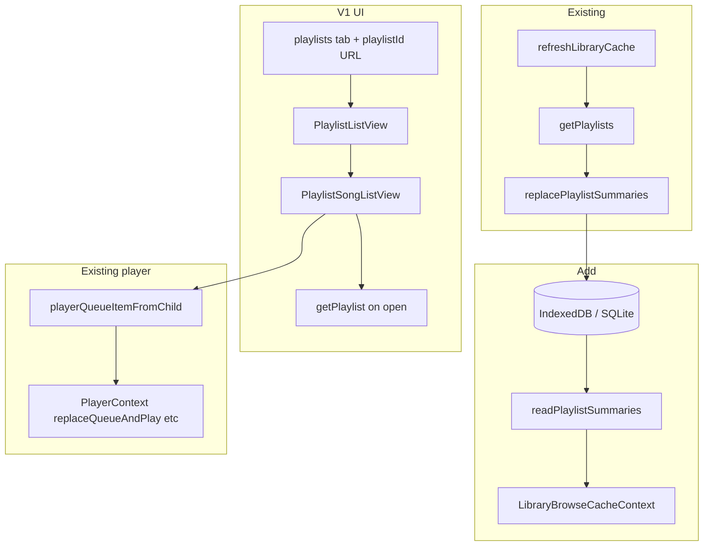

# Playlist feature (browse + play first)

## Goal

Port the legacy iOS playlist **browse and play** experience to the shared web/Capacitor UI. Server playlists remain distinct from the local **playback queue** (same split as legacy: playing a playlist copies track IDs into `PlayerManager`, it does not mutate the server playlist).

**V1 (your choice):** list cached summaries, open a playlist’s tracks, play / shuffle / queue actions.  
**V2 (deferred):** `createPlaylist`, `deletePlaylist`, `updatePlaylist`, library editor, reorder, “add to playlist” from the player sheet — reference `[legacy-swiftui-ios/AsMusic/Views/Library/LibraryView/PlaylistView/](legacy-swiftui-ios/AsMusic/Views/Library/LibraryView/PlaylistView/)`.

---

## Current state vs legacy


| Capability                       | Legacy iOS | New app today                                                                                                            |
| -------------------------------- | ---------- | ------------------------------------------------------------------------------------------------------------------------ |
| `getPlaylists` + cache summaries | Yes        | Yes — `[refreshLibraryCache.ts](packages/core/src/library/refreshLibraryCache.ts)` writes via `replacePlaylistSummaries` |
| Read summaries into UI           | Yes        | **No** — `LibraryCacheStorage` has write-only `replacePlaylistSummaries`                                                 |
| `getPlaylist` (tracks)           | Yes        | **No**                                                                                                                   |
| Browse / play UI                 | Yes        | **No** tab or views                                                                                                      |
| CRUD / edit                      | Yes        | Deferred (V2)                                                                                                            |


Summaries are already stored:

- Web: IndexedDB `playlists` store — `[indexedDbLibraryCacheStorage.ts](packages/platform-web/src/indexedDbLibraryCacheStorage.ts)`
- iOS: SQLite `library_playlists` — `[LibraryCacheSQLiteStore.swift](ios/App/App/LibraryCacheSQLiteStore.swift)`

Type today: `[LibraryPlaylistSummary](packages/core/src/library/storage/LibraryCacheStorage.ts)` `{ id, name, songCount }` (legacy also had `owner`, `duration`; optional to extend later for shared-playlist labeling).

**Naming note:** MUI `PlaylistAdd` in song lists means **“add all to queue”**, not Subsonic playlists. Do not repurpose it in V1; V2 should use a distinct icon (e.g. `PlaylistAddOutlined` vs `QueueMusic`) for “add to playlist.”

---

## Architecture (V1)




**Track resolution:** On playlist open, call `api.getPlaylist({ id })` (via existing `SubsonicAPI` from `[client.ts](packages/core/src/api/client.ts)`). Map `playlist.entry` / `Child[]` to `SongListEntry[]` by joining against cached songs in `LibraryBrowseCacheContext` when possible (for artwork, starred state, offline flags). Tracks missing from cache still play using `getPlaylist` payload fields (same approach as album views that mix API + cache).

**Multi-library:** When multiple active libraries are loaded, merge playlist rows across slices (like `albumCatalogRows`), each row carrying `serverId`, `libraryId`, and `scope`. Deep links use existing `lb1.` encoded refs in `[libraryNavigationUrl.ts](packages/ui/src/components/libraryNavigationUrl.ts)` — add `playlistId` query param analogous to `albumId`.

---

## Implementation plan

### 1. Core storage: read playlist summaries

Extend `[LibraryCacheStorage](packages/core/src/library/storage/LibraryCacheStorage.ts)`:

```ts
readPlaylistSummaries(scope: LibraryCacheScope): Promise<LibraryPlaylistSummary[]>;
```

Implement in:

- `[indexedDbLibraryCacheStorage.ts](packages/platform-web/src/indexedDbLibraryCacheStorage.ts)` — index query on `byScopePl`, sort by `name`
- `[LibraryCacheSQLiteStore.swift](ios/App/App/LibraryCacheSQLiteStore.swift)` — `SELECT` from `library_playlists` for scope
- `[capacitorIosSqliteLibraryCacheStorage.ts](packages/platform-capacitor/src/capacitorIosSqliteLibraryCacheStorage.ts)` + `[asmusicNativePlugin.ts](packages/platform-capacitor/src/asmusicNativePlugin.ts)` — new `libraryCacheReadPlaylistSummaries` bridge (mirror `readSongList` pattern)

Optional small helper in `@asmusic/core`:

- `refreshPlaylistSummariesOnly(api, storage, scope)` — extract playlist tail from `refreshLibraryCache` for lighter refresh after V2 CRUD (not required for V1).

### 2. Browse context: load summaries on boot

In `[LibraryBrowseCacheContext.tsx](packages/ui/src/contexts/LibraryBrowseCacheContext.tsx)`:

- On slice load (alongside `readSongList`), call `readPlaylistSummaries` per scope
- Expose `playlistCatalogRows` (sorted by name, with server/library labels when `multiLibrary`)
- After `runRefresh` / sync completes, reload summaries from disk (summaries already rewritten during sync)

Row type (UI-local or shared):

```ts
{ serverId, libraryId, scope, playlist: LibraryPlaylistSummary }
```

### 3. URL navigation + home tab

Update `[libraryNavigationUrl.ts](packages/ui/src/components/libraryNavigationUrl.ts)`:

- Add `'playlists'` to `LibraryBrowserTab`
- Add `playlistId` param; when set, `tab: 'playlists'` and `playlist: { id }` in `LibraryBrowserView`
- `parseLibraryBrowserView` / `mergeLibraryBrowserSearchParams` — same back-stack behavior as album/artist drill-down

Update `[useLibraryBrowserTabBar.ts](packages/ui/src/components/useLibraryBrowserTabBar.ts)` and `[HomePage.tsx](packages/ui/src/pages/HomePage.tsx)`:

- Fifth toggle: `QueueMusic` or `PlaylistPlay` icon, tooltip “Playlists”
- `selectTab('playlists')` clears `playlistId` when leaving detail

### 4. V1 UI components

`**PlaylistListView.tsx**` (new, under `packages/ui/src/components/`)

- Virtuoso list patterned after `[ArtistListView.tsx](packages/ui/src/components/ArtistListView.tsx)`
- Search/filter by name (legacy `[PlaylistView.swift](legacy-swiftui-ios/AsMusic/Views/Library/LibraryView/PlaylistView/PlaylistView.swift)`)
- Tap row → set `playlistId` in URL (encode with `encodeLibraryBrowserRef` when multi-library)
- Empty / error / loading states
- **No** create/delete toolbar in V1

`**PlaylistSongListView.tsx`** (new)

- On mount: `getPlaylist` for resolved scope + id; loading + error UI
- Reuse `[SongListView](packages/ui/src/components/SongListView.tsx)` for track rows and existing per-track actions (play now, play next, add to queue, star if cached)
- Header actions (legacy `[PlaylistSongView.swift](legacy-swiftui-ios/AsMusic/Views/Library/LibraryView/PlaylistView/PlaylistSongView.swift)`):
  - Play all → `replaceQueueAndPlay`
  - Shuffle → shuffle copy then `replaceQueueAndPlay`
  - Add all to queue → `appendToQueue` (existing `PlaylistAdd` icon is correct here)
- Back navigation via `PageCloseButton` / tab bar (same as album drill-down)

Wire in `[LibraryBrowser.tsx](packages/ui/src/components/LibraryBrowser.tsx)`:

```tsx
tab === 'playlists' && !playlistScope → <PlaylistListView … />
tab === 'playlists' && playlistScope → <PlaylistSongListView … />
```

### 5. Playback integration

No changes to queue persistence model. Use existing helpers:

- `[playerQueueItemFromChild.ts](packages/ui/src/player/playerQueueItemFromChild.ts)`
- `[PlayerContext](packages/ui/src/contexts/PlayerContext.tsx)` — `replaceQueueAndPlay`, `insertAfterCurrent`, `appendToQueue`

Map playlist entries the same way `[LibraryBrowser](packages/ui/src/components/LibraryBrowser.tsx)` maps cached `Child` rows for albums/songs.

### 6. Export / docs touchpoints

- Export new types/helpers from `[packages/core/src/index.ts](packages/core/src/index.ts)` if any core helpers are added
- Update `[apps/web/NOTE.md](apps/web/NOTE.md)` / `[ios/NOTE.md](ios/NOTE.md)` only if you document the new read API (optional)

---

## V2 backlog (CRUD — not in V1)

Mirror legacy API usage in `[AsNavidromeKit.swift](legacy-swiftui-ios/AsNavidromeKit/Sources/AsNavidromeKit/AsNavidromeKit.swift)`:


| Action            | API                        | Notes                                                                               |
| ----------------- | -------------------------- | ----------------------------------------------------------------------------------- |
| Create            | `createPlaylist({ name })` | Refresh summaries                                                                   |
| Delete            | `deletePlaylist({ id })`   | Remove from cache + navigate back                                                   |
| Add/remove tracks | `updatePlaylist`           | Remove indices **high → low**, then add each `songIdToAdd` (one request per change) |
| Editor UI         | `PlaylistEditorView.swift` | Checkbox against full cached library                                                |
| Player sheet      | `PlayerSheetView.swift`    | Pick playlist → add current track                                                   |


After mutations: call `refreshPlaylistSummariesOnly` or full library refresh; optionally persist playlist **entries** in cache (legacy `song_list_json`) for offline-open — not needed for V1.

**Offline:** `[OfflineBulkJobKind](packages/core/src/offline/OfflineBulkJobQueue.ts)` already includes `'playlist'`; wire `enqueuePlaylistDownload` in `[OfflineDownloadContext.tsx](packages/ui/src/contexts/OfflineDownloadContext.tsx)` after `getPlaylist` expands IDs — separate from playlist UI V1.

---

## Testing checklist (V1)

- Fresh library sync populates playlist list from cache (airplane mode after sync shows list)
- Single- and multi-library scopes show correct rows and deep links (`lb1.` refs)
- Open playlist loads tracks via `getPlaylist`; play / shuffle / queue-all work
- Tracks not in full library cache still play when returned by server
- iOS Capacitor: read path works through native SQLite bridge
- Web: IndexedDB read returns sorted summaries
- Tab/back navigation: list ↔ detail ↔ other tabs matches album/artist behavior

---

## Key reference files


| Area       | Legacy                                                                                                               | New (touch in V1)                                                                                |
| ---------- | -------------------------------------------------------------------------------------------------------------------- | ------------------------------------------------------------------------------------------------ |
| API models | `[Playlist.swift](legacy-swiftui-ios/AsNavidromeKit/Sources/AsNavidromeKit/Models/Playlist.swift)`                   | `subsonic-api` via `[client.ts](packages/core/src/api/client.ts)`                                |
| List UI    | `[PlaylistView.swift](legacy-swiftui-ios/AsMusic/Views/Library/LibraryView/PlaylistView/PlaylistView.swift)`         | `PlaylistListView.tsx`                                                                           |
| Detail UI  | `[PlaylistSongView.swift](legacy-swiftui-ios/AsMusic/Views/Library/LibraryView/PlaylistView/PlaylistSongView.swift)` | `PlaylistSongListView.tsx`                                                                       |
| Sync       | `[LibrarySongFetchSupport.swift](legacy-swiftui-ios/AsMusic/Stores/LibrarySongFetchSupport.swift)`                   | `[refreshLibraryCache.ts](packages/core/src/library/refreshLibraryCache.ts)`                     |
| Pattern    | Favorites tab plan                                                                                                   | `[favorites_star_parity_6752ebad.plan.md](.cursor/plans/favorites_star_parity_6752ebad.plan.md)` |


