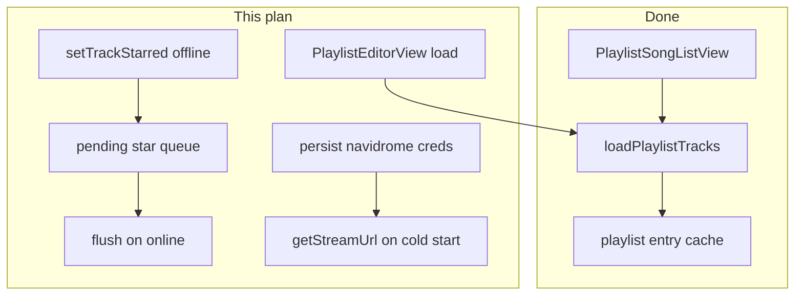
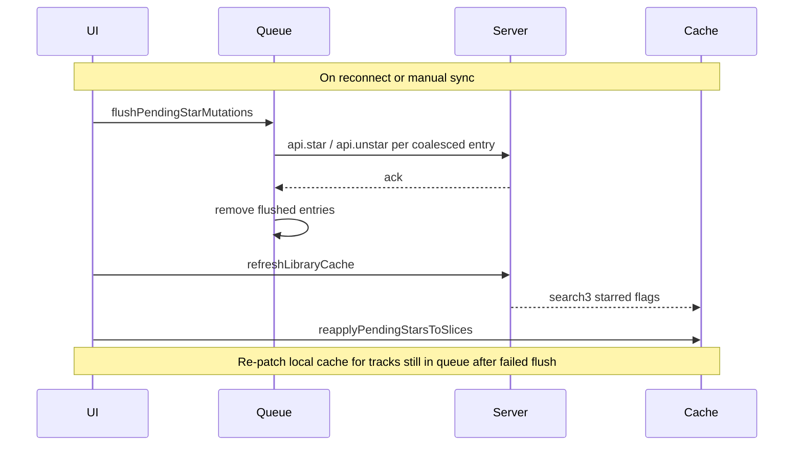

# Offline high-priority fixes

## Already done (retro)

Server playlist **browse + play** offline was fixed in commit `0a1a2c0`:

- Entry track IDs cached during sync (`refreshPlaylistCacheForScope`) and on successful open
- [`loadPlaylistTracks`](packages/core/src/library/loadPlaylistTracks.ts) tries `api.getPlaylist`, falls back to `readPlaylistEntryTrackIds` + cached songs
- Storage on web (IndexedDB `playlistTrackLists`) and iOS (`library_playlist_tracks`)
- UI wired in [`PlaylistSongListView`](packages/ui/src/views/home/library/detail/PlaylistSongListView.tsx)

**Requirement for offline use:** library must have been synced or playlist opened once while online so entry IDs exist in cache.

---

## Remaining high-priority gaps



| Gap             | Current behavior                                                                                                   | Target                                                       |
| --------------- | ------------------------------------------------------------------------------------------------------------------ | ------------------------------------------------------------ |
| Playlist editor | Live `api.getPlaylist` in [`PlaylistEditorView`](packages/ui/src/views/home/library/detail/PlaylistEditorView.tsx) | Load membership from cache; save still server-only           |
| Star / unstar   | [`setTrackStarred`](packages/ui/src/contexts/LibraryBrowseCacheContext.tsx) always calls `api.star` / `api.unstar` | Optimistic local patch + queue; flush when online            |
| Stream creds    | [`navidromeSession`](packages/ui/src/contexts/ServerAndLibraryContext.tsx) only in memory; lost on cold start      | Persist token/salt in secure storage; restore before network |

---

## 1. Shared offline utilities

Add a small UI hook [`packages/ui/src/shared/useNetworkStatus.ts`](packages/ui/src/shared/useNetworkStatus.ts):

- `isOnline` from `navigator.onLine` + `window` `online` / `offline` listeners
- Used by editor save gating and star flush trigger

No new context required unless multiple distant consumers need it later.

---

## 2. Playlist editor offline load

**Core:** extend [`LoadPlaylistTracksResult`](packages/core/src/library/loadPlaylistTracks.ts) with `entryTrackIds: string[]` (full server order, not filtered to cached songs). Populate from live `getPlaylist` response or `readPlaylistEntryTrackIds`.

**UI:** update [`PlaylistEditorView`](packages/ui/src/views/home/library/detail/PlaylistEditorView.tsx):

- Add props: `scope: LibraryCacheScope`, `storage: LibraryCacheStorage` (via `useHost()` or passed from [`LibraryBrowser`](packages/ui/src/views/home/library/LibraryBrowser.tsx))
- Replace inline `api.getPlaylist` with `loadPlaylistTracks`
- Initialize editor state from `entryTrackIds`:
  - `originalEntryIds` = `entryTrackIds`
  - `selectedIds` / `originalIds` = `new Set(entryTrackIds)`
  - `songs` = `allCachedSongsSorted(cachedSongs)` (unchanged picker UX)
- When `fromCache === true` **or** `!isOnline`:
  - Disable **Done/Save** button
  - Show short read-only banner (new i18n key, all locales in [`packages/i18n`](packages/i18n/src/messages/))

**Wire scope:** extend server `PlaylistEditorTarget` in [`useLibraryBrowserPlaylists.tsx`](packages/ui/src/views/home/library/browser/useLibraryBrowserPlaylists.tsx) with `scope` from `resolvedPlaylist.slice.scope`.

Saving (`onSave` → `updatePlaylistMembership`) remains online-only by design.

---

## 3. Star / unstar offline (optimistic + deferred sync)

### Multi-device conflict policy

Subsonic favorites are **account-scoped on the server** — there is no per-device star state on Navidrome. Multiple apps/devices sharing one account therefore share one server truth. The offline queue holds **this device’s intent**, not a global lock.

**Across devices (server last-write-wins):**

| Scenario                                                        | Resolution                                                                                          |
| --------------------------------------------------------------- | --------------------------------------------------------------------------------------------------- |
| Device A stars offline, Device B unstars online, then A flushes | A’s flush calls `api.star` → server ends starred (A’s flush timestamp wins over B if it runs later) |
| Both devices flush opposite intents                             | Whichever `api.star` / `api.unstar` reaches the server **last** wins — standard Subsonic LWW        |
| Both devices star the same track offline                        | Idempotent; server stays starred                                                                    |

No conflict dialog in v1 — same as iTunes/Spotify-style favorites without CRDTs. Acceptable for low-stakes metadata.

**On this device (queue coalescing — required):**

The queue must **collapse multiple pending ops for the same track** before flush:

```ts
// Key: `${serverId}|${libraryId}|${trackId}` → latest starred boolean
```

Example: star → unstar → star offline before reconnect → queue holds one entry: `{ starred: true }`.

**Sync vs pending queue (required — avoids the real bug):**

Library refresh (`refreshLibraryCache` / `search3`) pulls server `starred` and overwrites local cache. Without care, a sync while the queue is non-empty would **wipe offline stars from the UI** even though the user still intends to push them.

Ordered reconciliation:



1. **Flush first** — apply coalesced queue to server while online
2. **Sync second** — `refreshLibraryCache` pulls authoritative server flags
3. **Re-apply pending to slices** — for entries that failed flush or remain queued, call `applyLocalStarState` again so this device’s UI reflects **local intent** until the next successful flush

After a successful flush + sync, server and all devices converge on the same starred set (modulo races where another device writes in between steps 1 and 2 — next sync on any device fixes it).

**What we explicitly do not build (out of scope):**

- Vector clocks / CRDT merge for stars
- “Server vs local” conflict prompts
- Per-library device registration for star sync (device API is unrelated to Subsonic stars)

---

**Core:** add [`packages/core/src/library/pendingStarMutations.ts`](packages/core/src/library/pendingStarMutations.ts):

```ts
export type PendingStarMutation = {
  serverId: string;
  libraryId: string;
  trackId: string;
  starred: boolean;
  queuedAt: number; // ms; used for ordering coalesced entries and debugging
};
```

Helpers:

- `coalescePendingStarMutations(queue)` — latest per track key wins
- `serialize` / `deserialize` for secure storage key `asmusic-pending-star-mutations-v1`

**UI:** refactor [`setTrackStarred`](packages/ui/src/contexts/LibraryBrowseCacheContext.tsx):

1. Extract existing optimistic `patchSong` + `setSlices` into `applyLocalStarState(...)` (reuse for both paths)
2. **If online:** current flow — API first, then local patch on success
3. **If offline:** apply local patch immediately, **coalesce** into pending queue, persist queue to secure storage
4. Add `flushPendingStarMutations()`:
   - Coalesce queue, then for each entry: `api.star` / `api.unstar`, remove on success
   - On failure, keep in queue for next retry
5. Add `reapplyPendingStarsToSlices()` — after sync, patch slice rows for tracks still in queue
6. Call flush from:
   - `useNetworkStatus` `online` event (in provider `useEffect`)
   - **Start of `runRefresh`** (before `refreshLibraryCache`)
7. Call `reapplyPendingStarsToSlices` at **end of `runRefresh`** (success path)

Player full-screen favorites ([`usePlayerFullScreenTrackActions`](packages/ui/src/player/fullScreen/usePlayerFullScreenTrackActions.ts)) already delegates to `setTrackStarred` — no separate change needed.

---

## 4. Persist Navidrome stream credentials

In [`ServerAndLibraryContext.tsx`](packages/ui/src/contexts/ServerAndLibraryContext.tsx):

- Add `streamCredsStorageKey(serverId)` → `asmusic-server-stream-creds-${serverId}`
- **`hydrateNavidrome`:** on `navidromeSession()` success, persist `{ subsonicToken, subsonicSalt }` to secure storage; on failure, load persisted creds into `navidromeByServerRef` if present (do not overwrite good in-memory creds)
- **Server restore effect:** after loading servers list, preload persisted creds per server into `navidromeByServerRef` before/alongside warm `getApiForServer` loop
- **`removeServer`:** also `secureStorage.remove(streamCredsStorageKey(id))`
- **`invalidateApiCache`:** keep creds unless password changes (on `updateServer` with new password, clear stream creds and re-hydrate)

**Outcome:** `getStreamUrl` / `getCoverArtUrl` return URLs on cold start after a prior online session. Actual streaming still requires network unless an offline copy exists — but downloads / persist-while-streaming no longer silently enqueue zero tracks due to missing creds.

---

## 5. i18n

Add keys (en-US + es-ES, ja-JP, zh-CN, zh-TW):

- `library.playlist.editor.offlineReadOnly` — editor is view-only offline
- `library.favorites.offlineQueued` (optional toast/snackbar on offline star) — brief confirmation that change will sync later

---

## 6. Docs

Update [`doc/features/playlist.md`](doc/features/playlist.md) “Implemented vs gaps”:

- Move “cached playlist entries” from deferred → implemented
- Note editor is read-only offline; save requires network

---

## Out of scope (medium/low from audit)

- Uncached cover art network fetch
- Player “refresh cover art” action
- Library sync / playlist CRUD (expected online-only)
- Streaming without offline download when never online since install

---

## Verification

Manual test matrix:

1. **Playlist detail offline** — open synced playlist, airplane mode, tracks list + play (already fixed)
2. **Playlist editor offline** — open editor, membership loads from cache, Save disabled
3. **Star offline** — star a track, appears in Favorites tab; go online, confirm server reflects change after flush
4. **Multi-device star** — Device A stars offline; Device B unstars same track online; A reconnects → document expected LWW; same device star→unstar→star offline → only final intent flushed
5. **Cold start creds** — use app online once, force-quit, relaunch offline, confirm `getStreamUrl` is non-null (e.g. start a bulk download job shows tracks queued, not empty)

Optional unit test: `loadPlaylistTracks` cache fallback when `getPlaylist` throws (mock storage + api).
