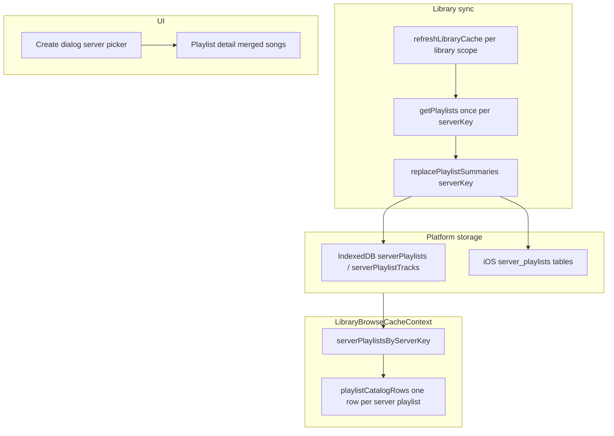

# Server playlists per account

## Problem

Subsonic playlists are **per server account**, but the app cached them under each `(serverKey, libraryId)` scope. That caused:

- Duplicate playlist rows when multiple libraries on one server were active (papered over with catalog dedupe)
- A misleading **library picker** on create (“which library should own the playlist?”)
- Redundant `getPlaylists` fetches during sync (once per active library on the same server)
- Playlists deleted when `deleteScope` cleared one music folder

## Goal

- Cache playlists under **`serverKey` only** (one copy per account)
- Keep songs, artwork, and offline media **per library scope**
- Create dialog: **server picker** when multiple servers are active; no library picker
- Playlist detail/editor: merged song cache across all active libraries on that server
- Per-track scope resolution for artwork, starring, and queue items

## Architecture (after)

## Key changes

### Core (`packages/core`)

| File | Change |
|------|--------|
| `cacheScope.ts` | `ServerPlaylistScope = { serverKey }` |
| `LibraryCacheStorage.ts` | Playlist methods take `ServerPlaylistScope` |
| `playlistMutations.ts` | `refreshPlaylistCacheForServer`; deprecate per-scope name |
| `loadPlaylistTracks.ts` | `serverKey` instead of full `LibraryCacheScope` |
| `refreshLibraryCache.ts` | No longer refreshes playlists |

### Storage

| Platform | Migration |
|----------|-----------|
| Web IndexedDB | v6: new stores, dedupe migrate, `deleteScope` skips playlists |
| iOS SQLite | v5: `server_playlists` / `server_playlist_tracks`, drop legacy tables |

### UI

| Area | Change |
|------|--------|
| `LibraryBrowseCacheContext` | `serverPlaylistsByServerKey`, `multiServer`; mutations drop `libraryId` |
| `PlaylistListViewCreateDialog` | Server selector when `multiServer` |
| `libraryNavigationUrl.ts` | `lp1.` encode/decode for `{ serverKey, id }` |
| `useLibraryBrowserResolvedScopes` | Server playlist resolves merged `cachedSongs` + `findTrackScope` |
| `PlaylistSongListView` | Per-track artwork scope; `serverKey` for cache reads |

## Deep links

| Ref prefix | Payload | When used |
|------------|---------|-----------|
| `lp1.` | `{ serverKey, id }` | Multiple servers active |
| `lb1.` | `{ serverKey, libraryId, id }` | Legacy playlist URLs (still resolves) |
| raw id | playlist id | Single server |

## Test matrix

| Scenario | Expected |
|----------|----------|
| Two libraries, same server | One playlist list; one sync fetch per server |
| Create server playlist, multi-library same server | No picker; playlist appears once |
| Create with two servers | Server picker shown |
| `deleteScope` one library | Playlists preserved |
| Playlist track in library B | Resolves from merged cache; correct per-track scope for artwork |
| Legacy `lb1.` bookmark | Still opens playlist |

## Related

- Prior plan: `media-library/2026-05-17T16-03-11-playlist_feature_parity_9362e259.plan.md`
- Product notes: `NOTE.md`, `doc/features/playlist.md`
- Fixes duplicate playlist display issue (#27 follow-up)
