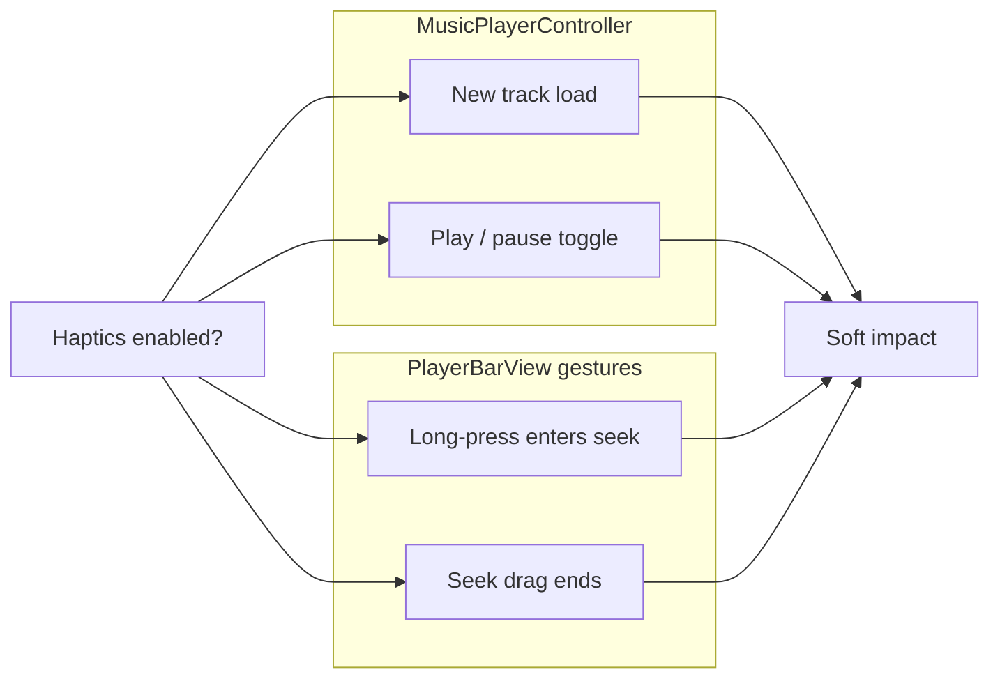

# Native haptic feedback (iOS / Android)

## Current state

| Area | Status |
|------|--------|
| Settings toggle | Exists in [`packages/ui/src/pages/UserExperienceView.tsx`](packages/ui/src/pages/UserExperienceView.tsx) with placeholder copy |
| Preference storage | [`packages/ui/src/preferences/hapticFeedbackPreference.ts`](packages/ui/src/preferences/hapticFeedbackPreference.ts) — persisted in `localStorage`, **defaults off** when unset (`=== '1'`) |
| Native playback | Wired via [`PlatformHost`](packages/core/src/host/types.ts) / [`iosCapacitorHost`](packages/platform-capacitor/src/iosCapacitorHost.ts) |
| Haptic calls | **None** in the new React player or gestures |
| Android shell | Not shipped yet ([`android/NOTE.md`](android/NOTE.md)); only iOS Capacitor host is selected in [`createPlatformHost`](packages/shell/src/createPlatformHost.ts) |

## Legacy parity (reference)

[`legacy-swiftui-ios/AsMusic/AppHaptics.swift`](legacy-swiftui-ios/AsMusic/AppHaptics.swift) uses `UIImpactFeedbackGenerator` with **`.soft`** style, gated by `app.feedback.haptics.enabled` (default **on**).

Trigger points:



## Recommended approach

Use the official **[`@capacitor/haptics`](https://capacitorjs.com/docs/apis/haptics)** plugin rather than extending [`AsmusicNativePlugin`](packages/platform-capacitor/src/asmusicNativePlugin.ts):

- iOS: maps to `UIImpactFeedbackGenerator` (`ImpactStyle.Light` ≈ legacy `.soft`)
- Android: uses the system vibrator when the Android Capacitor project is added — no custom Kotlin in this task
- Web / browser host: no-op (same as legacy `#else` stub)

Expose haptics through **`PlatformHost`** so UI stays platform-agnostic and Android later reuses the same path:

```typescript
// packages/core/src/host/types.ts
export type HapticsHost = {
  impact(style?: 'light' | 'medium' | 'heavy'): Promise<void>;
};

export type PlatformHost = {
  // ...existing fields
  readonly haptics: HapticsHost;
};
```

Implementations:

- [`packages/platform-web/src/browserHost.ts`](packages/platform-web/src/browserHost.ts) — empty `impact()`
- [`packages/platform-capacitor/src/iosCapacitorHost.ts`](packages/platform-capacitor/src/iosCapacitorHost.ts) — `Haptics.impact({ style: ImpactStyle.Light })` with swallowed errors

Add a small UI helper:

```typescript
// packages/ui/src/haptics/playImpactIfEnabled.ts
export function playImpactIfEnabled(host: PlatformHost): void {
  if (!getHapticFeedbackEnabled()) return;
  void host.haptics.impact('light');
}
```

## Call sites (match legacy)

| Event | File | Where |
|-------|------|--------|
| New track starts loading | [`PlayerManager.ts`](packages/ui/src/player/PlayerManager.ts) | Start of `loadCurrentTrack` after validation, before `loadUrl` (mirrors legacy `load` after `tearDownPlayer`) |
| Play / pause toggle | [`PlayerManager.ts`](packages/ui/src/player/PlayerManager.ts) | Start of `togglePlayPause` when queue is non-empty |
| Mini bar enters seek mode | [`usePlayerMiniBarLegacyGestures.ts`](packages/ui/src/player/usePlayerMiniBarLegacyGestures.ts) | Inside long-press `setTimeout` when phase becomes `'seeking'` |
| Mini bar seek commit | same file | `onPointerUp` when `phase === 'seeking'`, before final `seek()` |

Wire gestures by passing `host` from [`PlayerMiniBar.tsx`](packages/ui/src/player/PlayerMiniBar.tsx) (`useHost()`) into the hook options, or pass `playImpactIfEnabled: () => playImpactIfEnabled(host)` to keep the hook free of context.

**Out of scope for v1:** haptics on skip carousel, favorite taps, list rows, etc. (legacy did not use them there).

**Optional small gap (not required for haptics task):** legacy also fires haptic when seek mode is entered via drag after hold time ([`tryEnterSeekModeIfLongPressElapsed`](legacy-swiftui-ios/AsMusic/Views/PlayerView/PlayerBarView/PlayerBarView.swift)); the React hook only enters seek via the timer. Can add the same haptic + phase transition in `onPointerMove` in a follow-up if gesture parity is desired.

## Preference default (parity fix)

Change [`hapticFeedbackPreference.ts`](packages/ui/src/preferences/hapticFeedbackPreference.ts) to **opt-out** like legacy:

- Treat unset / missing key as **enabled**
- Persist `'0'` when user turns off, `'1'` when on (or keep current encoding but invert read logic: `getItem !== '0'`)

Update [`UserExperienceView.tsx`](packages/ui/src/pages/UserExperienceView.tsx): remove the “Placeholder — native haptics are not wired up yet” caption.

## Dependencies and native sync

1. Add `@capacitor/haptics` (match existing Capacitor `^8.3.4`) to:
   - [`apps/web/package.json`](apps/web/package.json) — required for `cap sync` to register the native plugin
   - [`packages/platform-capacitor/package.json`](packages/platform-capacitor/package.json) — implementation import site
2. Run `pnpm install` and `pnpm --filter asmusic-web cap:sync` so iOS picks up the plugin.

No Swift changes to [`AsmusicNativePlugin.swift`](ios/App/App/AsmusicNativePlugin.swift) unless we later need custom haptic styles beyond Capacitor’s API.

## Android readiness

When Android Capacitor is added:

- Extend [`createPlatformHost`](packages/shell/src/createPlatformHost.ts) to return the same capacitor host (or an `androidCapacitorHost` sharing the haptics implementation)
- `cap sync android` — `@capacitor/haptics` registers automatically

No additional haptic code should be needed in the UI layer.

## Testing

- **iOS device/simulator:** Settings → User experience → toggle haptics off/on; verify impact on play/pause, track change, mini-bar long-press seek, seek release
- **Web dev:** no vibration; toggle still persists
- **Toggle off:** no haptics at any trigger site
