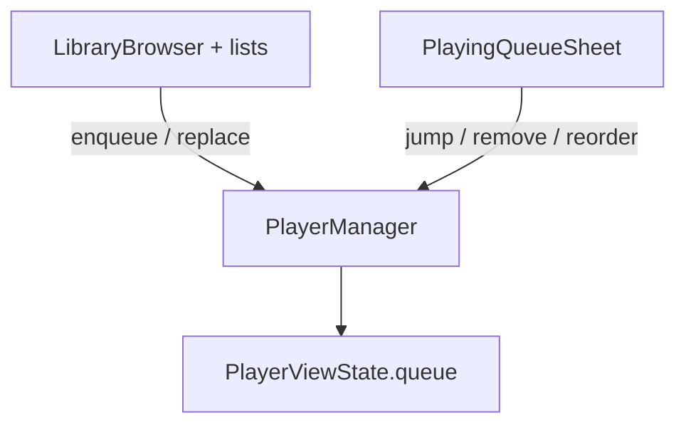

# Now Playing queue

## Legacy reference

- [`legacy-swiftui-ios/AsMusic/Managers/MusicPlayerController+Queue.swift`](legacy-swiftui-ios/AsMusic/Managers/MusicPlayerController+Queue.swift) — append, insert after current, jump, remove, move, duplicate, clear/shuffle/loop.
- [`legacy-swiftui-ios/AsMusic/Models/NowPlayingQueueItem.swift`](legacy-swiftui-ios/AsMusic/Models/NowPlayingQueueItem.swift) — `rowId` vs track id.
- [`legacy-swiftui-ios/AsMusic/Views/PlayerView/PlayingQueueSheetView.swift`](legacy-swiftui-ios/AsMusic/Views/PlayerView/PlayingQueueSheetView.swift) — queue list UI patterns.

## Architecture (current → target)

## Core implementation (unchanged intent)

1. **Types:** Add `rowId: string` to `PlayerQueueItem` in [`packages/ui/src/player/types.ts`](packages/ui/src/player/types.ts); set in [`packages/ui/src/player/playerQueueItemFromChild.ts`](packages/ui/src/player/playerQueueItemFromChild.ts) (e.g. `crypto.randomUUID()`).

2. **PlayerManager** ([`packages/ui/src/player/PlayerManager.ts`](packages/ui/src/player/PlayerManager.ts)): `appendToQueue`, `insertAfterCurrent` (with optional “play first inserted”), `playQueueIndex`, `removeQueueIndex`, `moveQueueItem`, `duplicateQueueItemToEnd`. Mirror legacy index rules when removing the current row; on empty queue align with existing teardown (pause, revoke).

3. **PlayerContext** ([`packages/ui/src/contexts/PlayerContext.tsx`](packages/ui/src/contexts/PlayerContext.tsx)): expose new actions; optional `queueSheetOpen` + open/close.

4. **Queue UI:** New drawer/sheet component under `packages/ui/src/player/`; entry from [`PlayerFullScreen`](packages/ui/src/player/PlayerFullScreen.tsx) toolbar; optional mini-bar when queue non-empty.

5. **Library wire-up:** [`SongItem`](packages/ui/src/components/SongItem.tsx) + [`LibraryBrowser`](packages/ui/src/components/LibraryBrowser.tsx) + album/artist/song list views — callbacks for play next / add to queue (and keep tap-to-play as today).

**Out of scope v1:** queue persistence; shuffle/loop/clear-except-current toolbar parity (optional follow-up).

---

## SongItem action buttons: Electron/web vs mobile/tablet

Optimize **affordance and hit targets** by **interaction mode**, not by building separate Electron-only bundles. One `SongItem` implementation branches on a small hook-derived mode.

### Detection heuristic (recommended)

Add e.g. `useSongRowInteractionMode()` in `packages/ui/src/hooks/` (or colocate under `components/`):

- **`touch` mode** when **any** of:
  - `(pointer: coarse)` — phones, many tablets, touch laptops used with finger.
  - **Native shell:** `Capacitor.getPlatform() !== 'web'` (iOS/Android always use touch patterns), consistent with existing [`AboutView.tsx`](packages/ui/src/pages/AboutView.tsx) usage of `@capacitor/core`.
  - Optional tightening: `useMediaQuery(theme.breakpoints.down('sm'))` **and** coarse pointer, if you want tablets in landscape to use desktop density — tune in QA.

- **`desktop` mode** otherwise — includes **Electron + browser on mouse/trackpad** (`pointer: fine` + web).

Document the rules in a one-line comment above the hook so future changes do not regress Electron.

### UX by mode

| Concern | Desktop / Electron / web (fine pointer) | Mobile / tablet / native (touch) |
|--------|-------------------------------------------|-------------------------------------|
| Discoverability | Hover-reveal trailing actions: compact icon buttons (e.g. “play next”, “add to queue”) + optional `MoreVert` for overflow; avoids extra click for common actions. | **No hover-only UI.** Always show a single trailing **overflow** `IconButton`, or **always-visible** 1–2 primary icons if layout fits; minimum **44×44** touch target (`theme.spacing` / `minWidth` / `minHeight`). |
| Density | Secondary actions can sit in `ListItemSecondaryAction` with `opacity` 0 → 1 on row `:hover`. | Full opacity; consider **one** menu entry point to reduce accidental taps on the main row (play). |
| Gestures | Optional **right-click** `Menu` (same items as overflow) — natural on Electron/desktop web. | Optional **long-press** opens **MUI `Menu`** anchored to row or a **bottom-aligned** action sheet pattern for thumb reach; align with HIG/Material large touch zones. |
| Play vs queue | Row tap / primary click = play (current behavior). Queue actions only via icons/menu so we do not change play affordance. | Same; ensure `touch-action` / list scrolling: use `onClick` for play; use **stopPropagation** on menu button so opening menu does not start play. |

### Implementation notes

- Implement mode-specific layout **inside** [`SongItem.tsx`](packages/ui/src/components/SongItem.tsx) (or extract `SongItemActions.tsx` for readability) driven by `interactionMode` prop from parent **or** the hook inside `SongItem` (prefer prop injection for testability: `<SongItem interactionMode="touch" />` in tests).
- Use MUI `sx` with `'@media (pointer: fine)'` only if you prefer CSS-only hover reveal without JS hook; still keep **Capacitor native** forcing touch layout via prop from a parent that reads `Capacitor.getPlatform()`.
- **Tablet edge case:** `pointer: coarse` + wide width → still use touch rules (large targets); optional future “compact touch” breakpoint is not required for v1.

### Testing

- Manual: Electron window, desktop browser, iOS/Android builds, and a narrow browser window with DevTools device emulation (coarse pointer).
- Verify: hover-only icons never the **only** path to queue actions on touch; queue actions reachable with one obvious control on native.
