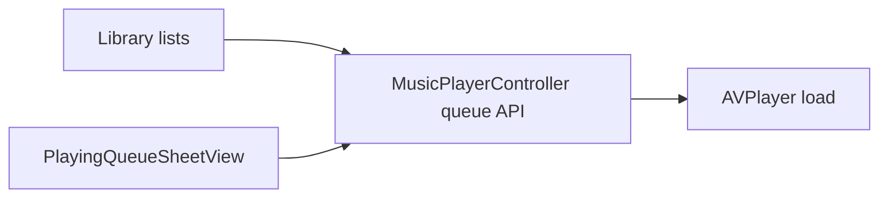

# Now Playing queue: legacy vs new codebase

## What the legacy app does (reference)

The SwiftUI app treats the queue as **rows** (`rowId` + Subsonic `id`) so the same track can appear twice and reorder still tracks “what is playing” by row ([`legacy-swiftui-ios/AsMusic/Models/NowPlayingQueueItem.swift`](legacy-swiftui-ios/AsMusic/Models/NowPlayingQueueItem.swift)).

**Queue mutations** live in [`legacy-swiftui-ios/AsMusic/Managers/MusicPlayerController+Queue.swift`](legacy-swiftui-ios/AsMusic/Managers/MusicPlayerController+Queue.swift): jump, replace queue, insert after current (play or not), append, **duplicate row to end**, **move row to play next**, **remove row** (with correct index/teardown when empty), **reorder** (`moveQueue`), **clear except current**, **reshuffle preserving current row**, and skip next/prev that **wrap when `loopCurrentQueue`**.

**Loop single track** is handled in playback advance logic ([`legacy-swiftui-ios/AsMusic/Managers/MusicPlayerController+Core.swift`](legacy-swiftui-ios/AsMusic/Managers/MusicPlayerController+Core.swift)) alongside queue loop.

**In-app queue UI** ([`legacy-swiftui-ios/AsMusic/Views/PlayerView/PlayingQueueSheetView.swift`](legacy-swiftui-ios/AsMusic/Views/PlayerView/PlayingQueueSheetView.swift)): empty state; list with title/artist; **tap row = jump**; **swipe** = play next / add to queue (duplicate) / delete; **long-press** activates reorder (with hidden system reorder grip); **scroll-to-current** (UIKit workaround for huge lists); toolbar = **shuffle**, **loop queue**, **loop song**, **clear queue** (confirm: drop all but current). Title: “Now Playing”.

**Persistence**: full queue + index + loop flags saved/restored ([`legacy-swiftui-ios/AsMusic/Managers/MusicPlayerController+Persistence.swift`](legacy-swiftui-ios/AsMusic/Managers/MusicPlayerController+Persistence.swift), [`MusicPlayerController.swift`](legacy-swiftui-ios/AsMusic/Managers/MusicPlayerController.swift) for loop `UserDefaults` keys).

## What the new codebase already has

| Area | Status |
|------|--------|
| `PlayerQueueItem.rowId` + metadata snapshot | Done — [`packages/ui/src/player/types.ts`](packages/ui/src/player/types.ts), [`playerQueueItemFromChild.ts`](packages/ui/src/player/playerQueueItemFromChild.ts) |
| `PlayerManager`: `replaceQueueAndPlay`, `appendToQueue`, `insertAfterCurrent`, `playQueueIndex`, skip prev/next | Done — [`packages/ui/src/player/PlayerManager.ts`](packages/ui/src/player/PlayerManager.ts) |
| Shell: full player + mini bar open queue drawer | Done — [`PlayerFullScreen.tsx`](packages/ui/src/player/PlayerFullScreen.tsx), [`PlayerMiniBar.tsx`](packages/ui/src/player/PlayerMiniBar.tsx), [`PlayerChrome.tsx`](packages/ui/src/player/PlayerChrome.tsx) |
| Queue drawer: list + empty copy + tap-to-play | Partial — [`packages/ui/src/player/PlayingQueueSheet.tsx`](packages/ui/src/player/PlayingQueueSheet.tsx) (plain `List` today; **must migrate to `Virtuoso`** for long queues; title “Queue”, no row actions / toolbar yet) |
| Library enqueue | Mostly done — [`LibraryBrowser.tsx`](packages/ui/src/components/LibraryBrowser.tsx) passes play-next / append for **songs tab**, **album track list**, **artist all-songs**; [`SongItem.tsx`](packages/ui/src/components/SongItem.tsx) uses overflow menu |
| `PlayerContext` actions | Matches current `PlayerManager` surface — [`packages/ui/src/contexts/PlayerContext.tsx`](packages/ui/src/contexts/PlayerContext.tsx) |

## Gaps vs legacy (priority order)

1. **Queue sheet UX parity** — No remove / play-next / duplicate-from-row; no reorder; no shuffle / loop queue / loop song / clear-except-current; no scroll-to-current. List is a plain MUI `map` today; it must become **virtualized** (see gap 4).
2. **`PlayerManager` APIs** — Missing: `removeQueueIndex`, `moveQueueRange` (or `moveQueueItem` + reorder), `duplicateQueueIndexToEnd`, `moveQueueIndexToPlayNext` (same semantics as legacy), `clearQueueExceptCurrent`, `reshuffleQueuePreservingCurrent`. These should mirror legacy index rules when removing the **current** row (reload next/prev or teardown if empty).
3. **Repeat / loop behavior** — New `skipNext` / `handlePlaybackEnded` do **not** wrap at end of queue and there is **no** “repeat one track”. Legacy toggles are persisted; new app needs `loopQueue` + `loopOne` (names TBD) on the manager, reflected in `PlayerViewState` if the UI toggles them, and wired into `skipNext`, `skipPrevious`, and end-of-track advance (and optionally `seek(0)` for repeat-one when the track ends—match legacy `MusicPlayerController+Core` behavior).
4. **Large-queue performance (required)** — Render the queue with **`react-virtuoso`** (`Virtuoso`), not an unbounded MUI `List` map. Reuse the same building blocks as library lists: [`LibraryVirtuosoFill`](packages/ui/src/components/LibraryVirtuosoFill.tsx) so the drawer body gets a definite height in flex layouts (iOS WebKit), [`VirtuosoMuiList`](packages/ui/src/components/virtuosoMuiList.tsx) as `components.List`, and optionally the same `Scroller` + ref merge approach as [`useLibraryVirtuosoScroller`](packages/ui/src/components/useLibraryVirtuosoScroller.tsx) if you need a single scroll parent for gestures. Use **`itemContent={(index) => …}`** with stable keys derived from `queue[index].rowId`; **`scrollToIndex`** when opening the sheet or when `currentIndex` changes to keep the playing row visible. Dynamic row height is fine (Virtuoso’s default); fixed `defaultItemHeight` can be tuned later if profiling shows jank.
5. **Queue persistence (optional phase 2)** — Serialize queue rows + `currentIndex` + loop flags (e.g. `localStorage` / Capacitor preferences) and rehydrate on app launch; align with how offline/server scope is represented in `PlayerQueueItem` so restore does not point at wrong library.

## Suggested implementation plan

### Phase A — `PlayerManager` + context (behavior foundation)

- Add methods listed in gap (2), each calling `ensureQueueRowIds` where new rows are created (duplicate), and when reordering **re-resolve `currentIndex` by `rowId`** of the playing row (same invariant as legacy `moveQueue`).
- Extend `PlayerViewState` with `loopQueue: boolean` and `loopOne: boolean` (or reuse legacy naming); implement toggle methods and persistence keys only if you want parity with legacy’s remembered loop flags (can default to `false` + no persist in v1).
- Update `skipNext`, `skipPrevious`, and `handlePlaybackEnded` to respect `loopQueue` / `loopOne` consistently.

### Phase B — `PlayingQueueSheet` + `PlayerContext`

- Expose new manager methods on [`PlayerActions`](packages/ui/src/contexts/PlayerContext.tsx).
- Evolve [`PlayingQueueSheet.tsx`](packages/ui/src/player/PlayingQueueSheet.tsx): replace the scrollable `Box` + mapped `List` with **`Virtuoso`** inside **`LibraryVirtuosoFill`** (toolbar / header stays outside the virtualized region). Toolbar row (shuffle, loop queue, loop one, clear with confirm); per-row **menu or swipe** (MUI `ListItemSecondaryAction` + `Menu`, or `SwipeableDrawer` child list patterns—pick one that works on iOS WebView); **drag reorder** via `@dnd-kit` or MUI-free manual drag—simplest v1 is **menu actions** (“Play next”, “Add to end”, “Remove”) plus a dedicated “Edit queue” mode with reorder if you want full legacy parity. Reorder + Virtuoso together may need a controlled `data` prop or `key` on `Virtuoso` tied to queue revision so row moves remeasure correctly.
- **Scroll into view**: `VirtuosoHandle.scrollToIndex({ index: currentIndex, align: 'center' })` when the sheet opens and when `currentIndex` changes while the sheet is open (mirror legacy “jump to current row” intent).

### Phase C — Library polish (small)

- **Artist album grid** ([`ArtistAlbumListView.tsx`](packages/ui/src/components/ArtistAlbumListView.tsx)) does not pass play-next/append into track rows today; wire the same callbacks as artist all-songs for consistency.
- Optional: desktop **hover-reveal** queue actions on `SongItem` (legacy plan in [`.cursor/plans/now_playing_queue.plan.md`](.cursor/plans/now_playing_queue.plan.md)); keep touch-safe minimum targets on native.

### Phase D — Persistence (optional)

- JSON snapshot of queue + indices + loop flags; restore after `PlayerProvider` mounts and servers resolve (may need to validate `serverId` still exists before `loadCurrentTrack`).

## Files to touch (expected)

- Core logic: [`packages/ui/src/player/PlayerManager.ts`](packages/ui/src/player/PlayerManager.ts), [`packages/ui/src/player/types.ts`](packages/ui/src/player/types.ts)
- API surface: [`packages/ui/src/contexts/PlayerContext.tsx`](packages/ui/src/contexts/PlayerContext.tsx)
- UI: [`packages/ui/src/player/PlayingQueueSheet.tsx`](packages/ui/src/player/PlayingQueueSheet.tsx) (Virtuoso + [`LibraryVirtuosoFill`](packages/ui/src/components/LibraryVirtuosoFill.tsx) + shared list components as above)
- Minor: [`packages/ui/src/components/ArtistAlbumListView.tsx`](packages/ui/src/components/ArtistAlbumListView.tsx) if album-grid enqueue parity is in scope

## Out of scope unless requested

- **CarPlay / MPRemoteCommand** queue editing (legacy CarPlay only pushes now playing template).
- **Cross-device queue sync**.
