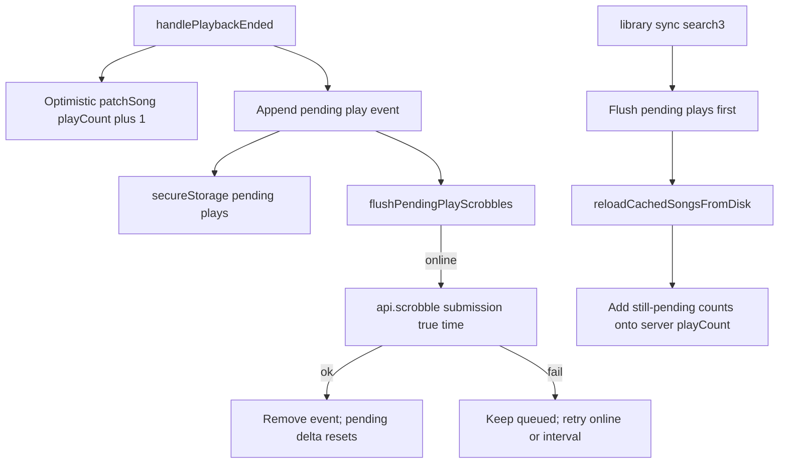

# Offline play count (scrobble) plan

## Context

Navidrome does **not** increment `playCount` on `stream`. Clients must call Subsonic [`scrobble`](https://www.navidrome.org/docs/developers/subsonic-api/) with `submission=true` (optional `time`). Each successful submit increments song/album/artist play counts and updates `played`.

AsMusic already stores full `Child` rows from `search3` (so unused `playCount` / `played` may already be present) but never reads or writes them. End-of-track is detected in [`PlayerManager.handlePlaybackEnded`](packages/ui/src/player/core/PlayerManager.ts); that handler only advances the queue today.

**Star/favorite offline pattern** (reference, not copy blindly):

- Optimistic local patch via `applyLocalStarState` + `libraryCache.patchSong`
- Pending queue in secure storage (`asmusic-pending-star-mutations-v1`) from [`pendingStarMutations.ts`](packages/core/src/library/pendingStarMutations.ts)
- Flush on toggle / online / 5‑minute interval from [`LibraryBrowseCacheContext`](packages/ui/src/contexts/LibraryBrowseCacheContext.tsx)
- Stars are **LWW** (coalesce by track → latest `starred` wins)

**Play counts differ:** each completed listen is an **additive** event. Coalescing to a single boolean would lose plays. Queue **one entry per play** (with timestamp), flush each as its own `scrobble`, and treat “local cached count” as the **pending delta**, not a replacement for server totals.

## v1 scope (chosen default)

- **In scope:** record a play on natural track completion (including loop-one restarts); offline pending queue; optimistic `Child.playCount` / `Child.played`; flush + reapply across reconnect / library sync; feature doc.
- **Out of scope for v1:** UI chrome for counts, Frequent/Most-played tab, Last.fm-style mid-track threshold, `scrobble(submission=false)` now-playing, `setRating`, album-index rollups of playCount.

(Display can later read patched `Child.playCount` with no further mutation work.)

## Design details

### 1. Pending play queue (core)

Add [`packages/core/src/library/pendingPlayScrobbles.ts`](packages/core/src/library/pendingPlayScrobbles.ts) parallel to stars:

| Field                              | Role                                                                   |
| ---------------------------------- | ---------------------------------------------------------------------- |
| `id`                               | Stable event id (for remove-after-flush; do **not** key only by track) |
| `serverId`, `libraryId`, `trackId` | Same identity model as stars                                           |
| `playedAt`                         | Epoch ms when the listen completed (sent as Subsonic `time`)           |
| `queuedAt`                         | When enqueued (ordering / diagnostics)                                 |

Storage key: `asmusic-pending-play-scrobbles-v1` via `host.secureStorage`.

Helpers: parse/serialize, append, remove by `id`, `pendingCountForTrack(...)`, optional soft cap (e.g. drop oldest if queue grows unbounded). **No LWW coalesce by track.**

### 2. Optimistic local playCount

In `LibraryBrowseCacheContext`, add `recordTrackPlayed({ serverId, libraryId, trackId, playedAt? })`:

1. Patch in-memory slice + `host.libraryCache.patchSong`: `playCount = (song.playCount ?? 0) + 1`, `played = ISO timestamp`.
2. Append pending play event; persist queue.
3. Fire-and-forget `flushPendingPlayScrobbles()`.

**Displayed / cached total** while offline = server baseline already in the song row **plus** increments from each local record (already applied to `playCount`). The “local cached count” the user described is the **pending event list**; after successful flush those events are removed (delta resets to 0) while `playCount` on the song stays at the combined value until the next sync refreshes from the server (which should match).

### 3. Flush

Same triggers as stars: after record, after hydration, `window` `online`, 5‑minute interval.

For each pending event: `getApiForServer` → `api.scrobble({ id: trackId, submission: true, time: playedAt })`. On success, remove that event and persist. On session/API failure, stop or continue other servers; leave failures queued.

Batching: Subsonic allows multiple `id`/`time` pairs; fine to flush sequentially first (matches star flush simplicity), optionally batch per server later.

### 4. Reapply after sync (critical vs stars gap)

Stars still have a documented gap: sync can overwrite pending local state ([`librarySync.md`](doc/features/librarySync.md)). For plays, do it correctly from day one:

1. Before `refreshLibraryCache` / song replace: **flush** pending play scrobbles (and ideally pending stars too while touching that path).
2. After `reloadCachedSongsFromDisk`: **reapply** remaining pending events — for each track, add `pendingCount` to the synced `playCount` and set `played` to the latest pending `playedAt` if newer than server `played`.

Without (2), an offline listen followed by sync-before-flush would show the server count and drop the local delta from the UI until flush+another sync.

### 5. Wire from the player

Keep `PlayerManager` free of Subsonic/cache knowledge:

- At the **start** of `handlePlaybackEnded` (before loop-one seek or queue advance), notify a new subscription (e.g. `subscribeTrackCompleted` / one-shot callback) with `{ serverId, libraryId, trackId, playedAt: Date.now() }` from the current queue item.
- Do **not** fire on user skip / load failure skip — only natural `onPlaybackEnded`.
- [`PlayerContext`](packages/ui/src/contexts/PlayerContext.tsx) subscribes and calls `recordTrackPlayed` (same layering as remote star → `setTrackStarred`).

Loop-one: each natural end counts as a play (then seek 0).

### 6. Docs / exports

- New [`doc/features/playCount.md`](doc/features/playCount.md) (per update-project-documentation skill): mental model, offline queue vs stars, flush/reapply, out of scope.
- Cross-link from [`librarySync.md`](doc/features/librarySync.md) (scrobble mutation; flush-before-sync).
- Re-export pending helpers from `@asmusic/core` like stars.

## Key files to touch

| File                                                                              | Change                                           |
| --------------------------------------------------------------------------------- | ------------------------------------------------ |
| `packages/core/src/library/pendingPlayScrobbles.ts`                               | New queue types/helpers                          |
| `packages/core/src/index.ts`                                                      | Export                                           |
| `packages/ui/src/contexts/LibraryBrowseCacheContext.tsx`                          | `recordTrackPlayed`, flush, hydrate, reapply     |
| `packages/ui/src/player/core/PlayerManager.ts`                                    | Emit track-completed on natural end              |
| `packages/ui/src/contexts/PlayerContext.tsx`                                      | Wire emit → `recordTrackPlayed`                  |
| `packages/ui/src/views/home/library/.../useRefreshLibraryRow.ts` (or sync caller) | Flush plays before refresh; reapply after reload |
| `doc/features/playCount.md`                                                       | Feature doc                                      |
| `doc/features/librarySync.md`                                                     | Mention scrobble + flush-before-sync             |

## Edge cases

- Track not in library cache: still queue the scrobble (server only needs id); skip optimistic `patchSong` if song missing.
- Duplicate flush / in-flight guard: same `flushInFlight` pattern as stars.
- Multi-device: each client scrobbles its own plays; server accumulates (no LWW conflict).
- Offline media playback: still counts — completion is host `ended`, independent of stream vs local file.
