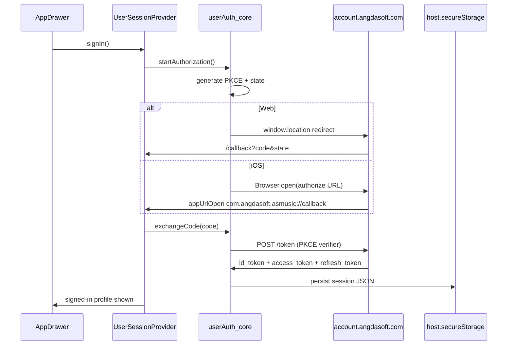

# OIDC User Sign-In Plan

## Context

AsMusic is a **client-only** Capacitor + React SPA with **no first-party backend**. Subsonic/Navidrome auth lives in [`ServerAndLibraryContext.tsx`](packages/ui/src/contexts/ServerAndLibraryContext.tsx). The new **AsMusic user account** is a separate concept backed by your IdP:

|          | Subsonic user                           | AsMusic user (new)                |
| -------- | --------------------------------------- | --------------------------------- |
| Purpose  | Stream music from a server              | Future cloud/sync features        |
| Auth     | username/password per server            | OIDC id/access/refresh tokens     |
| Storage  | `asmusic-server-pw-*` in secure storage | new `asmusic-user-session-v1` key |
| UI entry | Settings → Servers                      | Sidebar drawer                    |

IdP discovery (from `.env` + live config):

- Issuer: `https://account.angdasoft.com`
- Endpoints: `/authorize`, `/token`, `/userinfo`, `/revoke`
- Supports: `authorization_code`, `refresh_token`, PKCE (`S256`), public client auth (`none`)
- Scopes: `openid`, `email`, `profile`, `offline_access`, `groups`

Sign-in is **optional** — no gate on music playback or onboarding.

## Architecture



## 1. Environment and IdP registration

**Current [`.env`](.env)** (already configured):

```bash
OIDC_CONFIG_URL=https://account.angdasoft.com/.well-known/openid-configuration
OIDC_CLIENT_ID=1177398a-152f-4100-a21e-41ffbfec9a22
OIDC_REDIRECT_URI_WEB=http://localhost:3000/callback
OIDC_REDIRECT_URI_MOBILE=com.angdasoft.asmusic://callback
```

These use non-`VITE_` names (kept out of git). Inject into the client bundle via [`apps/web/vite.config.ts`](apps/web/vite.config.ts) `define` — same pattern as `VITE_APP_VERSION`, reading `process.env.OIDC_*` at build/dev time and exposing as `import.meta.env.OIDC_*`. Extend [`apps/web/src/vite-env.d.ts`](apps/web/src/vite-env.d.ts) with the types.

**Redirect URI selection at runtime** ([`config.ts`](packages/core/src/userAuth/config.ts)):

- **Web (`host.kind === 'browser'`):** use `OIDC_REDIRECT_URI_WEB` verbatim (must match what is registered at the IdP).
- **iOS Capacitor:** use `OIDC_REDIRECT_URI_MOBILE` verbatim.
- No runtime computation fallback — env is the source of truth. For web prod, set `OIDC_REDIRECT_URI_WEB` to the deployed origin + path before building (e.g. `https://music.example.com/callback`).

Document the same four vars in a new `.env.example` (no secrets).

**IdP redirect URIs** (registered — matches `.env`):

| Platform | Redirect URI                                       |
| -------- | -------------------------------------------------- |
| Web dev  | `http://localhost:3000/callback`                   |
| Web prod | set `OIDC_REDIRECT_URI_WEB` per deploy environment |
| iOS      | `com.angdasoft.asmusic://callback`                 |

**Note:** mobile scheme is `com.angdasoft.asmusic` (lowercase), which differs from Capacitor `appId` `com.angdasoft.AsMusic`. Info.plist `CFBundleURLSchemes` must use the **mobile redirect scheme** from env, not the bundle ID.

Use scopes: `openid profile email offline_access`.

## 2. Core OIDC module (`@asmusic/core`)

Add a new framework-agnostic module at `packages/core/src/userAuth/`:

| File              | Responsibility                                                                                      |
| ----------------- | --------------------------------------------------------------------------------------------------- |
| `types.ts`        | `UserSession`, `UserProfile`, `OidcConfig`, token bundle                                            |
| `config.ts`       | Read `OIDC_CONFIG_URL`, `OIDC_CLIENT_ID`, and platform-specific redirect URI from `import.meta.env` |
| `pkce.ts`         | Generate verifier/challenge (Web Crypto `S256`)                                                     |
| `discovery.ts`    | Fetch/cache `.well-known/openid-configuration`                                                      |
| `client.ts`       | Build authorize URL; exchange code; refresh tokens; revoke on sign-out                              |
| `sessionStore.ts` | Persist/load/clear session via `SecureStorageHost` (`asmusic-user-session-v1`)                      |
| `profile.ts`      | Decode id_token claims (base64 JWT payload) + optional `/userinfo` fetch                            |

**Dependency:** add [`oauth4webapi`](https://github.com/panva/oauth4webapi) to [`packages/core/package.json`](packages/core/package.json) — small, zero-deps, ideal for custom Capacitor + web flows.

**PKCE state:** store `{ state, codeVerifier, returnPath }` in `sessionStorage` (ephemeral, survives redirect). Tokens go in `host.secureStorage` (iOS Keychain via existing native plugin; web localStorage today).

**Refresh:** on provider mount, if `refresh_token` exists and access token is near expiry, silently refresh via `/token`. Expose `getAccessToken()` for future features.

## 3. React session layer (`@asmusic/ui`)

**New context:** [`packages/ui/src/contexts/UserSessionContext.tsx`](packages/ui/src/contexts/UserSessionContext.tsx)

```typescript
type UserSessionContextValue = {
  isRestoring: boolean;
  isSignedIn: boolean;
  user: UserProfile | null; // name, email, sub from id_token/userinfo
  signIn: () => Promise<void>;
  signOut: () => Promise<void>;
  getAccessToken: () => Promise<string | null>;
};
```

- Wrap in [`App.tsx`](packages/ui/src/App.tsx) **outside** `OnboardingGate` (sign-in must work before server setup).
- Export from [`packages/ui/src/contexts/index.ts`](packages/ui/src/contexts/index.ts) and [`packages/ui/src/index.ts`](packages/ui/src/index.ts).

**Callback handling:**

- New route `/callback` → `AuthCallbackView` (spinner + error display); path must match `OIDC_REDIRECT_URI_WEB` path component.
- New hook `useOidcRedirectListener` mounted once in `App` or the provider:
  - **Web:** route reads `code` + `state` from query string.
  - **iOS:** `@capacitor/app` `appUrlOpen` listener parses custom-scheme URL (pattern already used in [`appBuildInfo.ts`](packages/ui/src/app/appBuildInfo.ts) for Capacitor imports).
- After successful exchange, navigate to stored `returnPath` (default `/`).

**OnboardingGate fix:** exclude `/callback` from the redirect-to-onboarding effect in [`OnboardingGate.tsx`](packages/ui/src/OnboardingGate.tsx) so the callback is not interrupted.

## 4. Platform-specific sign-in launch

| Platform | Launch                                       | Callback                                                      |
| -------- | -------------------------------------------- | ------------------------------------------------------------- |
| Web      | `window.location.assign(authorizeUrl)`       | Full-page redirect to `/callback`                             |
| iOS      | `@capacitor/browser` `Browser.open({ url })` | `App.addListener('appUrlOpen')` → close browser → process URL |

**New dependency:** `@capacitor/browser` in [`apps/web/package.json`](apps/web/package.json) and [`packages/ui/package.json`](packages/ui/package.json); run `cap sync ios`.

**iOS native config:** add `CFBundleURLTypes` to [`ios/App/App/Info.plist`](ios/App/App/Info.plist):

```xml
<key>CFBundleURLTypes</key>
<array>
  <dict>
    <key>CFBundleURLSchemes</key>
    <array>
      <string>com.angdasoft.asmusic</string>
    </array>
  </dict>
</array>
```

## 5. Sidebar entry point

Update [`AppDrawer.tsx`](packages/ui/src/views/home/AppDrawer.tsx):

- Add an **Account** section at the **top** of the list (below header divider), visually distinct from nav items.
- **Signed out:** `ListItemButton` → “Sign in” → calls `signIn()`.
- **Signed in:** show avatar initial + display name/email; secondary action “Sign out”.
- **Restoring:** subtle loading state (disable button or skeleton text).

This keeps account auth discoverable without blocking music usage.

## 6. i18n

Add keys to all locale files under [`packages/i18n/src/messages/`](packages/i18n/src/messages/) (at minimum `en-US.ts`, mirror in `zh-CN`, `zh-TW`, `ja-JP`, `es-ES`):

- `nav.account`, `nav.signIn`, `nav.signInHint`, `nav.signOut`, `nav.signedInAs`
- `auth.callback.processing`, `auth.callback.error`, `auth.signIn.failed`

## 7. What we are explicitly NOT doing (future work)

- No backend token validation or BFF proxy
- No feature gating on signed-in state
- No linking Subsonic users to OIDC users
- No Android-specific deep link (same pattern can be added later)

## IdP checklist

- [x] Redirect URIs registered (`OIDC_REDIRECT_URI_WEB`, `OIDC_REDIRECT_URI_MOBILE` in `.env`)
- [ ] Confirm grant types: Authorization Code + Refresh Token enabled
- [ ] Confirm client is public (no client secret required for SPA/mobile)
- [ ] When deploying web prod, update `OIDC_REDIRECT_URI_WEB` and register that URI at the IdP

## Test plan

1. **Web dev:** `pnpm dev` → open drawer → Sign in → IdP login → lands back on home with name shown → Sign out clears state
2. **Web refresh:** reload page while signed in → session restored via stored tokens / refresh
3. **iOS:** `pnpm cap:sync` → run on device/simulator → Sign in opens system browser → returns via custom scheme → drawer shows account
4. **Regression:** Subsonic server add/play/offline flows unchanged without signing in
5. **Onboarding:** fresh install can still complete server setup without account
