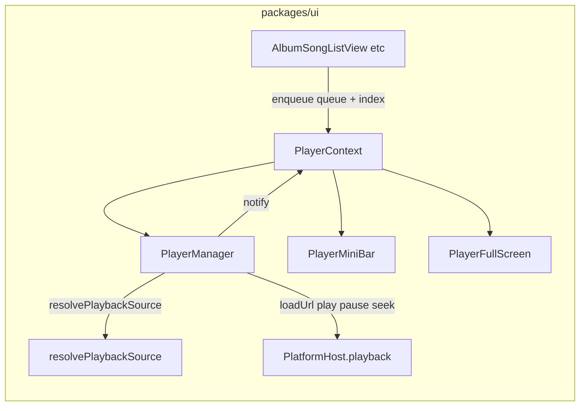

# PlayerManager and dual player UI

## Product rule (bottom bar)

- **Mini player is always visible** on all main routes, including when the queue is empty and nothing is loaded. Empty state: neutral placeholder (e.g. “Nothing playing”), compact artwork placeholder, and **disabled** or no-op transport controls until a track is active—expand to full player may still be allowed if the full UI handles empty state gracefully (same rules), or the expand control is disabled until there is a current item (pick one consistent rule in implementation; prefer **expand always available** with full sheet showing empty state + hint to pick a song).

## Legacy reference (behavioral parity, not gesture parity)

- **Mind / transport:** `legacy-swiftui-ios/AsMusic/Managers/MusicPlayerController.swift` — app-scoped queue, load URL, time updates, seek, skip next/prev, play/pause, auto-advance on end.
- **Bottom chrome:** `legacy-swiftui-ios/AsMusic/Views/PlayerView/PlayerBarView/PlayerBarView.swift` — compact bar + progress (v1 uses explicit controls).
- **Full sheet:** `legacy-swiftui-ios/AsMusic/Views/PlayerView/PlayerSheetView/PlayerSheetView.swift` — large artwork, metadata, scrubber.

## Existing platform contracts (reuse)

- **Playback:** `packages/core/src/host/types.ts` — `loadUrl`, `play`, `pause`, `seek`, listeners.
- **Local-first URL:** `packages/core/src/offline/playbackResolver.ts` — `resolvePlaybackSource`; caller must `revoke()` when switching tracks.
- **Stream URL:** `packages/ui/src/contexts/ServerAndLibraryContext.tsx` — `getStreamUrl`.
- **Web transport:** `packages/platform-web/src/browserHost.ts` — `<audio>` + `timeupdate`.

## Architecture

## 1. PlayerManager (plain TypeScript)

- Under e.g. `packages/ui/src/player/`: queue items with server scope + metadata snapshot from `Child`.
- Load path: `getStreamUrl` → `resolvePlaybackSource` → `loadUrl` + `revoke` discipline; `getCoverArtUrl` for NP artwork on iOS.
- Transport: play/pause, seek, ±10s, prev/next, end-of-track advance; v1 no queue loop.
- Subscribe API for React `useSyncExternalStore`.

## 2. React integration

- `PlayerProvider` inside `ServerAndLibraryProvider`; add `getCoverArtUrl` next to `getStreamUrl`.

## 3. Two UIs

| Surface | Role |
|--------|------|
| **Mini bar** | **Always rendered** at bottom (fixed + safe area). With a current track: artwork, title, play/pause, slim progress, expand. **Empty queue:** placeholder copy, muted styling, disabled primary actions (or no-op with tooltip). |
| **Full player** | Toggle overlay: full controls when a track exists; empty state when not. |

## 4. Shell layout

- `App.tsx`: `PlayerProvider` + `PlayerChrome` after routes.
- **Bottom padding:** main scroll areas always reserve space for the mini bar height (since the bar is always visible).

## 5. Library wire-up

- Tappable `SongItem`; `LibraryBrowser` passes `replaceQueueAndPlay` from lists.

## 6. Optional

- `browserHost.loadUrl(url, meta?)` signature parity.

## Out of scope v1

- Queue persistence, CarPlay-only flows, legacy bar gestures, persist-while-streaming wiring into the player.
