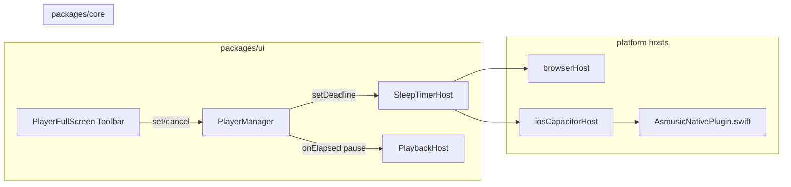

# Sleep timer (cross-platform host + full-screen app bar)

## Product behavior (match legacy)

Legacy stops playback by pausing only when something is playing ([`PlayerSheetView.swift`](legacy-swiftui-ios/AsMusic/Views/PlayerView/PlayerSheetView/PlayerSheetView.swift) ~`scheduleSleepTimer` → `togglePlayPause` if `isPlaying`). New app should do the same: **on elapsed, `pause()` if currently playing**; always **clear the scheduled deadline** so the UI returns to idle.

## Architecture

- **Authoritative contract:** wall-clock **`endsAtEpochMs`** (nullable = off), not “a single `setTimeout` duration.”
- **Policy in one TS place:** [`PlayerManager`](packages/ui/src/player/PlayerManager.ts) subscribes to `host.sleepTimer.onElapsed`, calls `pause()` when `isPlaying`, clears local deadline state, and notifies a **narrow** subscriber channel (do **not** fold per-second countdown into existing transport `subscribe` / [`PlayerTransportRoot`](packages/ui/src/contexts/PlayerContext.tsx) or you will re-render the app every second).

## 1) Core interface — [`packages/core/src/host/types.ts`](packages/core/src/host/types.ts)

Add a **`SleepTimerHost`** to **`PlatformHost`**:

- `setDeadline(endsAtEpochMs: number | null): Promise<void>` — `null` clears.
- `getDeadline(): Promise<number | null>` — for hydration / debugging (optional for v1 UI).
- `onElapsed(cb: () => void): () => void` — fired once when the backend determines the deadline has passed (then implementation should behave as cleared).

**Semantics:** implementations should treat `setDeadline` as idempotent replace; after `onElapsed`, deadline is cleared on the backend so `getDeadline()` returns `null`.

Export from [`packages/core/src/index.ts`](packages/core/src/index.ts) if needed for consumers.

## 2) Browser / web — [`packages/platform-web/src/browserHost.ts`](packages/platform-web/src/browserHost.ts)

Implement `sleepTimer` in-process:

- Store `endsAtEpochMs`.
- While armed: `setInterval` (e.g. 1s) to compare `Date.now()` to deadline; fire `onElapsed` subscribers when due, then clear.
- Also subscribe to **`document.visibilitychange`** and **`window` `focus`** (and optionally `pageshow`) to catch up when the tab wakes from bfcache / throttling.
- `dispose` / teardown: clear interval and listeners when `setDeadline(null)` or on elapsed.

No Capacitor dependency in `platform-web` (web dev and pure browser builds stay clean).

## 3) iOS Capacitor — TypeScript bridge

- Extend [`packages/platform-capacitor/src/asmusicNativePlugin.ts`](packages/platform-capacitor/src/asmusicNativePlugin.ts): methods e.g. `sleepTimerSet({ endsAtEpochMs: number | null })`, `sleepTimerGet(): Promise<{ endsAtEpochMs: number | null }>`, and event `sleepTimerElapsed` in `AsmusicNativePluginEvents`.
- Implement no-op / safe defaults in [`packages/platform-capacitor/src/asmusicNativePluginWeb.ts`](packages/platform-capacitor/src/asmusicNativePluginWeb.ts) (resolve only; no throw) so web registration does not break.
- In [`packages/platform-capacitor/src/iosCapacitorHost.ts`](packages/platform-capacitor/src/iosCapacitorHost.ts), add **`buildSleepTimer()`** mirroring `buildPlayback`: register listener for `sleepTimerElapsed`, fan out to `onElapsed` subscribers, forward `setDeadline`/`getDeadline` to `AsmusicNative`.
- Optionally add **`@capacitor/app` `resume`** listener here (or in the same module) to compare `Date.now()` to the last known deadline and fire elapsed if iOS delivered a late event — defensive, low cost.

## 4) iOS native — [`ios/App/App/AsmusicNativePlugin.swift`](ios/App/App/AsmusicNativePlugin.swift)

- Register new `CAPPluginMethod`s + `notifyListeners("sleepTimerElapsed", ...)`.
- Hold `sleepTimerWorkItem` / `Timer` on main queue for `Date(timeIntervalSince1970: endsAtEpochMs/1000)`.
- On fire: **`player?.pause()`** (hard guarantee when WebView is frozen) **and** notify JS so `PlayerManager` clears UI state.
- `setDeadline(null)` invalidates pending work item.

This matches the legacy native-side reliability model (Swift concurrency there) while keeping TS policy for anything beyond pause.

## 5) `PlayerManager` + context

- Constructor: subscribe `host.sleepTimer.onElapsed`; `dispose()` unsubscribe (extend [`dispose`](packages/ui/src/player/PlayerManager.ts)).
- Add **`sleepEndsAtEpochMs: number | null`** on the manager plus **`subscribeSleepTimer` / `getSleepTimerSnapshot`** (small `Set` of listeners, separate from transport `listeners`).
- Public methods e.g. `setSleepTimerMinutes(minutes: number)`, `cancelSleepTimer()` → compute `endsAt`, call `host.sleepTimer.setDeadline`, update local snapshot, notify sleep listeners.
- On elapsed handler: `cancelSleepTimer()` / sync `null` from host, `if (this.isPlaying) void this.pause()`, notify sleep listeners.

Expose from [`PlayerContext.tsx`](packages/ui/src/contexts/PlayerContext.tsx):

- New hook **`usePlayerSleepTimer()`** using `useSyncExternalStore(subscribeSleepTimer, getSleepTimerSnapshot, getSleepTimerSnapshot)`.
- New actions on **`PlayerActions`** (or a tiny parallel export) for `setSleepTimerMinutes` / `cancelSleepTimer` — whichever keeps `PlayerFullScreen` from reaching into `usePlayerManager()` directly.

## 6) UI — [`packages/ui/src/player/PlayerFullScreen.tsx`](packages/ui/src/player/PlayerFullScreen.tsx)

App bar today ([`Toolbar`](packages/ui/src/player/PlayerFullScreen.tsx) ~lines 128–151): title, track info, queue, close.

- Add a **timer `IconButton`** before queue/close (same pattern as `InfoOutlined` / `QueueMusic`): `Timer` vs `Timer`+filled styling when `sleepEndsAtEpochMs != null`.
- **`aria-label`**: “Sleep timer” / “Sleep timer on”.
- Click opens a **MUI `Dialog` or `Drawer`** (reuse patterns from existing `trackInfoOpen` dialog in the same file): slider **1–120** min (legacy [`PlayerSleepTimerSheetView`](legacy-swiftui-ios/AsMusic/Views/PlayerView/PlayerSheetView/PlayerSleepTimerFeature.swift)), **Start**, **Turn off timer** (destructive when active), **Cancel**.
- **Countdown in toolbar (optional v1):** local `useEffect` + `setInterval` while `sleepEndsAtEpochMs` is set, derived from `Date.now()` — updates only `PlayerFullScreen` subtree, not global transport.

## 7) Android / Electron (not in repo today)

- **Android (future):** implement `SleepTimerHost` in the future Capacitor host using `Handler`/`Looper` near playback, or `AlarmManager` if you need firing while not playing (policy-heavy).
- **Electron (future):** prefer main-process deadline + IPC into renderer, or reuse browser strategy + `BrowserWindow` focus events.

No code in this PR for those shells; the **interface on `PlatformHost`** is the stable extension point (already documented in [`types.ts`](packages/core/src/host/types.ts) for “Android / desktop adapters later”).

## Testing checklist

- Web: start 2-minute timer, switch tab away, return after 2+ minutes → playback paused (or at least elapsed fires and timer clears).
- iOS: start timer, lock device, confirm audio stops at deadline and toolbar state clears when reopened.
- Cancel / replace while armed updates deadline without duplicate firings.
