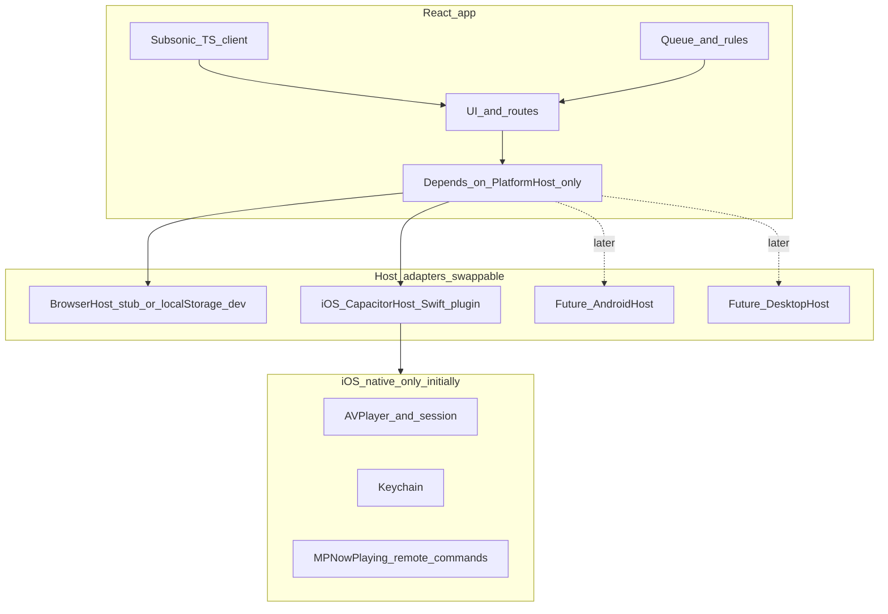

# Capacitor migration plan — iOS first, generic host layer

## Scope decision

- **In scope now**: Finish **migrating iOS** to the **shared web UI** (React/Vite) inside a **Capacitor iOS** shell, with **native Swift** only for the **host** (playback, secure credentials, background/lock-screen behavior, and other OS-level work the WebView cannot own).
- **Out of scope for this phase**: Implementing **Android**, **desktop**, or adding `cap add android` / Android CI. Keep a **placeholder** in docs or backlog only.
- **Cross-cutting requirement**: Design the **host layer in TypeScript as platform-agnostic** so later you add `AndroidHost`, `DesktopHost`, etc., as **adapters** implementing the same interface — the React app depends on **`PlatformHost`**, not on “Capacitor” or “iOS” types.
- **Product focus**: **iOS (Capacitor shell)** is the real product surface for now. **Standalone web** has **~0 MAU** excluding yourself — it is **not** a constraint for migration (no obligation to preserve web UX, avoid breaking external web users, or keep browser and shell feature-identical). Keeping `vite dev` + `BrowserHost` useful for **local iteration** and **CI** is enough.

## Current state (repo facts)

- **Web**: React + Vite in [`web/`](web/), Subsonic/Navidrome via [`subsonic-api`](web/package.json) and [`web/src/api/`](web/src/api/). Playback today is **`<audio>` + React state** in [`web/src/contexts/PlayerContext.tsx`](web/src/contexts/PlayerContext.tsx). Treated as the **shared UI implementation** and dev target, not a committed public web product.
- **iOS (CI canonical)**: Native SwiftUI + [`AsNavidromeKit`](ios/AsNavidromeKit/) under [`ios/`](ios/); CI builds [`ios/AsMusic.xcodeproj`](.github/workflows/build-ios.yml). Native-heavy reference: [`MusicPlayerController*.swift`](ios/AsMusic/Managers/MusicPlayerController.swift), [`ServerCredentialsKeychain.swift`](ios/AsMusic/Managers/ServerCredentialsKeychain.swift), [`CarPlaySceneDelegate.swift`](ios/AsMusic/Managers/CarPlaySceneDelegate.swift), caches/downloads under `Managers/` and `Stores/`. (Former `ios-native` rename is done; a single `ios/` tree remains — no duplicate-folder merge work.)
- **Android folder**: May stay minimal or untouched until a later epic; **do not** block iOS migration on Android scaffolding.

## Target architecture (iOS now, adapters later)

**Design rule**: `PlatformHost` (or equivalent name) lives in **`web/src`** and describes **capabilities** (playback transport, secure KV or “server list”, optional file/download hooks) in **neutral terms** — no Swift/Kotlin types, no iOS-only method names. **Capacitor** is an **implementation detail** of the iOS adapter (`createIosHost(): PlatformHost`), the same way a future package would expose `createAndroidHost()`.

**Optional refinement**: inject `PlatformHost` via React context (`HostProvider`) set at app bootstrap from `detectEnvironment()` so feature code never imports `@capacitor/core` directly except inside the adapter module.

## Phase 0 — Capacitor (iOS only)

1. **Capacitor in [`web/`](web/)**: `capacitor.config.*`, `webDir` → Vite `dist`, app id.
2. **`npx cap add ios` only** (under `ios/` or Capacitor default `ios/` — align with existing folder layout intentionally so CI paths stay predictable). **Do not** `cap add android` in this phase.
3. **Dev loop**: `vite build` → `cap sync ios` → open Xcode; document ATS / local server caveats for Navidrome.

## Phase 1 — Generic host contract + iOS adapter skeleton

1. **TypeScript**: Define `PlatformHost` with grouped capabilities, for example:
   - `playback`: load, play, pause, seek, subscribe to time/state/end events (names and shapes that map equally well to ExoPlayer or desktop later).
   - `secureStorage` (or `serverCredentials`): CRUD opaque blobs or structured server rows — avoid iOS Keychain terminology in the public interface.
2. **Browser**: `BrowserHost` implements `PlatformHost` using existing `<audio>` + optional `localStorage` for local dev (fine given no external web audience); **iOS shell** uses native secure storage via the plugin. If web ever becomes a public surface again, tighten storage and playback parity then.
3. **iOS**: `IosCapacitorHost` implements `PlatformHost` by calling a **local Capacitor plugin** (Swift). The plugin is the only place that knows about `AVPlayer`, `MPNowPlayingInfoCenter`, Keychain.
4. **Versioning**: optional `hostApiVersion` in the contract so a future Android plugin can negotiate behavior without breaking the web bundle.

Deliverable: app runs in **iOS simulator/device** with `IosCapacitorHost` (even stub playback first, then fill in); **browser** with `BrowserHost` remains **runnable** for your own dev/CI, not a launch gate.

## Phase 2 — Refactor web playback behind the host

1. **Refactor [`PlayerContext`](web/src/contexts/PlayerContext.tsx)** to use `host.playback` (or injected engine) instead of hard-coding `HTMLAudioElement` when `PlatformHost` indicates native transport.
2. **Unify [`usePlayer`](web/src/hooks/usePlayer.ts)** with `PlayerContext` (remove stub duplication).
3. **Bootstrap**: `main.tsx` or `App.tsx` selects `BrowserHost` vs `IosCapacitorHost` based on environment (e.g. Capacitor’s native platform check **inside the adapter factory**, not scattered across components).

## Phase 3 — iOS native host (replace SwiftUI)

1. **Capacitor shell**: minimal app host loading bundled `dist`.
2. **Swift plugin**: `AVPlayer` (or `AVQueuePlayer`), audio session category, **MPNowPlayingInfoCenter** + remote commands, background modes in plist.
3. **Keychain**: implement secure server credential storage behind `PlatformHost.secureStorage` (reuse logic concepts from [`ServerCredentialsKeychain.swift`](ios/AsMusic/Managers/ServerCredentialsKeychain.swift)).
4. **Retire SwiftUI**: remove or stop shipping the old app target once **v1 acceptance** is met; delete/archive SwiftUI views and, over time, **`AsNavidromeKit`** if Subsonic stays fully in TS — avoid two API clients long-term.

## Phase 4 — Parity and cuts (unchanged intent)

- **v1 bar**: login, browse library/playlists/search to a level **you** need on iOS (reuse existing React flows; no requirement to match a separate “web product”), plus background playback + lock screen, basic queue, reconnect after network loss.
- **Defer**: CarPlay, sleep timer parity, aggressive offline/download parity — re-add via **the same `PlatformHost` surface** when prioritized.

## Future work (explicit backlog — do not implement in iOS-first phase)

- **Android**: `cap add android`, Kotlin plugin, ExoPlayer + MediaSession + foreground service — new `AndroidCapacitorHost` implementing **`PlatformHost`**.
- **Desktop**: Tauri/Electron in [`desktop/`](desktop/) with `DesktopHost` implementing **`PlatformHost`** (file picks, shortcuts, updater).
- **CI**: add Android workflow only when that epic starts; keep **iOS** green as the migration gate; **web build** in CI remains useful as a compile check for the shared bundle, not a public SLA.

## Risks and mitigations

- **Overfitting `PlatformHost` to AVPlayer**: review method names against Android Media3 capabilities before freezing v1; keep “load URL / file ref” generic.
- **WKWebView performance**: virtualize long lists; test memory on large libraries.
- **Secrets**: on **iOS shell** builds, route credentials only through `secureStorage`. Browser `localStorage` is acceptable for author-only `vite dev`; revisit if web becomes a real surface.

## Success criteria (this phase)

- iOS ships as **Capacitor + web bundle** with **native playback + Keychain** behind **`PlatformHost`**.
- Shared React bundle may change freely for iOS needs; **browser** staying buildable/runnable locally is sufficient (no external web audience to preserve).
- CI green for **iOS** migration path; **web** workflow may remain as a **TypeScript/Vite compile** check for the same sources if useful.
- **`PlatformHost`** documented in code (short module doc) as the **single extension point** for Android/desktop later.
