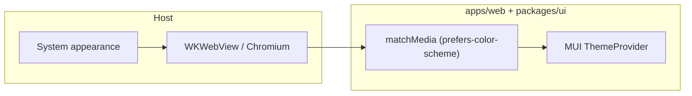

# Respect system light/dark mode

## Current state

- `[packages/ui/src/theme.ts](packages/ui/src/theme.ts)` hardcodes `palette.mode: 'dark'` and custom dark-only background/text colors.
- `[apps/web/src/main.tsx](apps/web/src/main.tsx)` wraps the app in `<ThemeProvider theme={appTheme}>` with no media-query logic.
- `[ios/App/App/Info.plist](ios/App/App/Info.plist)` does **not** set `UIUserInterfaceStyle`, so the Capacitor host already follows the device; the gap is entirely the React/MUI layer always rendering dark.
- Desktop Electron is not in-repo yet; Chromium’s `prefers-color-scheme` tracks the OS when the window uses the default “system” theme (document for future host—no code there today).

## Implementation

### 1. Theme factory in `@asmusic/ui`

Refactor `[packages/ui/src/theme.ts](packages/ui/src/theme.ts)` to export `**createAppTheme(mode: 'light' | 'dark')**` (or `PaletteMode`) that returns `createTheme({...})`:

- **Dark**: keep the existing palette values (current look).
- **Light**: set `mode: 'light'` and define matching `background.default`, `background.paper`, `divider`, `text.primary`, `text.secondary` (and keep `primary.main` as the same blue `#3d6fd4` for brand consistency). Reuse shared pieces (`shape`, `typography`, `components.MuiCssBaseline`) so both modes stay in sync.

Optionally set `colorScheme` on `html` via `MuiCssBaseline.styleOverrides` so scrollbars/form UAs respect the active mode (same file as theme overrides).

Keep a `**export const appTheme = createAppTheme('dark')`** (or document removal) only if something still needs a static default; today only `[packages/ui/src/index.ts](packages/ui/src/index.ts)` re-exports it—prefer exporting `**createAppTheme`** and updating the public API to `**AppThemeProvider**` (below) so hosts do not import a fixed dark theme by mistake.

### 2. `AppThemeProvider` (recommended location: `packages/ui`)

Add a small client component, e.g. `[packages/ui/src/AppThemeProvider.tsx](packages/ui/src/AppThemeProvider.tsx)`, that:

- Calls `**useMediaQuery('(prefers-color-scheme: dark)', { defaultMatches: ... })**` from `@mui/material/useMediaQuery` with a `**defaultMatches**` that mirrors `window.matchMedia` when `typeof window !== 'undefined'` (avoids SSR mismatch if SSR is added later).
- `**useMemo**` → `createAppTheme(prefersDark ? 'dark' : 'light')`.
- Renders `**ThemeProvider**` + `**CssBaseline**` and `children`.

Export it from `[packages/ui/src/index.ts](packages/ui/src/index.ts)`.

This keeps `[apps/web/src/main.tsx](apps/web/src/main.tsx)` minimal: replace manual `ThemeProvider`/`CssBaseline`/`appTheme` with `<AppThemeProvider>...</AppThemeProvider>` wrapping `HostProvider` (same tree order as today).

### 3. Cover art placeholder gradient

`[packages/ui/src/components/CoverArtThumb.tsx](packages/ui/src/components/CoverArtThumb.tsx)` uses `grey[900]`/`grey[800]` for empty/loading placeholders. In light mode those read as harsh dark slabs. Switch the gradient to **mode-dependent** greys (e.g. `grey[200]` → `grey[400]` when `theme.palette.mode === 'light'`, else keep current dark gradient).

### 4. Optional polish (low priority)

- Add `<meta name="color-scheme" content="light dark">` to `[apps/web/index.html](apps/web/index.html)` so the UA knows both schemes are valid before JS runs (minor flash reduction for default page chrome).

## Out of scope (unless you ask)

- In-app “Appearance: Light / Dark / System” setting (legacy SwiftUI had this; not required for “respect device preference”).
- Changing native iOS launch storyboard colors for light mode (separate asset work).

## Verification

- Toggle OS appearance (macOS Safari, iOS Simulator/device): UI should switch light/dark without reload.
- `pnpm --filter asmusic-web run build` (and quick manual smoke) to confirm TypeScript and bundle.

