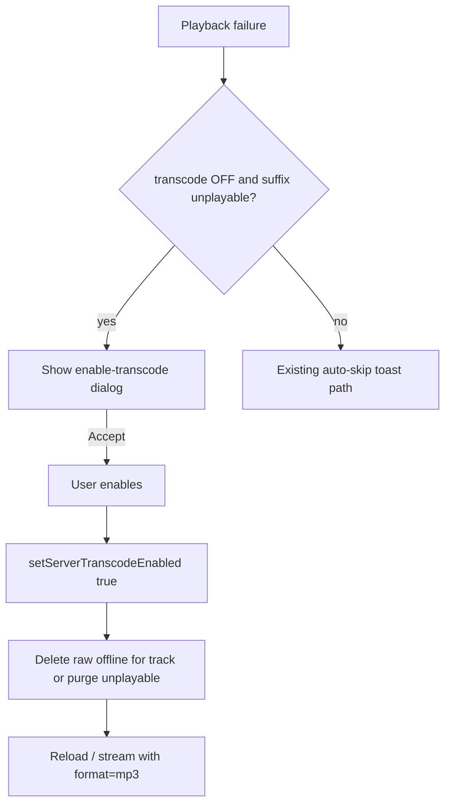

# Prompt to enable server transcode on format failure

## Chosen defaults

- Prompt only when transcode is **OFF** and the failed track’s `suffix` is outside a **platform-specific playable allowlist** (avoids prompting on network/auth errors). One shared list is wrong: e.g. `ogg`/`opus` often play on web Chromium but not on iOS `AVPlayer`.
- **iOS** allowlist: `mp3`, `m4a`, `aac`, `mp4`, `wav`, `flac`, `alac` (case-insensitive). Not playable → prompt: `wma`, `asf`, `ape`, `ogg`, `opus`, etc.
- **Web** allowlist: iOS set plus `ogg`, `opus` (typical HTML5 support). Still not playable: `wma`, `asf`, `ape`, etc.
- Resolve platform via `Capacitor.getPlatform() === 'ios'` (else web). Pass platform into `isPlayableAudioSuffix(suffix, platform)`.
- On enable from the **prompt**: turn preference ON, delete **that track’s** raw offline blob (`variant: ''`), reload the same track.
- On enable from **Settings**: turn preference ON, then purge all raw offline blobs for tracks whose catalog `suffix` fails the **current platform** allowlist (scan cached song lists). Leave playable raw downloads alone.

## Implementation

### 1. Platform-specific playability helper

Add in [`packages/core/src/offline/`](packages/core/src/offline/) (exported from `@asmusic/core`):

- `AudioPlaybackPlatform = 'ios' | 'web'`
- Separate suffix sets for iOS vs web (as above)
- `isPlayableAudioSuffix(suffix: string | undefined, platform: AudioPlaybackPlatform): boolean`
- Optional `isPlayableAudioMime(mime, platform)` for status/MIME fallback (WMA ≈ `audio/x-ms-wma`)

UI/call sites pass platform from Capacitor (`ios` vs otherwise `web`). Same helper used for failure prompt and Settings purge so both stay consistent.

### 2. Failure → dialog instead of silent skip

In [`PlayerManager.ts`](packages/ui/src/player/core/PlayerManager.ts) `handlePlaybackFailure` / load errors:

- If `!getServerTranscodeEnabled()` and `!isPlayableAudioSuffix(currentItem.suffix, platform)`, emit a new event (extend [`PlayerToastEvent`](packages/ui/src/player/core/types.ts) or a dedicated `PlayerPromptEvent`) with the failed item identity (`serverId`, `libraryId`, `trackId`, `serverUrl`, `username`, title).
- **Do not auto-advance** for this case; leave `loadError` set so the UI can show the dialog over the failed track.
- All other failures keep today’s skip/toast behavior.

Wire a dialog from [`PlayerContext`](packages/ui/src/contexts/PlayerContext.tsx) / a small `PlayerServerTranscodePrompt` (MUI `Dialog`, same pattern as other player dialogs):

- Title/body i18n explaining compatibility + link to the Playback setting meaning.
- **Enable**: `setServerTranscodeEnabled(true)` → `offlineMedia.delete({ scope, trackId, variant: OFFLINE_MEDIA_DEFAULT_VARIANT })` → `loadCurrentTrack({ autoplay: true })` (or a PlayerManager method `enableServerTranscodeAndRetry()`).
- **Not now**: dismiss; user can skip manually.

### 3. Settings toggle also purges unplayable raw downloads

When [`setServerTranscodeEnabled(true)`](packages/ui/src/preferences/serverTranscodePreference.ts) runs (Settings or prompt), after writing localStorage call a purge helper:

1. `listReadyKeys(null)` (or per active scopes).
2. Keep only keys with empty/`''` variant.
3. For each distinct scope, `libraryCache.readSongList(scope)` → map `id → suffix`.
4. Delete keys whose track `suffix` fails `isPlayableAudioSuffix(..., currentPlatform)`.
5. If a track is offline but missing from catalog, skip delete (don’t guess).

Expose purge as `purgeUnplayableRawOfflineMedia(host)` used by preference setter and/or PlaybackView `onChange` so both paths share one implementation. Preference module stays sync for the boolean write; fire-and-forget `void purge…()` from the UI `onChange` / prompt Accept (host available there).

### 4. i18n

All locales: dialog title, body, Enable / Not now buttons. Soft-update `settings.ux.serverTranscode.caption` if needed (no plan-file edits).

## Out of scope

- Changing Navidrome bitrate / format beyond existing `format=mp3`
- Migrating raw blobs into `variant=mp3` (re-download / persist-while-streaming handles that)
- Prompting on every failure while OFF

## Verify

- Transcode OFF + WMA track fails → dialog; Enable → preference ON, raw offline gone, track plays via `format=mp3`.
- Transcode OFF + MP3 network failure → no dialog; existing skip toast.
- Settings: enable with a downloaded WMA (empty variant) → that download removed; downloaded MP3 raw remains.
- Dismiss dialog → stays OFF; no purge.
