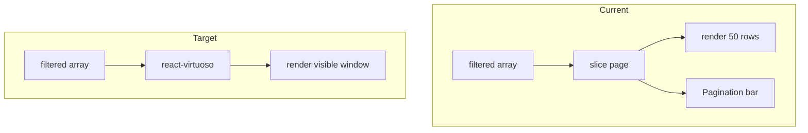

# Replace pagination with react-virtuoso

## Why this library

- **[react-virtuoso](https://virtuoso.dev/)** fits this codebase better than TanStack Virtual alone: built-in **dynamic height** rows (good for [`SongItem`](packages/ui/src/components/SongItem.tsx) / MUI list rows), **`GroupedVirtuoso`** for [`ArtistListView`](packages/ui/src/components/ArtistListView.tsx) letter sections, and **`VirtuosoGrid`** for album **grid** modes in [`AlbumListView`](packages/ui/src/components/AlbumListView.tsx) and [`ArtistAlbumListView`](packages/ui/src/components/ArtistAlbumListView.tsx). TanStack Virtual is headless and would require more glue for grids, groups, and MUI `List`.

## Dependency

- Add `react-virtuoso` to [`packages/ui/package.json`](packages/ui/package.json) (workspace `pnpm` install from repo root).

## Remove obsolete pagination layer

Delete or stop using (after migration):

- [`packages/ui/src/components/useFilteredListPagination.ts`](packages/ui/src/components/useFilteredListPagination.ts)
- [`packages/ui/src/components/LibraryListPaginationBar.tsx`](packages/ui/src/components/LibraryListPaginationBar.tsx)
- [`packages/ui/src/components/libraryListPageSize.ts`](packages/ui/src/components/libraryListPageSize.ts)

## Scroll restoration + Virtuoso

[`useLibraryScrollRestoration`](packages/ui/src/components/useLibraryScrollRestoration.ts) expects a ref on the **actual scrolling DOM node** (`scrollTop` / `scroll` events).

- Override Virtuoso’s **`components.Scroller`** to render a `Box`/`div` that receives Virtuoso’s `ref` **and** the restoration ref (use a tiny **`mergeRefs`** helper in `packages/ui`—local util or copy the standard pattern).
- Keep the same **outer flex layout** as today: toolbar (search / toggles) `flexShrink: 0`, Virtuoso fills `flex: 1; minHeight: 0` so the list is the scroll parent.
- If a race appears on first paint (Virtuoso measures after your `useLayoutEffect` restore), follow up by restoring via Virtuoso’s API (`scrollTo` / `useVirtuosoLocation` patterns from their docs) keyed to the same `libraryScrollMemory` values—only if needed after manual test.

## Filter semantics (unchanged conceptually)

- Continue building **`filtered*` arrays** with existing `useMemo` + `*MatchesQuery` logic in each view.
- Virtuoso uses **`totalCount={filtered.length}`** (or `data={filtered}`) so **all filtered items** participate in scroll range; only visible rows render.
- **`itemContent` index** is the global index into the filtered array → wire **`onPlaySongs(filtered, index)`** / **`onPlayTracks(filtered, index)`** directly (no `globalIndexForPageLocalIndex`).
- On **search / filter key change**, scroll to top: `useEffect` calling `virtuosoRef.current?.scrollToIndex({ index: 0, align: 'start' })` or remount with a React `key` tied to `search` (pick one approach; avoid double-reset).

## Per-view implementation notes

| View | Component | Notes |
|------|-----------|--------|
| [`SongListView`](packages/ui/src/components/SongListView.tsx) | `Virtuoso` | Replace inner scroll `Box` + `List` map; use `components.List` / `components.Item` as per Virtuoso+MUI examples, or `Box` list with `role` preserved. |
| [`AlbumSongListView`](packages/ui/src/components/AlbumSongListView.tsx), [`ArtistAllSongListView`](packages/ui/src/components/ArtistAllSongListView.tsx) | `Virtuoso` | Same pattern as songs; keep existing headers / empty states outside Virtuoso. |
| [`AlbumListView`](packages/ui/src/components/AlbumListView.tsx) | `Virtuoso` (list) / `VirtuosoGrid` (grid) | **List mode:** one row per album (existing `ListItemButton`). **Grid mode:** `itemContent` renders the existing card cell; set a **stable `itemHeight`** (or documented default) so rows align—slightly fixed card `minHeight` in `sx` if text wraps. Skip `flatMap` “no api” holes by **filtering rows with a valid api** in `useMemo` before passing to Virtuoso (same UX as today, avoids empty grid slots). |
| [`ArtistListView`](packages/ui/src/components/ArtistListView.tsx) | `GroupedVirtuoso` | Precompute from **`filteredRows`** (not paged): sorted `letter` groups → `groupCounts`, `groupContent` renders the overline letter, `itemContent(index)` maps flat index back to the correct row (pre-built flat array + `groupCounts` parallel structure, or a small lookup helper). |
| [`ArtistAlbumListView`](packages/ui/src/components/ArtistAlbumListView.tsx) | Fixed **“All songs”** block **above** Virtuoso (both modes) | Keeps special row out of virtual indices; Virtuoso only virtualizes **`filteredAlbums`**. List + grid same split as album catalog. |

## Accessibility / DOM

- Preserve **`role="tabpanel"`** and existing `id` / `aria-labelledby` on the outer panel `Box` (not on the inner scroll root unless appropriate).
- Keep **`aria-label`** on search fields.

## Verification

- Run `pnpm exec tsc --noEmit` in [`packages/ui`](packages/ui).
- Manually: large library tab — scroll songs/albums/artists; filter to subset — scroll and play from mid-list; back navigation — **scroll position restores**; artist **grid/list** toggle; **All songs** still opens from artist album view.

