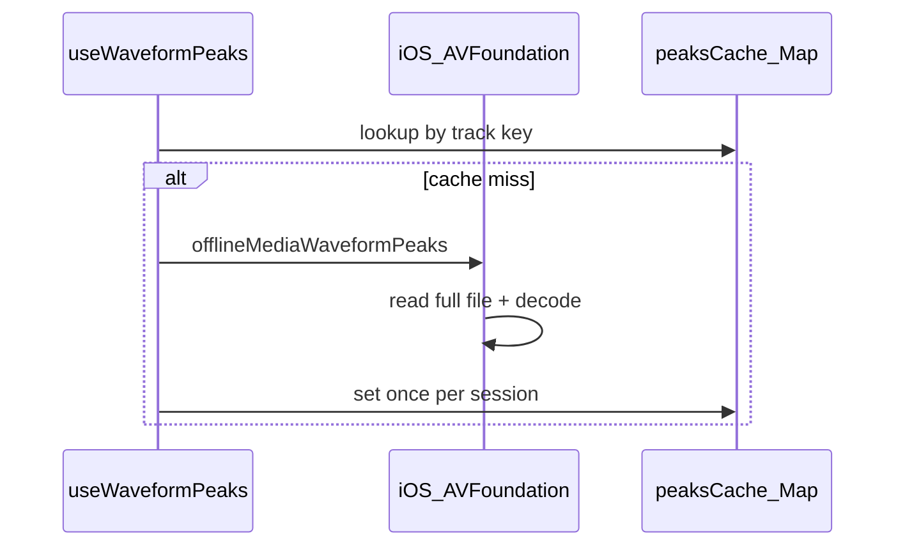
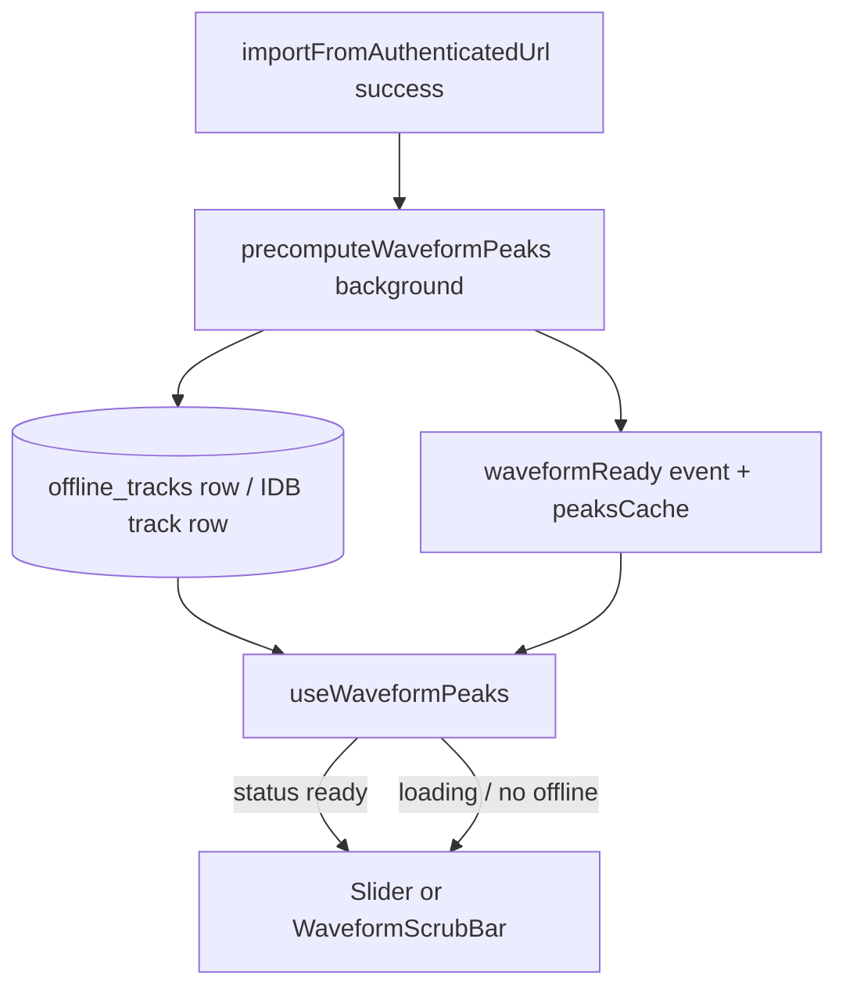

# Waveform persistence and progressive UI upgrade

## Current behavior (baseline)



- [`WaveformProgressBar.tsx`](packages/ui/src/player/WaveformProgressBar.tsx) is display-only.
- [`useWaveformPeaks.ts`](packages/ui/src/player/fullScreen/useWaveformPeaks.ts) computes on first use per session; iOS native always decodes the full file ([`offlineWaveformPeaks`](ios/App/App/LibraryCacheSQLiteStore.swift) → `computeWaveformPeaks`).
- Waveform UI is gated by `playingFromLocalFile && waveformEnabled` and shows **immediately** with [`WAVEFORM_PLACEHOLDER_PEAKS`](packages/ui/src/player/WaveformProgressBar.tsx) while loading ([`PlayerFullScreenProgressBar.tsx`](packages/ui/src/player/fullScreen/PlayerFullScreenProgressBar.tsx) lines 35–38, 47–49, 103).
- Stream-cache runs in background via [`PlayerManager.startPersistWhileStreamingIfNeeded`](packages/ui/src/player/core/PlayerManager.ts) but does not notify the UI when done.

## Answers to your three questions

| #   | Question                                     | Recommendation                                                                                                                                                                  |
| --- | -------------------------------------------- | ------------------------------------------------------------------------------------------------------------------------------------------------------------------------------- |
| 1   | Cache in DB across launches?                 | **Yes** — store normalized peaks next to offline media metadata; read path becomes O(1) instead of full-file decode.                                                            |
| 2   | Compute when download/stream-cache finishes? | **Yes** — hook at the end of every successful `importFromAuthenticatedUrl` (bulk queue, manual download, persist-while-streaming).                                              |
| 3   | Replace slider with waveform when ready?     | **Yes** — show standard slider until `peaks.status === 'ready'`; then swap to waveform scrubber. Support **in-place upgrade mid-play** when cache + peaks finish (your choice). |

---

## Architecture



### 1. Extend `OfflineMediaStore` contract

In [`packages/core/src/offline/OfflineMediaStore.ts`](packages/core/src/offline/OfflineMediaStore.ts):

- Document that `getWaveformPeaks` **must** return cached DB peaks when present (no full decode).
- Add optional `precomputeWaveformPeaks?(key, barCount): Promise<void>` (fire-and-forget; errors swallowed) — or keep precompute entirely inside platform `importFromAuthenticatedUrl` implementations to avoid changing every caller. **Prefer internal platform hook** after write to keep [`OfflineBulkJobQueue`](packages/core/src/offline/OfflineBulkJobQueue.ts) unchanged.

- Peaks live on the **same row** as the offline file metadata — no duplicate keys. Deleting a track deletes peaks automatically.

Constant: `WAVEFORM_BAR_COUNT = 96` (shared between storage and UI; store `waveform_bar_count` and recompute if mismatch).

### 2. iOS: columns on `offline_tracks` (no second table)

**Migration** (bump `PRAGMA user_version`, `ALTER TABLE` on existing DBs):

```sql
ALTER TABLE offline_tracks ADD COLUMN waveform_peaks_json TEXT;  -- nullable JSON array [0,1]
ALTER TABLE offline_tracks ADD COLUMN waveform_bar_count INTEGER;  -- nullable; matches WAVEFORM_BAR_COUNT
```

~1–2 KB per track (96 doubles as JSON) — negligible next to audio files.

- On import UPSERT in [`offlineImportFromUrl`](ios/App/App/LibraryCacheSQLiteStore.swift): set `waveform_peaks_json = NULL`, `waveform_bar_count = NULL` (file changed).
- Background: `computeWaveformPeaks` → `UPDATE offline_tracks SET waveform_peaks_json = ?, waveform_bar_count = ? WHERE …`.
- [`offlineWaveformPeaks`](ios/App/App/LibraryCacheSQLiteStore.swift): `SELECT waveform_peaks_json, waveform_bar_count, updated_at` from `offline_tracks`; return if valid; else compute, persist on same row, return (lazy backfill for existing library).
- Invalidation: if `waveform_bar_count != requested barCount`, recompute. Re-import clears columns via UPSERT above.

No new Capacitor method required if `offlineMediaWaveformPeaks` already delegates to `offlineWaveformPeaks`.

### 3. Web: same `tracks` object store (already one row per blob)

In [`indexedDbOfflineMediaStorage.ts`](packages/platform-web/src/indexedDbOfflineMediaStorage.ts):

- DB version bump: add optional `waveformPeaks?: number[]` and `waveformBarCount?: number` on existing `OfflineTrackRow` (same key path as `body` blob).
- On import: write track row without peaks (or clear peaks), then background decode → `put` row again with peaks filled in.
- `getWaveformPeaks`: read same IDB row, return `waveformPeaks` if present.
- Delete track: peaks removed with the row (no extra cleanup).

### 4. Precompute trigger points

| Trigger                | Location                                                                                                             |
| ---------------------- | -------------------------------------------------------------------------------------------------------------------- |
| Bulk / manual download | iOS: end of `offlineImportFromUrl`; Web: end of IDB `importFromAuthenticatedUrl`                                     |
| Save while streaming   | Same — already calls `importFromAuthenticatedUrl` in [`PlayerManager`](packages/ui/src/player/core/PlayerManager.ts) |

After precompute completes, bump in-memory cache and emit a lightweight readiness signal (see below).

### 5. UI: slider until ready + mid-play upgrade

**Gate changes** (full-screen + mini bar):

- Replace `useWaveform = playingFromLocalFile && waveformEnabled` with something like:
  - `waveformEnabled && item && (playingFromLocalFile || offlineReadyForItem)`
  - `offlineReadyForItem`: poll or subscribe — prefer **event-driven** over polling.
- Replace `showWaveform = useWaveform` with:
  - `showWaveform = useWaveform && waveform.status === 'ready'`
- While `useWaveform && status !== 'ready'`, keep **Slider** / mini-bar flat progress (remove placeholder sine bars during load).

**`useWaveformPeaks` updates** ([`useWaveformPeaks.ts`](packages/ui/src/player/fullScreen/useWaveformPeaks.ts)):

- On mount: call `getWaveformPeaks` first (fast DB/IDB hit).
- Subscribe to `waveformReady` events keyed by `trackWaveformKey(item)` so mid-play persist completion re-renders without track reload.
- Keep module `peaksCache` as L1; DB as L2 across launches.

**Offline readiness for current track** (mid-stream):

- Small helper hook `useOfflineReadyForItem(item)`:
  - Initial `host.offlineMedia.getStatus(key)` when item changes.
  - Re-check on `waveformReady` event for matching key (covers persist-while-streaming finishing).
- Pass `enabled` to `useWaveformPeaks` when `waveformEnabled && (playingFromLocalFile || offlineReady)`.

**PlayerManager** (optional small addition):

- After `startPersistWhileStreamingIfNeeded`’s import resolves, emit the same `waveformReady` event (platform precompute may still be in flight; event ordering: `importDone` → precompute → `waveformReady`).

### 6. Shared readiness bus

Minimal module e.g. [`packages/ui/src/player/waveformPeaksEvents.ts`](packages/ui/src/player/waveformPeaksEvents.ts):

```ts
export function emitWaveformPeaksReady(cacheKey: string): void;
export function subscribeWaveformPeaksReady(
  listener: (key: string) => void,
): () => void;
```

Called from:

- Platform after DB/IDB write
- `useWaveformPeaks` after successful compute (for web fallback path)

---

## Files to touch (primary)

| Area          | Files                                                                                                                                                                                               |
| ------------- | --------------------------------------------------------------------------------------------------------------------------------------------------------------------------------------------------- |
| Contract      | [`OfflineMediaStore.ts`](packages/core/src/offline/OfflineMediaStore.ts)                                                                                                                            |
| Decode helper | new `decodeWaveformPeaks.ts` (core or platform-web)                                                                                                                                                 |
| iOS storage   | [`LibraryCacheSQLiteStore.swift`](ios/App/App/LibraryCacheSQLiteStore.swift), migration in `openIfNeeded`                                                                                           |
| Web storage   | [`indexedDbOfflineMediaStorage.ts`](packages/platform-web/src/indexedDbOfflineMediaStorage.ts)                                                                                                      |
| UI hook       | [`useWaveformPeaks.ts`](packages/ui/src/player/fullScreen/useWaveformPeaks.ts), new `useOfflineReadyForItem.ts`                                                                                     |
| Player bars   | [`PlayerFullScreenProgressBar.tsx`](packages/ui/src/player/fullScreen/PlayerFullScreenProgressBar.tsx), [`usePlayerMiniBarProgress.ts`](packages/ui/src/player/miniBar/usePlayerMiniBarProgress.ts) |
| Events        | new `waveformPeaksEvents.ts`                                                                                                                                                                        |

---

## Edge cases

- **Re-download / replace file**: import UPSERT clears waveform columns; background job refills.
- **Delete offline track**: peaks gone with the track row.
- **Waveform setting off**: no precompute on import (skip background work when preference false — read preference in platform is awkward; acceptable to always precompute on import and only gate UI, or pass flag from JS after import — start with always precompute, UI gated by preference).
- **Very long files**: keep work on background queue (iOS `userInitiated`); bulk downloads already sequential.
- **Existing library**: lazy fill on first `getWaveformPeaks` miss (compute + persist), same as today but only once ever per track.

---

## Testing

- Play offline track → waveform appears immediately from DB (no visible decode delay).
- Stream with save-while-streaming → slider during stream → waveform appears when import + precompute finish (same session, no skip).
- Kill app, replay same track → peaks load from DB, no full decode.
- Delete offline track → waveform gone; slider only on next play.
- Web + iOS parity for download queue path.
