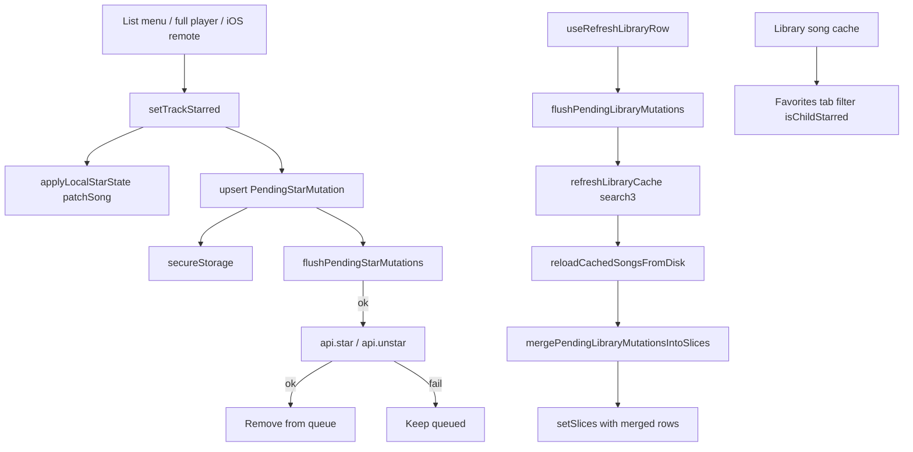

# Favorites (star / unstar)

Track favorites via Subsonic `star` / `unstar`, with optimistic local `Child.starred` patches and an offline pending-mutation queue. The library **Favorites** tab is a local filter of the song cache — **no** `getStarred` / `getStarred2` catalog calls.

**Out of scope:** Album or artist starring, a separate starred catalog sync API, rating (`setRating`), and an offline-queued toast (`library.favorites.offlineQueued` exists in i18n but is unwired).

## Mental model

| Concept | Meaning |
|---------|---------|
| **Server truth** | Per-user starred flag on Navidrome after successful `star` / `unstar` |
| **Local flag** | `Child.starred` — ISO timestamp when starred, cleared when unstarred |
| **Pending intent** | Latest star/unstar per track in secure storage (LWW coalesce) |
| vs **play counts** | Stars are boolean LWW intents; plays are additive scrobble events — see [`playCount.md`](./playCount.md) |

| Capability | Status |
|------------|--------|
| Optimistic local `patchSong` + pending queue | Done |
| Flush on toggle / online / 5‑minute interval | Done |
| Favorites tab (`isChildStarred` filter) | Done |
| Song lists + playlist/album/artist detail toggles | Done |
| Full-player toolbar star | Done |
| iOS Control Center like / dislike | Done |
| Flush before library sync | Done |
| Merge pending stars after sync reload (before paint) | Done |
| Track-only (no album/artist star) | By design |
| `getStarred` / `getStarred2` | **Not used** |
| Offline-queued toast | **Gap** (i18n key unused) |
| List-row star failure toast | **Gap** |
| Remote star failure rollback | **Gap** |

## Architecture



## Types / queue

```ts
type PendingStarMutation = {
  serverId: string;
  libraryId: string;
  trackId: string;
  starred: boolean;
  queuedAt: number;
};

// Storage: asmusic-pending-star-mutations-v1 (secureStorage)
// Key for coalesce: serverId|libraryId|trackId — latest queuedAt wins
```

Helpers: [`packages/core/src/library/pendingStarMutations.ts`](../../packages/core/src/library/pendingStarMutations.ts) — coalesce / parse / serialize / upsert / remove. Retry interval: 5 minutes (`PENDING_STAR_MUTATIONS_RETRY_INTERVAL_MS`).

Starred predicate: `isChildStarred` in `libraryIndexFromSongs.ts` — non-empty `starred` string, valid `Date`, or otherwise truthy.

## Mutations

1. **`setTrackStarred`** ([`LibraryBrowseCacheContext`](../../packages/ui/src/contexts/LibraryBrowseCacheContext.tsx)) — requires the track in an active loaded library slice.
2. Optimistic `applyLocalStarState` — `starred: ISO string | undefined` + `patchSong`.
3. Upsert pending mutation; persist; fire-and-forget flush.
4. **Flush** — `api.star({ id })` / `api.unstar({ id })`; successes removed; failures retried on `online`, interval, next toggle, or pre-sync flush.
5. **Sync** — `flushPendingLibraryMutations` before `refreshLibraryCache`; `reloadCachedSongsFromDisk` merges remaining pending stars (and play deltas) into loaded rows **before** `setSlices`.

Cold start / scope load still calls `reapplyPendingStarsToSlices` after `setSlices` (LWW, largely idempotent when disk already has optimistic patches). Sync reload uses merge-before-paint to avoid briefly wiped favorites.

## UI entry points

| Surface | Role |
|---------|------|
| `HomePageAppBar` | Favorites tab (`home.appBar.favorites`, Star icon) |
| `LibraryBrowser` | `tab === 'favorites'` → `SongListView` with `favoriteSongEntriesSorted` |
| `SongListView` / album / artist / playlist / local playlist lists | Overflow menu add/remove favorite |
| `PlayerFullScreenToolbarActions` | Toolbar star; rollback + `player.favorite.couldNotUpdate` on failure |
| iOS remote | `onRemoteFavoriteStar` / `Unstar` → patch queue item + `setTrackStarred` |

### Deep links / URL

- Query: `tab=favorites` (`LIBRARY_URL_TAB`).
- Validated with other library tabs in `libraryNavigationUrl` / `libraryBrowserTabPreference`.

### i18n

| Key | Status |
|-----|--------|
| `home.appBar.favorites` | Used |
| `library.favorites.empty` / `.noMatch` / `.search` | Used |
| `library.favorites.offlineQueued` | **Unused** |
| `player.favorite.add` / `.remove` | Used |
| `player.favorite.couldNotUpdate` | Full player only |

## Multi-library / multi-server

- Favorites list = starred tracks from **all active** library slices (title-sorted per slice, then concatenated).
- Mutations keyed by `(serverId, libraryId, trackId)` so the correct cache row is patched; Subsonic star is account-scoped on the server.
- Server playlist rows hide star when the track cannot resolve to a library id.
- Track must already be in that library’s local song cache — cannot invent a favorite for a never-synced id.

## Edge cases

- Same-device toggle spam: coalesce keeps only the latest intent per track.
- Multi-device: last successful API call wins (no conflict UI).
- Unstar stores `starred: undefined` on the patched `Child`.
- List toggles do not show a failure toast if `setTrackStarred` throws (unlike full player).
- Remote Control Center star does not roll back the queue snapshot on failure.

## Key files

| Path | Role |
|------|------|
| `packages/core/src/library/pendingStarMutations.ts` | Queue types / helpers |
| `packages/core/src/library/libraryIndexFromSongs.ts` | `isChildStarred` |
| `packages/ui/src/contexts/LibraryBrowseCacheContext.tsx` | `setTrackStarred`, flush, merge, `favoriteSongEntriesSorted` |
| `packages/ui/src/views/servers/librarySelector/useRefreshLibraryRow.ts` | Flush before sync |
| `packages/ui/src/player/fullScreen/usePlayerFullScreenTrackActions.ts` | Full-player toggle + rollback |
| `packages/ui/src/contexts/PlayerContext.tsx` | Remote star / unstar wiring |
| `packages/ui/src/views/home/library/LibraryBrowser.tsx` | Favorites tab + pass `setTrackStarred` |

## Related

- Catalog sync / starred flags from `search3`: [`librarySync.md`](./librarySync.md)
- Play count offline queue (additive counterpart): [`playCount.md`](./playCount.md)
- Queue `starred` snapshot / remotes: [`nowPlayingQueue.md`](./nowPlayingQueue.md)
- Full-player chrome: [`playerChrome.md`](./playerChrome.md)
