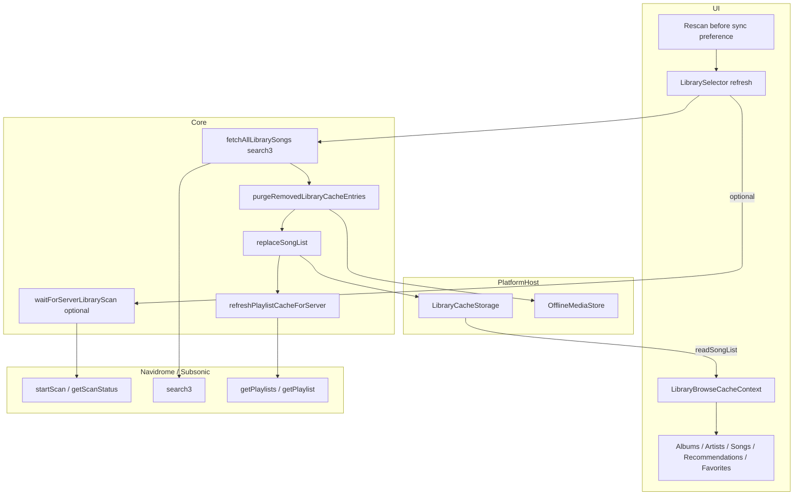

# Library sync (Navidrome / Subsonic)

How AsMusic mirrors a server music catalog into the local `LibraryCacheStorage` for browse UI. Primary fetch is paginated Subsonic **`search3`** (empty query, songs only), matching legacy iOS `getSongsPage`.

**Out of scope:** Playback queue ([`nowPlayingQueue.md`](./nowPlayingQueue.md)), player chrome ([`playerChrome.md`](./playerChrome.md)), playlist CRUD ([`playlist.md`](./playlist.md)) — only the post-sync playlist summary refresh is noted here. Offline **audio** downloads (`OfflineMediaStore`) are a separate store; this doc covers catalog metadata sync and how removed tracks purge offline orphans.

## Mental model

The main library UI does **not** live-browse Subsonic album/artist trees. It:

1. Syncs a **full song list** per music folder into local storage.
2. Derives albums / artists / favorites / recommendations (New Songs + Most Played from cache; see [`recommendations.md`](./recommendations.md)) / sorted songs from that flat `Child[]` list.
3. Reads the mirror on launch; **does not auto-sync**.

| Concept | Meaning |
|---------|---------|
| **Sync unit** | One `LibraryCacheScope` = `{ serverKey, libraryId }` |
| `serverKey` | Hash of normalized server URL + username (`serverAccountKey`) |
| `libraryId` | Subsonic music folder id, or `'default'` when the server has no folders |
| **Fetch** | Empty-query `search3`, page size 500, optional `musicFolderId` |
| **Write** | **Full replace** of that scope’s songs + rebuild album/artist index rows |
| **Trigger** | User taps refresh on an **active** library row in the Libraries selector |

Playlists are **account-scoped** (`serverKey` only) and refreshed **after** song sync — see [`playlist.md`](./playlist.md). Songs, artwork, and offline media remain **folder-scoped**.



## API usage

Client: `createNavidromeApi` → `subsonic-api` `SubsonicAPI` (`packages/core/src/api/client.ts`).

| Call | Role in sync |
|------|----------------|
| **`search3`** | Primary catalog fetch: `query: ''`, `artistCount/albumCount: 0`, `songCount: 500`, `songOffset`, optional `musicFolderId` |
| **`getMusicFolders`** | List libraries for the selector / names (not part of song write) |
| **`startScan` / `getScanStatus`** | Optional pre-sync server rescan |
| **`startScan.view` + `target=<libraryId>:`** | Navidrome selective scan for one music folder |
| **`getPlaylists` / `getPlaylist`** | After song sync only (`refreshPlaylistCacheForServer`) |
| **`star` / `unstar`** | Favorites mutations; see [`favorites.md`](./favorites.md) — starred flags also return on next `search3` |
| **`scrobble` (`submission=true`)** | Play counts; see [`playCount.md`](./playCount.md) — not part of catalog fetch |

**Not used for the catalog mirror:** `getAlbumList2`, `getArtists`, `getIndexes`, recursive `getMusicDirectory`, `getStarred2`.

## Types

```ts
type LibraryCacheScope = { serverKey: string; libraryId: string };
type LibraryCacheMeta = { lastSyncAt: number; songCount: number };

type LibraryRefreshProgress =
  | { phase: 'fetch'; loaded: number }
  | { phase: 'write'; written: number }
  | { phase: 'playlists' }; // leftover type; playlists are refreshed outside refreshLibraryCache
```

Song payload: `Child` from `subsonic-api`. Constant: `DEFAULT_LIBRARY_ID = 'default'`.

## `refreshLibraryCache` steps

`packages/core/src/library/refreshLibraryCache.ts`:

1. **`readSongList(scope)`** — pre-refresh snapshot (removed-id stats / comparison).
2. **Folder filter** — if `libraryId === 'default'`, omit `musicFolderId`; else pass it to `search3`.
3. **`fetchAllLibrarySongs`** — loop `search3` until page length `< 500`; emit `{ phase: 'fetch', loaded }`.
4. **Removed ids** — `removedSongIdsFromLibraryRefresh(cached, latest)`.
5. **`purgeRemovedLibraryCacheEntries`** — if `offlineMedia` is provided, delete ready offline keys whose `trackId` is gone from the latest list.
6. **`replaceSongList(scope, songs, …)`** — full replace + rebuild album/artist indexes + update meta; emit `{ phase: 'write', written }`.
7. **Return** `{ songCount, songs, removedSongCount }`.

**UI wrapper** (`useRefreshLibraryRow`) around that:

8. **`flushPendingLibraryMutations`** — push pending offline stars and play scrobbles before replace when possible.
9. Optional **`waitForServerLibraryScan`** when preference `asmusic-server-library-rescan-before-sync-v1` is on (before catalog fetch).
10. Call `refreshLibraryCache` with `offlineMedia: host.offlineMedia`.
11. **`refreshPlaylistCacheForServer`** for `{ serverKey }` (once per account after that row’s song sync).
12. **`reloadCachedSongsFromDisk()`** — re-read slices, **merge pending star intents and play-count deltas into the loaded rows (and `patchSong`) before the first `setSlices`**, then refresh playlist summaries.

There is **no incremental / delta sync** — always full fetch + full replace per scope. Catalog fetch/write has **no cancellation**. Scan wait supports `AbortSignal`, but the UI does not pass one. Only one library row refresh at a time (`refreshingKey`).

## Derived indexes

From flat `Child[]` in `libraryIndexFromSongs.ts` (legacy `LibraryIndexFromSongs` parity):

| Index | Rule |
|-------|------|
| **Albums** | Bucket by `albumId` or `title\|albumArtist`; prefer `al-*` coverArt; sort by album artist then title |
| **Artists** | Bucket by `artistId` or `name:<lowercased display>`; album count = distinct album buckets |
| **Favorites** | Filter `isChildStarred` (`starred` non-empty); **no** separate `getStarred` API |
| **Song list** | Sort album artist → album → disc → track → title |

`replaceSongList` materializes album/artist rows in storage. Browse UI primarily loads **songs** via `readSongList` and often re-derives catalogs in memory (`LibraryBrowseCacheContext`). `readCachedAlbumCount` feeds selector stats. `patchSong` updates one track (e.g. star) without rebuilding album/artist indexes.

Cover art is **not** cleared on normal sync (lazy / on-demand).

## Persistence backends

| Host | Backend |
|------|---------|
| Web | IndexedDB `asmusic-library-cache` — `indexedDbLibraryCacheStorage.ts` |
| iOS Capacitor | SQLite via native plugin — `LibraryCacheSQLiteStore.swift` |
| Desktop / Android | Planned SQLite (not shipped) |

Contract: `LibraryCacheStorage` (`readSongList`, `replaceSongList`, `patchSong`, playlist APIs, artwork, `deleteScope`, `purgeServerAccount`, …).

## UI trigger and progress

**Where:** Libraries tab → refresh icon on a library row → `useRefreshLibraryRow.refreshLibraryRow`.

**Guards:** Row must be active; `libraryId === 'unreachable'` skipped; one refresh at a time.

**Progress UX:** Spinner on the refreshing row; other refresh buttons disabled. Core `onProgress` is passed as **`undefined`** — no fetch/write counts in the UI. After finish, row cache stats (`songCount`, `albumCount`, `lastSyncAt`) reload.

**Optional rescan:** Preference “Rescan server library before sync”. Errors map to `scanTimeout` / `scanFailed`. Requires server admin privileges typically.

**Browse:** Sync does not stream into UI mid-flight; UI refreshes after disk reload. Opening the app only reads the local mirror.

## Multi-library / multi-server

- Multiple active libraries → multiple cache slices; catalogs merge across scopes.
- Refresh is **per library row** (one `libraryId` on one server).
- Each successful row refresh also re-runs **playlist** cache refresh for that account’s `serverKey`.
- `deleteScope` clears one folder’s songs/meta/artwork/indexes; playlists stay under `serverKey`.
- Removing a saved server → `purgeServerAccount(serverKey)` (and related offline purge elsewhere).

## Offline media vs library cache

| | Library cache | Offline media |
|--|---------------|---------------|
| Store | `LibraryCacheStorage` | `OfflineMediaStore` |
| Contents | `Child` metadata, indexes, playlist summaries, cover blobs | Audio bytes + ready metadata |
| Scope | `(serverKey, libraryId)` | `(scope, trackId, variant)` |
| On sync | Songs replaced | Orphans for **removed** track ids deleted when `offlineMedia` is passed |

## Capability matrix

| Capability | Status |
|------------|--------|
| Full song catalog via `search3` | Done |
| Per music-folder filter | Done |
| Full replace + derived indexes | Done |
| Optional server rescan before sync | Done (admin; Navidrome selective target) |
| Progress callbacks in core | Done |
| Progress UX (counts / phases) | **Gap** — spinner only |
| Incremental / delta sync | **Gap** |
| Cancel in-flight catalog sync | **Gap** |
| Auto-sync on launch / interval | **Gap** |
| Favorites from `starred` on songs | Done — see [`favorites.md`](./favorites.md) |
| Flush pending offline stars before sync | Done (`flushPendingLibraryMutations`) |
| Reapply pending stars after sync reload | Done (merged into slices before first paint) |
| Play scrobble / local playCount | Done — see [`playCount.md`](./playCount.md) |
| Desktop / Android SQLite cache | Planned only |

## Edge cases

- Empty `search3` → replace still writes meta with `songCount: 0`.
- No music folders → `DEFAULT_LIBRARY_ID` and no `musicFolderId` on `search3`.
- Scan timeout default **1 hour**; UI maps timeout specially.
- Failed `search3` throws **before** replace — previous song cache remains.
- Concurrent refreshes blocked in UI only.
- Pending stars / plays that fail to flush before sync are merged back onto reloaded server rows inside `reloadCachedSongsFromDisk` before UI state updates (avoids briefly showing wiped favorites / play counts).
- Artwork not purged on sync — covers can look stale until purge / refresh.
- iOS may store `lastSyncAt` in seconds and multiply ×1000 on read for JS.
- Unreachable server placeholder rows cannot refresh.

## Key files

| Area | Paths |
|------|-------|
| Orchestrator | `packages/core/src/library/refreshLibraryCache.ts` |
| `search3` pages | `packages/core/src/library/fetchAllLibrarySongs.ts` |
| Optional rescan | `packages/core/src/library/waitForServerLibraryScan.ts` |
| Scope | `packages/core/src/library/cacheScope.ts`, `constants.ts` |
| Indexes | `packages/core/src/library/libraryIndexFromSongs.ts` |
| Offline orphan purge | `packages/core/src/library/purgeRemovedLibraryCacheEntries.ts` |
| Storage contract | `packages/core/src/library/storage/LibraryCacheStorage.ts` |
| API client | `packages/core/src/api/client.ts` |
| Web storage | `packages/platform-web/src/indexedDbLibraryCacheStorage.ts` |
| iOS storage | `ios/App/App/LibraryCacheSQLiteStore.swift`, Capacitor bridge |
| UI trigger | `packages/ui/src/views/servers/librarySelector/useRefreshLibraryRow.ts` |
| Browse load | `packages/ui/src/contexts/LibraryBrowseCacheContext.tsx` |
| Rescan pref | `packages/ui/src/preferences/serverLibraryRescanBeforeSyncPreference.ts` |
| Post-sync playlists | `packages/core/src/library/playlistMutations.ts` → [`playlist.md`](./playlist.md) |
| Plans | `.cursor/plans/media-library/2026-07-07T23-49-55-server_playlists_per_account.plan.md`, `…-offline_media_architecture_….plan.md`, `…-favorites_star_parity_….plan.md`, `…-offline_high-priority_fixes_….plan.md` |
| Product note | `NOTE.md` (playlists per account vs songs per library) |
