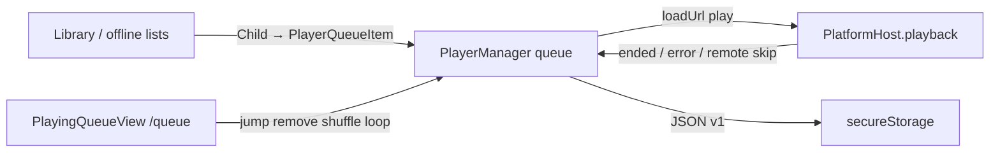

# Now-playing queue

Session playback queue owned by `PlayerManager`: ordered `PlayerQueueItem` rows, current index, loop modes, and position. Distinct from library Subsonic / local playlists.

**Out of scope:** Library playlist CRUD, sync, and catalog UI — see [`playlist.md`](./playlist.md). Those features only *enqueue into* this queue. Also out of scope here: sleep timer, EQ, waveform peaks, and cover-art caching internals (adjacent player chrome).

`NOTE.md` has no dedicated queue section (only playlist → player “Add to playlist”).

## Mental model

| Concept | What it is |
|---------|------------|
| **Playback queue** | Runtime ordered list of `PlayerQueueItem` snapshots. Not a saved library playlist. |
| **Current track** | `currentIndex` into that list + derived `currentItem`. Transport attaches here. |
| **Library playlist** | Durable catalog. Playing it **copies** track snapshots into the queue; playlist membership is unchanged. |

**Enqueue semantics:**

| User intent | Typical API | Queue effect |
|-------------|-------------|--------------|
| Tap / Play now (single song) | `insertAfterCurrent([item], { playFirst: true })` | Insert after current and jump — **does not wipe** the rest of the queue |
| Play next | `insertAfterCurrent(..., { playFirst: false })` | Insert after current; keep playing |
| Add to queue | `appendToQueue` | Push end; if empty, start at 0 |
| Play all / shuffle play all | `replaceQueueAndPlay` | Full replace |
| Clear (UI) | `clearQueueExceptCurrent` | Keep playing row only |

Duplicates are allowed: same `trackId` may appear many times. Identity for current track / reorder is **`rowId`**.



## Types

Defined in `packages/ui/src/player/core/types.ts`:

```ts
type PlayerQueueItem = {
  rowId: string;           // stable identity; duplicates get distinct rowIds
  serverId: string;
  libraryId: string;
  trackId: string;
  serverUrl: string;
  username: string;
  title: string;
  artist?: string;
  album?: string;
  durationSeconds?: number;
  suffix?: string;
  bitRate?: number;
  coverArtId?: string;
  coverArtFallbackId?: string;
  starred?: boolean;       // snapshot; patched from player star toggle
};

type PlayerViewState = {
  queue: readonly PlayerQueueItem[];
  currentIndex: number | null;
  currentItem: PlayerQueueItem | null;
  positionSeconds: number;
  durationSeconds: number;
  isPlaying: boolean;
  loadError: string | null;
  hasNext: boolean;
  hasPrevious: boolean;
  loopQueue: boolean;      // wrap on next / end-of-track
  loopOne: boolean;        // seek 0 on natural end (checked before advance)
  playingFromLocalFile: boolean;
};
```

Persistence shape (`playbackQueuePersistence.ts`):

```ts
type PersistedPlaybackQueueV1 = {
  v: 1;
  queue: PlayerQueueItem[];
  currentIndex: number | null;
  loopQueue: boolean;
  loopOne: boolean;
  positionSeconds: number;
};
```

Factories: `playerQueueItemFromChild.ts` (catalog `Child`); `playerQueueItemFromLocalEntry.ts` (local playlist → queue, wraps core `playerQueueItemFromLocalEntry`).

Ephemeral (not in queue structure): `PlayerToastEvent` (auto-skip), `PlayerServerTranscodePromptEvent`.

## Architecture

| Layer | Role |
|-------|------|
| `PlayerManager` | Owns queue array, mutations, load/advance/failure, persist schedule |
| `PlayerContext` / `PlayerProvider` | Instantiates manager, exposes `PlayerActions` + `PlayerViewState`, hydrates after servers restore, wires OS remotes |
| `PlatformHost.playback` | Stream / local file load, play/pause/seek, ended/error events |
| `PlatformHost.secureStorage` | Persist queue JSON |
| Library / offline UI | Build `PlayerQueueItem[]` and call actions |
| `PlayingQueueView` | Dedicated `/queue` editor UI |

## Mutations (`PlayerManager` → `PlayerActions`)

| Action | Behavior |
|--------|----------|
| `replaceQueueAndPlay(items, startIndex)` | Replace entire queue; play clamped index. Empty → teardown (pause, revoke, clear persist, reset loops). |
| `appendToQueue(items)` | Push end; if was empty, start at 0. |
| `insertAfterCurrent(items, { playFirst? })` | Splice after current; empty queue → replace@0; `playFirst` loads inserted head. |
| `playQueueIndex(index)` | Jump + autoplay. |
| `removeQueueIndex(index)` | Fix `currentIndex`; if removed current → load successor; if empty → teardown. |
| `duplicateQueueIndexToEnd` | Clone with new `rowId`. |
| `moveQueueIndexToPlayNext` | Move row to immediately after current. |
| `reorderQueue(from, to)` | `arrayMoveOne`; re-resolve current by `rowId`. **No UI caller.** |
| `clearQueueExceptCurrent` | Keep playing row only. |
| `reshuffleQueuePreservingCurrent` | Fisher–Yates; keep current `rowId` at front of shuffle logic (current preserved). |
| `toggleLoopQueue` / `toggleLoopOne` | Persisted with queue. |
| `skipNext` / `skipPrevious` | Advance/back; wrap only if `loopQueue`. Previous does **not** restart current when mid-track. |

### Auto-advance and failure

| Event | Behavior |
|-------|----------|
| Natural end (`handlePlaybackEnded`) | Emit `TrackCompletedEvent` (scrobble — see [`playCount.md`](./playCount.md)); then `loopOne` → seek 0 + play; else next; else wrap if `loopQueue`; else pause at end. |
| Playback failure | Unplayable suffix + transcode off → **prompt**, no auto-skip. Else skip forward up to `getPlaybackFailureAutoSkipLimit()` (settings, default 5, range 5–20). Does **not** wrap via `loopQueue`. Toast per skip. |
| Inactive library | `skipInactiveLibraryTracks`: skip rows whose `(serverId, libraryId)` ∉ `activeLibraryRefs`; toast; no wrap. Rows stay in the queue. |

Also on manager (adjacent): `patchCurrentQueueItemStarred`, sleep timer, now-playing artwork sync, persist-while-streaming offline mirror.

## Persistence

| Detail | Value |
|--------|--------|
| Key | `asmusic-playback-queue-v1` (`PLAYBACK_QUEUE_STATE_KEY`) |
| Write | Debounced **900 ms**; while playing, position-only throttle ~**1500 ms**. Empty / null current → `secureStorage.remove`. |
| Read | `PlayerProvider` → `hydrateFromPersistence(servers)` after `isRestoring` clears. Skips if queue already non-empty. |
| Filter | `filterQueueForKnownServers`: keep rows whose `serverId` + URL + username still match saved servers. Re-find current by `rowId`. |
| Restore | `loadCurrentTrack({ autoplay: false })` then `seek(positionSeconds)`. |
| Web | `localStorage` via `browserHost.secureStorage` |
| iOS | Keychain via Capacitor native plugin |
| Not persisted | Toast/prompt state, consecutive failure counter, sleep timer |

## UI entry points

| Entry | Location | Notes |
|-------|----------|-------|
| Route | `/queue` (`PLAYING_QUEUE_PATH`) → `PlayingQueueView` | Full-page AppBar + Virtuoso list |
| Mini bar | `PlayerMiniBarQueueButton` | Navigates to `/queue` (closes full player first); toggles back if already there |
| Drawer | `AppDrawer` “Playback queue” | Same route |
| Full-screen player | No dedicated queue button in AppBar | Queue via mini-bar / drawer / URL only |
| Cover belt gestures | Mini / full belt | Horizontal skip = queue prev/next; does **not** open queue |
| Deep link | `/queue` only | No query params / share scheme |

**Queue view actions:** tap row → play; ⋮ → play next / duplicate to end / remove; toolbar → shuffle, loop queue, loop one, clear-except-current (confirm).

`PlayingQueueView` supports `embedded={true}` for parent-supplied chrome — **no in-repo caller** uses it (ex-sheet leftover).

## How lists enqueue

Primary hub: `useLibraryBrowserPlayback.ts`.

| Source | Play now | Play next | Append | Play all / shuffle |
|--------|----------|-----------|--------|--------------------|
| Song / album / artist lists | `insertAfterCurrent` playFirst | insert | append / append all | shuffle → `replaceQueueAndPlay` |
| Server playlist | same per-track; play-all → replace@0 | same | append all | shuffle → replace |
| Local playlist | same; may enqueue unavailable placeholders | same | same | same |
| Offline downloads | Same pattern in `DownloadedSongListView` | same | same | same |

Song row chrome: `SongItem` / `SongItemActionsMenu` (`onPlayNext`, `onAppendToQueue`). MUI `PlaylistAdd` in song lists means **add to this queue**, not a library playlist.

## Multi-server / multi-library

- Each row stores its own `serverId` / `libraryId` / `serverUrl` / `username` — **mixed queues are allowed**.
- Hydration drops rows for removed or mismatched server accounts.
- Disabled library → skip + toast on play; row not removed.
- Local playlist placeholders with empty `serverId` fail load → auto-skip path.
- Star / stream / cover resolve per row’s server.

## OS / lock-screen integration

| Platform | Behavior |
|----------|----------|
| **iOS** | `loadUrl` sets `MPNowPlayingInfoCenter`; remotes use queue `hasNext` / `hasPrevious` / star. Events → `PlayerProvider` → `skipNext` / `skipPrevious` / star patch. |
| **Browser** | `<audio>` only; `loadUrl` ignores title/artist/artwork; **no** Media Session API. |
| **Android / desktop** | Not in current `PlatformKind`. |

The queue **list** is not exposed to the OS — only current-track transport and skip availability.

## Capability matrix

| Capability | Status |
|------------|--------|
| Typed queue + `rowId` | Done |
| Replace / append / play next / play index | Done |
| Remove / duplicate / move-to-play-next | Done (UI menu) |
| Drag reorder | **Gap** — `reorderQueue` exists, unused in UI |
| Shuffle preserving current | Done |
| Loop queue / loop one + persist | Done |
| Clear except current | Done |
| Clear entire queue while keeping chrome | **Gap** — teardown only via remove-last / empty replace |
| Virtuoso queue UI + scroll-to-current | Done |
| Persistence + server filter + position restore | Done |
| Auto-advance / loop wrap | Done |
| Auto-skip on failure + limit setting | Done |
| Skip inactive libraries | Done |
| Transcode prompt instead of skip (bad suffix) | Done |
| Previous restarts current when mid-track | **Gap** |
| Queue button on full-screen AppBar | **Gap** |
| Web Media Session / Android notification queue | **Gap** |
| Cross-device queue sync | Out of scope |
| `PlayingQueueView` embedded sheet | API unused |

## Edge cases

- Single-song “play now” **does not replace** the queue — can surprise users expecting album-from-here replace.
- Failure / inactive-library auto-skip stops at last track (no `loopQueue` wrap).
- Hydrate guards refuse to overwrite a non-empty in-memory queue.
- Plans may still name old paths (`player/types.ts`, `PlayingQueueSheet.tsx`); code lives under `player/core/` and `views/queue/`.
- Initial `now_playing_queue.plan.md` frontmatter may still say pending; parity plan marks the shipped surface completed.

## Key files

| Area | Paths |
|------|-------|
| Queue engine | `packages/ui/src/player/core/PlayerManager.ts` |
| Types | `packages/ui/src/player/core/types.ts` |
| Persistence | `packages/ui/src/player/core/playbackQueuePersistence.ts` |
| Factories | `playerQueueItemFromChild.ts`, `playerQueueItemFromLocalEntry.ts` |
| Context | `packages/ui/src/contexts/PlayerContext.tsx` |
| Queue UI | `packages/ui/src/views/queue/*` (`PLAYING_QUEUE_PATH = "/queue"`) |
| Library enqueue | `packages/ui/src/views/home/library/browser/useLibraryBrowserPlayback.ts` |
| Offline enqueue | `packages/ui/src/views/offline/DownloadedSongListView.tsx` |
| Mini-bar open | `packages/ui/src/player/miniBar/PlayerMiniBarQueueButton.tsx` |
| Belt skip slots | `packages/ui/src/player/shared/resolvePlayerBeltSlots.ts` |
| Host contracts | `packages/core/src/host/types.ts` (`PlaybackHost`, `SecureStorageHost`) |
| Auto-skip limit | `packages/ui/src/preferences/playbackFailureAutoSkipLimitPreference.ts` |
| iOS remotes | `ios/App/App/AsmusicNativePlugin.swift` |
| Plans | `.cursor/plans/player/2026-05-17T16-03-11-now_playing_queue.plan.md`, `…-now_playing_queue_parity_05dd035d.plan.md`, `…-ios_now_playing_transport_949260f0.plan.md`, `…-player_manager_and_ui.plan.md` |
| Related feature doc | [`playlist.md`](./playlist.md), [`playCount.md`](./playCount.md), [`favorites.md`](./favorites.md) |
