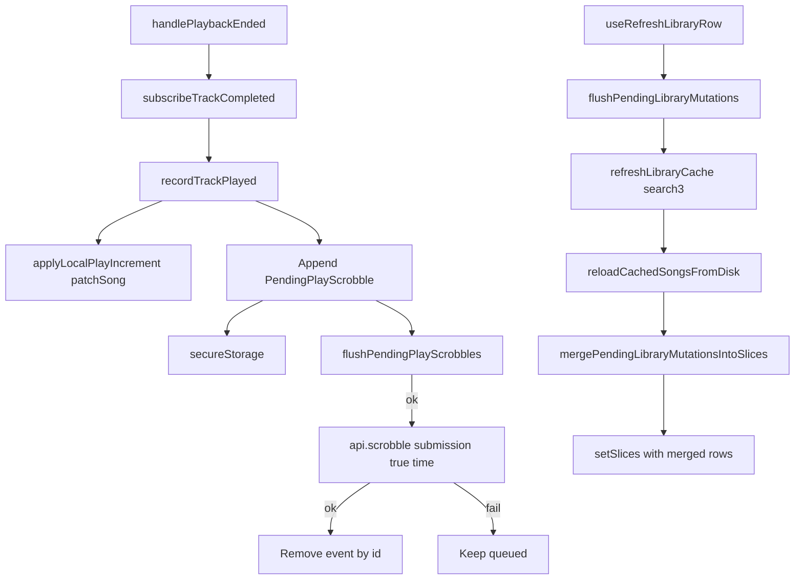

# Play count (scrobble)

Record completed listens to Navidrome / Subsonic via `scrobble` (`submission=true`), with an offline pending queue and optimistic local `Child.playCount` / `Child.played` patches on the library song cache.

**Out of scope:** UI chrome that displays counts, Frequent / Most-played browse tabs, Last.fm-style mid-track thresholds, `scrobble(submission=false)` now-playing, `setRating`, album/artist derived-index rollups of playCount.

Navidrome does **not** increment play counts on `stream` — only on explicit scrobble. Catalog sync still brings `playCount` / `played` back on `Child` from `search3` when the server has them.

## Mental model

| Concept | Meaning |
|---------|---------|
| **Server truth** | Per-user play totals on Navidrome after successful `scrobble` (`submission=true`) |
| **Local display total** | Cached `Child.playCount` after optimistic bumps (and after sync merge of any still-pending delta) |
| **Pending delta** | One queued event per completed listen in secure storage; removed after successful flush |
| vs **stars** | Stars are LWW boolean intents — see [`favorites.md`](./favorites.md); plays are **additive** events — never coalesce away listens |

| Capability | Status |
|------------|--------|
| Scrobble on natural track end | Done |
| Loop-one counts each completion | Done |
| Offline pending queue + flush | Done |
| Optimistic `playCount` / `played` via `patchSong` | Done |
| Flush stars + plays before library sync | Done |
| Merge pending deltas after sync reload (no UI flicker) | Done |
| Skip / load-failure does not scrobble | Done |
| Show counts in full-screen track details | Done |
| Show counts in list / other UI | **Gap** |
| Frequent / most-played tab | **Gap** |
| Mid-track duration threshold | **Gap** |
| Now-playing (`submission=false`) | **Gap** |

## Architecture



## Types

### Pending queue (`@asmusic/core`)

```ts
type PendingPlayScrobble = {
  id: string;        // stable event id (remove-after-flush)
  serverId: string;
  libraryId: string;
  trackId: string;
  playedAt: number;  // epoch ms → Subsonic scrobble `time`
  queuedAt: number;
};

// Storage key: asmusic-pending-play-scrobbles-v1 (host.secureStorage)
// Soft cap: PENDING_PLAY_SCROBBLES_MAX_QUEUE = 2000 (drop oldest)
// Retry: PENDING_PLAY_SCROBBLES_RETRY_INTERVAL_MS = 5 minutes
```

Helpers: `appendPendingPlayScrobble`, `removePendingPlayScrobblesById`, `pendingCountForTrack`, `pendingPlayDeltasByTrack`, parse/serialize. Re-exported from `@asmusic/core` like star mutations.

### Player event

```ts
type TrackCompletedEvent = {
  serverId: string;
  libraryId: string;
  trackId: string;
  playedAt: number; // epoch ms
};
```

### Song fields (Subsonic `Child`)

- `playCount?: number` — bumped locally; refreshed from server on sync
- `played?: string` — ISO timestamp of last listen; kept as the newer of server vs pending

## Sync / persistence

| Layer | What |
|-------|------|
| **Song row** | `LibraryCacheStorage.patchSong` after each local increment / merge |
| **Pending queue** | JSON array in `secureStorage` (`asmusic-pending-play-scrobbles-v1`) |
| **Catalog baseline** | Full `search3` replace via [`librarySync.md`](./librarySync.md); may include server `playCount` / `played` |

**Flush triggers:** after `recordTrackPlayed`, after queue hydration on launch, browser `online`, 5‑minute interval while open, and explicitly via `flushPendingLibraryMutations` before library sync.

**Cold start:** hydrate pending queue from disk and attempt flush. Do **not** re-add pending counts onto song rows — disk already has optimistic `playCount` from earlier `patchSong`.

**After library sync:** `reloadCachedSongsFromDisk` reads server rows, then `mergePendingLibraryMutationsIntoSlices` adds still-pending star intents and play deltas (and `patchSong`s) **before** the first `setSlices`, so the UI does not briefly show wiped local state.

## Mutations

1. **Natural end** — `PlayerManager.handlePlaybackEnded` emits `TrackCompletedEvent` for the current queue item **before** loop-one seek or queue advance.
2. **`PlayerContext`** — `subscribeTrackCompleted` → `recordTrackPlayed`.
3. **`recordTrackPlayed`** — `applyLocalPlayIncrement` when the track is in an active library slice (always queues even if missing from cache); persist; fire-and-forget flush.
4. **Flush** — per event: `api.scrobble({ id: trackId, submission: true, time: playedAt })`; remove by `id` on success.
5. **Sync path** — `useRefreshLibraryRow`: `flushPendingLibraryMutations` (stars + plays) → `refreshLibraryCache` → `reloadCachedSongsFromDisk` (merge pending).

Not fired on user skip or load-failure auto-skip — only host `onPlaybackEnded`.

## UI entry points / deep links

| Surface | Role |
|---------|------|
| Playback transport end | Implicit — records scrobble |
| Full-screen **Track details** | Shows live `playCount` from library cache (or em dash if not cached) |
| Library selector sync | Flushes pending scrobbles before catalog replace |

No browse tab, URL param, or preference for play counts. List UIs do not show counts yet.

## Multi-library / multi-server

- Each pending event carries `serverId` + `libraryId` + `trackId`.
- Flush uses `getApiForServer(serverId)` per event (mixed queues / multi-library OK).
- Multi-device: each client scrobbles its own listens; the server **accumulates** (no LWW conflict, unlike stars).

## Edge cases

- Track not in library cache: scrobble still queued; skip optimistic patch.
- Offline / local-file playback: still counts (completion is host `ended`).
- Loop-one: each natural end counts, then seek 0.
- Soft cap 2000: oldest pending events dropped if the queue grows unbounded offline.
- After successful flush, pending delta is empty; local `playCount` stays combined until the next sync refreshes from the server.
- `played` on merge/reapply: keep server value when it is newer than the pending `playedAt`.
- Initial scope load still re-applies **stars** only onto slices; play deltas are merged on **sync reload**, not on cold song read (avoids double-counting optimistic disk values).

## Key files

| Path | Role |
|------|------|
| `packages/core/src/library/pendingPlayScrobbles.ts` | Queue types / helpers / storage key |
| `packages/core/src/index.ts` | Re-exports |
| `packages/ui/src/contexts/LibraryBrowseCacheContext.tsx` | `recordTrackPlayed`, flush, hydrate, `mergePendingLibraryMutationsIntoSlices` |
| `packages/ui/src/player/core/PlayerManager.ts` | Emit on natural end |
| `packages/ui/src/player/core/types.ts` | `TrackCompletedEvent` |
| `packages/ui/src/contexts/PlayerContext.tsx` | Wire completed → `recordTrackPlayed` |
| `packages/ui/src/views/servers/librarySelector/useRefreshLibraryRow.ts` | Flush before sync |

## Related

- Catalog sync / song mirror: [`librarySync.md`](./librarySync.md)
- Playback queue / `handlePlaybackEnded`: [`nowPlayingQueue.md`](./nowPlayingQueue.md)
- Favorites / star offline queue: [`favorites.md`](./favorites.md)
