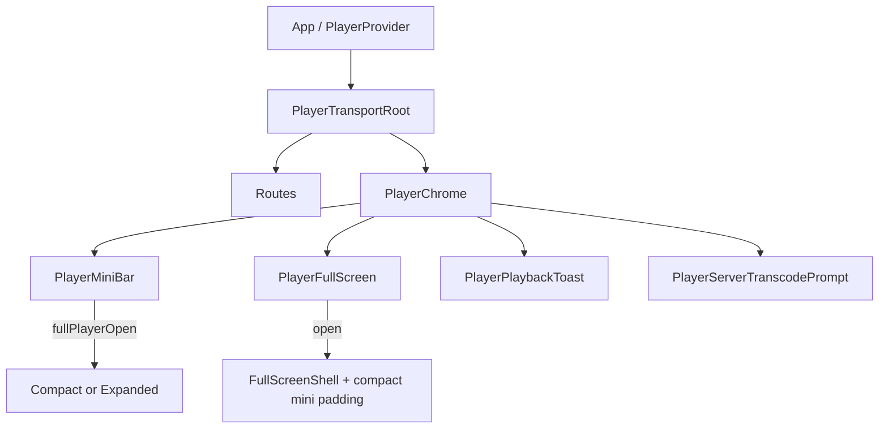

# Player chrome (mini bar & full screen)

Always-on bottom mini player and optional full-screen overlay. Mounted together by `PlayerChrome`; shell open state is `fullPlayerOpen` in `PlayerContext`.

**Out of scope:** Playback queue list and mutations — [`nowPlayingQueue.md`](./nowPlayingQueue.md). Library playlist CRUD — [`playlist.md`](./playlist.md) (full screen only *adds* the current track). Sleep timer host/API details (entry is App drawer, noted below). EQ / offline download jobs.

`NOTE.md` has no chrome-specific section.

## Mental model

| Surface | What it is | When visible |
|---------|------------|--------------|
| **Mini bar** | Fixed bottom dock | Always (under `PlayerTransportRoot`) |
| **Full screen** | Modal overlay (`role="dialog"`) | `fullPlayerOpen === true` |
| **Queue route** | `/queue` | Router — not chrome; opened from mini bar |

**Expanded vs compact mini bar** is **not** a settings preference. It follows `fullPlayerOpen`:

| `fullPlayerOpen` | Mini mode | Content |
|------------------|-----------|---------|
| `false` | **Expanded** | Art, track, progress, gestures or transport buttons, queue, expand |
| `true` | **Compact** | Queue + minimize only; sits **above** full screen (`zIndex: modal + 1`) |

Heights today: both modes use **56px** (`PLAYER_MINI_BAR_BASE_PX` === `PLAYER_MINI_BAR_COMPACT_PX`). Difference is content + z-index, not size.

`fullPlayerOpen` is React session state (default `false`); **not persisted**.

## Architecture

| Layer | Role |
|-------|------|
| `PlayerProvider` | `fullPlayerOpen`; `openFullPlayer` / `closeFullPlayer` / `toggleFullPlayer` |
| `PlayerChrome` | Mounts mini + full + skip toast + transcode prompt |
| `PlayerMiniBar` | Switches Expanded ↔ Compact on shell flag |
| `PlayerFullScreen` | Composition: AppBar, alerts, dialogs, body |
| `player/shared/*` | Cover art, belt slots, skip gesture math |
| Settings prefs | Mini swipe gestures; waveform progress (shared) |

Transport used by chrome: `togglePlayPause`, `seek` / `seekBy`, `skipNext` / `skipPrevious`, star patch, cover refresh, add-to-playlist (via cache), enable-transcode.

## Preferences

| Key | Default | Effect |
|-----|---------|--------|
| `asmusic-mini-player-swipe-gestures-v1` | on (`!== '0'`) | Settings → Playback → mini bar swipe / tap / hold-scrub |
| `asmusic-waveform-progress-bar-v1` | on | Decorative mini waveform + full-screen scrubbable waveform when local/offline-ready |

Related settings (not chrome layout): haptics, server transcode, auto-skip limit.

## Mini bar

### Expanded (`PlayerMiniBarExpanded`)

- Shell: fixed bottom, safe-area via `env(safe-area-inset-*)`, `zIndex: appBar + 1`
- **Progress layer** (non-interactive paint): waveform (`WaveformProgressBar` `variant="miniBar"`) when pref on + local/offline-ready + peaks; else solid fill
- **Gesture zone** (swipe pref on): cover + title belt (`resolvePlayerBeltSlots`); legacy gestures (`usePlayerMiniBarLegacyGestures`)
- **Transport buttons** (swipe pref off): prev / play-pause / next
- Queue button + expand (up chevron)

### Compact (`PlayerMiniBarCompact`)

- Same height; `zIndex: modal + 1` so it stays above the full-screen sheet
- Queue + minimize (down chevron / `toggleFullPlayer`) only

### Gestures (swipe mode on)

Mirrors legacy `PlayerBarView.swift` thresholds (`usePlayerMiniBarLegacyGestures`):

| Gesture | Behavior |
|---------|----------|
| Tap (≤10px, before long-press) | Play/pause if `currentItem` |
| Long-press 380ms | Scrub mode; horizontal seek (`deltaX / zoneWidth * duration`), throttle 120ms; haptics |
| Horizontal drag | Carousel + belt skip (`playerBeltSkipGesture`); commit next/prev |
| Swipe up (\|v\| dominant, v < −28) | `toggleFullPlayer` (opens full screen) |
| After commit | Suppress synthetic clicks ~450ms |

Swipe off → static track info + explicit transport buttons; no hold-scrub on the bar.

### Queue button

`PlayerMiniBarQueueButton`: if full screen open → `closeFullPlayer()` then navigate `/queue`; if already on `/queue` → `navigate(-1)`.

## Full screen

### Shell (`PlayerFullScreenShell`)

- Fixed inset using CSS vars `--safe-area-*` (mini uses `env()` — slight difference)
- Escape closes; locks `body` overflow while open
- Bottom padding = `PLAYER_MINI_BAR_COMPACT_PX` so compact mini remains usable
- Children unmounted when closed (`if (!open) return null`)

### AppBar

- Close (`PageCloseButton`)
- When `currentItem`: star, add-to-playlist (`PlaylistAddOutlined`), overflow (track info, refresh cover art)
- **No** queue button, **no** sleep timer in AppBar

### Body

| Block | Behavior |
|-------|----------|
| Empty | Copy + path back to library (`onClose`) |
| Track display | Multi-slot display belt (title/album/artist above cover) or single-slot cover belt; horizontal skip |
| Album / artist | Navigate library browser URLs then `closeFullPlayer()` |
| Long-press title/album/artist | Copy to clipboard + snackbar |
| `loadError` | Error text under artwork |
| Progress | Waveform scrub bar when pref + local/offline + peaks; else MUI `Slider` (step 0.5). Time · format/bitrate · duration |
| Transport | Rewind 10 / prev / play-pause / next / forward 10. Next disabled when `!hasNext`; prev only gated on `busy` (not `!hasPrevious`) |

Scrub state cleared when full screen closes.

### Track actions (`usePlayerFullScreenTrackActions`)

| Action | Behavior |
|--------|----------|
| Star | Optimistic `patchCurrentQueueItemStarred` + library cache API |
| Add to playlist | All local + same-**server** playlists; dialog + alerts on error |
| Refresh cover | Network refetch into cache + best-effort now-playing artwork sync |
| Track info dialog | Title, artist, album, format, bitrate, duration, trackId (`buildPlayerFullScreenTrackMeta`; format respects transcode pref) |

Library nav: `usePlayerLibraryNavigation` resolves album/artist from cache (name fallbacks), navigates `/` with browser params, closes full player.

### Chrome-level feedback

| Component | Role |
|-----------|------|
| `PlayerFullScreenErrorAlerts` | Star / playlist / refresh-cover errors |
| `PlayerPlaybackToast` | Auto-skip (failure / disabled library) from manager |
| `PlayerServerTranscodePrompt` | Enable transcode & retry |

### Sleep timer

**Not in full-screen UI.** Entry: home `AppDrawer` → `SleepTimerDialog`. Sleep-timer plan once targeted full-screen toolbar; shipped in drawer instead.

## Shared cover belt / skip gestures

| Piece | Role |
|-------|------|
| `resolvePlayerBeltSlots` | Prev / current / next (loop-aware via `hasNext` / `hasPrevious`); drag clamp |
| `playerBeltSkipGesture` | Arm next (swipe left) / previous (right); cancel if reverse past slop; threshold **28**, cancel slop **12** |
| `usePlayerCoverBeltGestures` | Full-screen cover belt only (no tap play, scrub, or swipe-up) |
| `usePlayerMiniBarLegacyGestures` | Mini: skip + play/pause + scrub + open full |
| `PlayerCoverArtBelt` | Cover-only carousel (single-slot full path) |
| `usePlayerCoverArt` (+ cache bump helpers) | Resolve artwork; multi-server slots use per-`serverId` APIs |

## Platform notes

| Aspect | Behavior |
|--------|----------|
| UI trees | Same React chrome on web + iOS Capacitor |
| Safe area | Mini: `env(...)`; full: `--safe-area-*` vars |
| Haptics | `playImpactIfEnabled(host)` on belt commits / long-press scrub / copy |
| Waveform local files | `useWaveformPeaks` may use `Capacitor.convertFileSrc` for native paths |
| iOS Control Center | Remotes → `PlayerProvider` → manager (not chrome widgets) |

## Capability matrix

| Capability | Mini expanded | Mini compact | Full screen |
|------------|:-------------:|:------------:|:-----------:|
| Always-on dock | ✓ | ✓ | — |
| Play/pause | ✓ | — | ✓ |
| Skip ± | ✓ | — | ✓ |
| Seek ±10s | — | — | ✓ |
| Scrub | ✓ (hold, swipe on) | — | ✓ |
| Waveform visual | ✓ (local/offline) | — | ✓ (scrubbable) |
| Open/close full | ✓ | ✓ | ✓ |
| Queue entry | ✓ | ✓ | — |
| Star / playlist / track info | — | — | ✓ |
| Refresh cover | — | — | ✓ |
| Album/artist nav | — | — | ✓ |
| Sleep timer UI | — | — | — (drawer) |
| Loop/shuffle UI | — | — | — (queue route) |
| Persist full-open | — | — | — |

## Edge cases / dead code

- **`openFullPlayer` unused by UI** — chrome calls `toggleFullPlayer` / `closeFullPlayer`; swipe-up option is named `openFullPlayer` but receives toggle.
- Compact and expanded heights are identical (56px).
- Prev button not disabled when `!hasPrevious` (unlike next); belt skip still respects `hasPrevious`.
- Add-to-playlist dialog often gets `error={null}`; errors surface via alerts above.
- Empty mini: placeholder title; transport disabled; expand still opens empty full screen.
- Old plans may mention `PlayingQueueSheet` / full-screen queue icon — queue is `/queue` + mini button ([`nowPlayingQueue.md`](./nowPlayingQueue.md)).

## Key files

| Area | Paths |
|------|-------|
| Mount | `packages/ui/src/player/PlayerChrome.tsx`, `App.tsx` (`PlayerTransportRoot`) |
| Shell state | `packages/ui/src/contexts/PlayerContext.tsx` |
| Mini | `packages/ui/src/player/miniBar/*` |
| Mini prefs | `miniBar/miniPlayerPreferences.ts` |
| Full | `packages/ui/src/player/fullScreen/*` |
| Shared belt | `player/shared/playerBeltSkipGesture.ts`, `resolvePlayerBeltSlots.ts`, `usePlayerCoverBeltGestures.ts`, `PlayerCoverArtBelt.tsx` |
| Waveform | `WaveformProgressBar.tsx`, `fullScreen/WaveformScrubBar.tsx`, `preferences/waveformProgressBarPreference.ts` |
| Heights | `player/core/constants.ts` |
| Toast / transcode | `PlayerPlaybackToast.tsx`, `PlayerServerTranscodePrompt.tsx` |
| Sleep entry | `views/home/AppDrawer.tsx`, `player/sleepTimer/SleepTimerDialog.tsx` |
| Plans | `.cursor/plans/player/2026-05-17T16-03-11-player_manager_and_ui.plan.md`, `…-sleep_timer_platformhost_baa20f33.plan.md`, `…-ios_now_playing_transport_949260f0.plan.md` |
| Related docs | [`nowPlayingQueue.md`](./nowPlayingQueue.md), [`playlist.md`](./playlist.md) |
