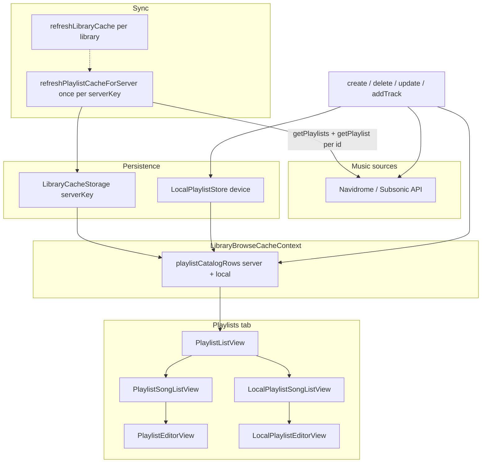

# Playlists

Library playlists in AsMusic: Subsonic **server playlists** (synced per account) and device-**local** cross-library playlists. Browse, play, create, edit membership, delete, add from the full-screen player, and offline bulk download.

**Out of scope for this doc:** the now-playing / playback queue (`PlayerManager`). Playing a playlist only copies tracks into that queue; it does not mutate playlist membership. MUI `PlaylistAdd` in album/song lists means “add to queue,” not a Subsonic or local playlist.

There is no Apple Music / Spotify playlist integration. Music sources are Navidrome / Subsonic / OpenSubsonic servers plus the on-device local playlist store.

## Mental model

Two playlist kinds share one **Playlists** tab catalog:

| Kind | Persistence | Scope | Synced? |
|------|-------------|-------|---------|
| **Server** | Subsonic account + `LibraryCacheStorage` | `serverKey` (URL + username hash) | Yes — `getPlaylists` / `getPlaylist` / mutations |
| **Local** | `LocalPlaylistStore` on device | Device-global | No — never uploaded to Subsonic |

- Subsonic playlists are **per server account**, not per music-folder `libraryId`. Songs, artwork, and offline media remain per `(serverKey, libraryId)`.
- Local playlist entries are refs `(serverKey, libraryId, trackId)` with optional snapshot metadata (title/artist/album/cover) captured at add time.
- Playing either kind builds `PlayerQueueItem`s and calls `replaceQueueAndPlay` / `appendToQueue`. Membership is unchanged.

Product notes live in `NOTE.md` (section “Playlist creation and multiple active libraries”). This file is the detailed feature doc.

## Architecture



## Types

### Server (`LibraryCacheStorage`)

```ts
type LibraryPlaylistSummary = {
  id: string;
  name: string;
  songCount: number;
};

type ServerPlaylistScope = { serverKey: string };
```

Cached entry order: ordered `trackId[]` per `(serverKey, playlistId)` via `readPlaylistEntryTrackIds` / `replacePlaylistEntryTrackIds`.

### Local (`LocalPlaylistStore`)

```ts
type LocalPlaylistSummary = {
  id: string;
  name: string;
  trackCount: number;
  createdAt: number;
  updatedAt: number;
};

type LocalPlaylistTrackRef = {
  serverKey: string;
  libraryId: string;
  trackId: string;
  title?: string;
  artist?: string;
  album?: string;
  coverArtId?: string;
};

type LocalPlaylistEntry = LocalPlaylistTrackRef & { sortIndex: number };
```

Editor membership uses composite keys `serverKey|libraryId|trackId` (`localPlaylistEntryKey`).

### Catalog UI row

`PlaylistCatalogRow` in `LibraryBrowseCacheContext`:

- `kind: 'server'` — `playlist`, `serverId`, `serverKey`, `rowKey`
- `kind: 'local'` — `playlist` (summary shaped like `{ id, name, songCount }`), `rowKey`

Sorted by name (then `rowKey`) across both kinds.

## Sync and persistence

### Server playlist cache

Not refreshed inside `refreshLibraryCache` (songs only). After a library song sync completes, `useRefreshLibraryRow` calls `refreshPlaylistCacheForServer` **once per `serverKey`**:

1. `getPlaylists` → `replacePlaylistSummaries`
2. Per playlist: `getPlaylist` → `replacePlaylistEntryTrackIds`
3. `purgePlaylistEntryTrackIdsNotIn` for stale playlist ids

Mutations in context (`createPlaylist`, `deletePlaylist`, `addTrackToPlaylist`, `updatePlaylistMembership`) call Subsonic then `refreshPlaylistCacheForServer` again.

Detail open always tries live `getPlaylist` via `loadPlaylistTracks` and updates the entry-id cache. On failure, falls back to cached entry ids ∩ merged song cache for that server (`fromCache: true`). Offline/cache-fallback membership load is **read-only** in the editor (save needs network).

Server playlist rows survive per-library `deleteScope` (they are keyed only by `serverKey`).

### Local playlist store

| Platform | Backend |
|----------|---------|
| Web | IndexedDB `asmusic-local-playlists` (`indexedDbLocalPlaylistStorage.ts`) |
| iOS | SQLite `local_playlists` + `local_playlist_entries` (`LibraryCacheSQLiteStore.swift`) |
| Host wiring | `PlatformHost.localPlaylists` (`browserHost` / Capacitor) |

Device-only; survives library disable / `deleteScope`. Entries resolve to `available` | `libraryDisabled` | `unavailable` (`localPlaylistEntries.ts`).

`LocalPlaylistStore.rename` exists on web + iOS but **no UI** calls it.

## Core APIs

### Server — `packages/core/src/library/playlistMutations.ts`

| Function | Purpose |
|----------|---------|
| `fetchPlaylistSummariesFromApi` | `getPlaylists` → summaries |
| `refreshPlaylistSummariesOnly` | Fetch + write summaries |
| `refreshPlaylistEntryTrackIdsForServer` | Entry ids for all summaries |
| `refreshPlaylistCacheForServer` | Summaries + entry ids |
| `updatePlaylistTracks` | `updatePlaylist`: remove indices high→low, then add ids |
| `playlistEditDiff` | Checkbox editor add/remove sets |
| `reorderPlaylistEntries` | Full replace via remove-all + add-all (**unused by UI**) |

### Server load — `loadPlaylistTracks.ts`

Network-first `getPlaylist`; on failure, cached entry ids joined to `cachedSongs`. Returns `{ title, tracks, entryTrackIds, fromCache }`.

### Local — `packages/core/src/localPlaylists/`

| Module | Role |
|--------|------|
| `LocalPlaylistStore.ts` | Interface + types + noop store |
| `localPlaylistMutations.ts` | Create/delete/append/membership + composite keys |
| `localPlaylistEntries.ts` | Resolve entry status; build queue items (never filters unavailable) |

Local `appendTrack` dedupes the same `(serverKey, libraryId, trackId)` in storage backends.

## State layer (`LibraryBrowseCacheContext`)

- Loads `serverPlaylistsByServerKey` from `readPlaylistSummaries` per unique server among active scopes.
- Loads `localPlaylistSummaries` from `host.localPlaylists`.
- Merges into `playlistCatalogRows`.

| Method | Effect |
|--------|--------|
| `createPlaylist({ serverId, name })` | Subsonic `createPlaylist` + cache refresh |
| `deletePlaylist` | Subsonic `deletePlaylist` + refresh |
| `addTrackToPlaylist` | `updatePlaylistTracks` add one id + refresh |
| `updatePlaylistMembership` | Diff via `updatePlaylistTracks` + refresh |
| `createLocalPlaylist` / `deleteLocalPlaylist` | Local store + reload summaries |
| `addTrackToLocalPlaylist` | `appendTrack` + reload |
| `updateLocalPlaylistMembership` | Diff → `replaceEntries` + reload |

`canCreateServerPlaylist` / `canCreateLocalPlaylist` are true when any library scope is active.

## Navigation and deep links

Playlists is a first-class library tab (`tab=playlists`). Query encoding in `libraryNavigationUrl.ts`:

| Prefix | Payload | Meaning |
|--------|---------|---------|
| `lp1.` | `{ serverKey, id }` | Server playlist |
| `lpl1.` | `{ id }` | Local playlist (device-global) |
| `lb1.` | `{ serverKey, libraryId, id }` | Legacy multi-library ref (albums/artists; older playlist links) |

Optional `playlistName` for display before cache resolves. Resolution: `useLibraryBrowserResolvedScopes`.

`LibraryBrowser` states on the playlists tab:

1. **List** — `PlaylistListView`
2. **Detail** — `PlaylistSongListView` or `LocalPlaylistSongListView`
3. **Editor** — `PlaylistEditorView` / `LocalPlaylistEditorView` (overlay; not a separate URL)

Orchestration: `useLibraryBrowserPlaylists.tsx`.

## UI

### List (`playlists/*`)

- Virtuoso list + search (`playlistListFilter`)
- **Create** (+): radios **On server** / **On this device** (`PlaylistListViewCreateDialog`)
  - Multi-server → **server picker** for server create (not a library picker)
  - Multi-library → default create type is often **local** (see handlers / create dialog defaults)
- **Delete** per row via ⋮ menu (confirm dialog)
- Server rows can show server/library context in the secondary line when multi-server

### Server detail (`PlaylistSongListView`)

- Loads via `loadPlaylistTracks` with merged cached songs for that **server**
- Play all / add all to queue / shuffle; per-track play / next / queue / star
- Offline download: one job using the **first resolvable track’s `libraryId`** (limitation if tracks span folders)
- Edit / Delete in ⋮ menu; edit gated on having `playlistDetailApi` (session), not on library count

### Local detail (`LocalPlaylistSongListView`)

- Resolves entries to available / library-disabled / unavailable; UI grays non-available rows
- Same playback actions; play-all enqueues **all** entries in order (including unavailable — `PlayerManager` auto-skips load failures)
- Offline download: **splits** by `(serverId, libraryId)` into multiple jobs (available tracks only)

### Editors

| Editor | Song pool | Save |
|--------|-----------|------|
| `PlaylistEditorView` | Merged cached songs for that **server** across active libraries | `playlistEditDiff` → `updatePlaylistMembership` |
| `LocalPlaylistEditorView` | All active libraries’ `songEntries` via composite keys | `localPlaylistEditDiff` → `updateLocalPlaylistMembership` |

No drag-reorder UI despite `reorderPlaylistEntries` in core.

### Player — add to playlist

- Full-screen toolbar: `PlaylistAddOutlined` (distinct from queue `PlaylistAdd`)
- `usePlayerFullScreenTrackActions`: lists **all local** playlists + **server** playlists where `serverId ===` current track’s server
- Dialogs: `AddToPlaylistDialog` / `PlayerFullScreenAddToPlaylistDialog`
- Local add snapshots metadata via `localPlaylistTrackRefFromChild`

### Dead / leftover UI

- `PlaylistSingleLibraryRequiredDialog` — unused leftover from older single-library edit rules
- i18n still has some `editDisabledMulti` strings; edit is no longer gated on “single library only”

## Playback (from playlist → queue)

`useLibraryBrowserPlayback` builds queue items and delegates to `PlayerContext`. Playing does **not** write back to Subsonic or the local store.

Local: `playerQueueItemFromLocalEntry` never drops unavailable tracks from the enqueue list.

## Offline download

`OfflineDownloadContext.enqueuePlaylistDownload` → `OfflineBulkJobQueue` job kind `'playlist'`.

| Source | Behavior |
|--------|----------|
| Server playlist | Single `(serverId, libraryId)` from first track that resolves a library |
| Local playlist | One job per `(serverId, libraryId)` group of available tracks |

## Multi-library / multi-server rules

| Action | Behavior |
|--------|----------|
| Create server playlist | Any active library; **server picker** when multiple servers |
| Create local playlist | Any active libraries; preferred default when multi-library |
| Edit server membership | Merged song pool for that server; needs API session |
| Edit local membership | All active libraries’ songs |
| Add from player (server) | Same **server** as track |
| Add from player (local) | Always listed |
| Delete | Always (server API or local store) |
| Browse / play | Always |

## Capability matrix

| Capability | Server | Local |
|------------|--------|-------|
| Browse in Playlists tab | Yes | Yes |
| Create | Yes | Yes |
| Delete | Yes | Yes |
| Rename | No UI | Store API only, no UI |
| Edit membership (checkboxes) | Yes | Yes |
| Reorder | Core helper only | Order via `replaceEntries` only; no drag UI |
| Add from player | Same server | Always |
| Offline download | Yes (single-library heuristic) | Yes (split by scope) |
| Sync to server / other devices | Subsonic account | Device only |
| Offline browse via entry cache | Yes (`loadPlaylistTracks`) | Via local store + song caches |

## Gaps / edge cases

- **Rename** not exposed in UI (local store supports it; server `updatePlaylist` name unused).
- **Drag-reorder** not wired (`reorderPlaylistEntries` unused).
- Summary fields limited to `id` / `name` / `songCount` — no owner / duration / shared labeling.
- Server offline download may mis-assign `libraryId` when a playlist spans music folders.
- Duplicate add to a **server** playlist is not client-deduped (server-dependent); local append dedupes.
- Local unavailable tracks still enter the play-all queue (by design).
- Enabling a disabled library mid-queue can satisfy later local entries without re-enqueue.

## Key files

| Area | Paths |
|------|-------|
| Server mutations / load | `packages/core/src/library/playlistMutations.ts`, `playlistEntries.ts`, `loadPlaylistTracks.ts` |
| Scope | `packages/core/src/library/cacheScope.ts` (`ServerPlaylistScope`) |
| Storage contract | `packages/core/src/library/storage/LibraryCacheStorage.ts` |
| Local playlists | `packages/core/src/localPlaylists/*` |
| Web storage | `indexedDbLibraryCacheStorage.ts`, `indexedDbLocalPlaylistStorage.ts` |
| iOS storage | `ios/App/App/LibraryCacheSQLiteStore.swift`, Capacitor bridges |
| Context | `packages/ui/src/contexts/LibraryBrowseCacheContext.tsx` |
| Browser | `LibraryBrowser.tsx`, `useLibraryBrowserPlaylists.tsx`, `useLibraryBrowserResolvedScopes.ts`, `libraryNavigationUrl.ts` |
| List UI | `packages/ui/src/views/home/library/playlists/*` |
| Detail / editor | `detail/PlaylistSongListView.tsx`, `LocalPlaylistSongListView.tsx`, `PlaylistEditorView.tsx`, `LocalPlaylistEditorView.tsx` |
| Playback enqueue | `browser/useLibraryBrowserPlayback.ts` |
| Player add | `player/fullScreen/usePlayerFullScreenTrackActions.ts`, `shared/AddToPlaylistDialog.tsx` |
| Offline | `OfflineDownloadContext.tsx`, `OfflineBulkJobQueue.ts` |
| Library sync trigger | `useRefreshLibraryRow.ts` |
| Product notes | `NOTE.md` |
| Plans | `.cursor/plans/media-library/2026-05-17T16-03-11-playlist_feature_parity_9362e259.plan.md`, `.cursor/plans/media-library/2026-07-07T23-49-55-server_playlists_per_account.plan.md` |
