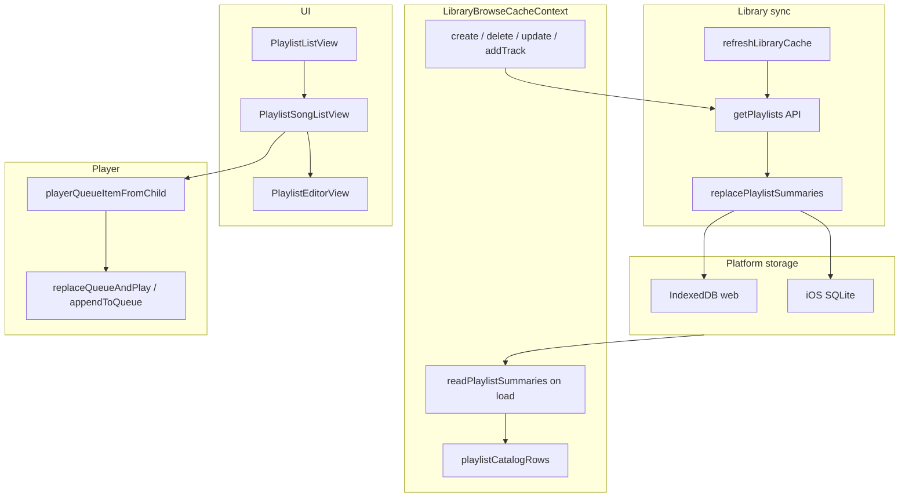

# Playlists

Server-side Subsonic playlists: browse, play, create, edit membership, delete, add tracks from the player, and offline bulk download.

## Mental model

- Playlists are **Subsonic server playlists** (per server account), not the local playback queue.
- Playing a playlist copies track IDs into `PlayerManager`; it does **not** mutate the server playlist.
- Summaries (`id`, `name`, `songCount`) are **cached per library scope** (`serverUrl` + `username` + `libraryId`).
- Full track lists are **fetched on demand** via `getPlaylist` when a playlist is opened.

## Architecture



## Core layer (`packages/core`)

### Types

`LibraryPlaylistSummary` in `packages/core/src/library/storage/LibraryCacheStorage.ts`:

```ts
export type LibraryPlaylistSummary = {
  id: string;
  name: string;
  songCount: number;
};
```

### Sync

During full library refresh, after songs are written, playlist summaries are refreshed (`packages/core/src/library/refreshLibraryCache.ts`):

1. Paginated song fetch + write
2. `refreshPlaylistSummariesOnly(api, storage, scope)`
3. Progress event: `{ phase: 'playlists' }`

### Mutations (`packages/core/src/library/playlistMutations.ts`)

| Function | Purpose |
|----------|---------|
| `fetchPlaylistSummariesFromApi` | `getPlaylists` → `LibraryPlaylistSummary[]` |
| `refreshPlaylistSummariesOnly` | Fetch + `replacePlaylistSummaries` |
| `updatePlaylistTracks` | Subsonic `updatePlaylist` (removes high→low, then adds) |
| `playlistEditDiff` | Checkbox editor add/remove sets |
| `reorderPlaylistEntries` | Full replace via remove-all + add-all (**defined, not wired to UI**) |

### Entry helpers (`packages/core/src/library/playlistEntries.ts`)

- `playlistEntriesFromGetPlaylistResponse` — normalize `getPlaylist` `entry` (single object or array)
- `mergePlaylistEntryWithCachedSongs` — prefer cached row when present (artwork, starred, etc.)

### Storage backends

All implement `readPlaylistSummaries` / `replacePlaylistSummaries` on `LibraryCacheStorage`:

- Web: `packages/platform-web/src/indexedDbLibraryCacheStorage.ts`
- iOS: `ios/App/App/LibraryCacheSQLiteStore.swift` via Capacitor bridge

## State layer (`LibraryBrowseCacheContext`)

Each loaded library slice carries `playlists: LibraryPlaylistSummary[]`. These merge into `playlistCatalogRows` (sorted by name, keyed by scope + playlist id).

Exposed mutations:

| Method | API call | Cache refresh |
|--------|----------|---------------|
| `createPlaylist` | `createPlaylist({ name })` | `refreshPlaylistSummariesForScope` |
| `deletePlaylist` | `deletePlaylist({ id })` | same |
| `addTrackToPlaylist` | `updatePlaylist` (add one id) | same |
| `updatePlaylistMembership` | `updatePlaylist` (add/remove diff) | same |

`singleSlice` is set when exactly one library is active (used for create-dialog defaults and legacy helpers).

## Navigation

The **Playlists** tab is a first-class library tab. Deep links use URL query params (`packages/ui/src/views/home/library/browser/libraryNavigationUrl.ts`):

- `tab=playlists`
- `playlistId` (+ optional `playlistName` for display before cache resolves)

With multiple active libraries, `playlistId` is an opaque `lb1.` + base64url ref encoding `{ serverKey, libraryId, id }` (same pattern as albums/artists). Resolution lives in `useLibraryBrowserResolvedScopes`.

`LibraryBrowser` renders three playlist states on the playlists tab:

1. **List** — `PlaylistListView`
2. **Detail** — `PlaylistSongListView` (when `playlistId` in URL resolves)
3. **Editor** — `PlaylistEditorView` (overlay within tab, not a separate URL)

## UI components

### `PlaylistListView`

- Virtuoso list with search (`playlistListFilter`)
- **Create** (+ button): enabled when any library is active; multiple libraries → type picker (On server / On device) with library picker for server create
- **Delete** per row via ⋮ menu (not gated on library count)
- Multi-library rows show `songCount · library name`

### `PlaylistSongListView`

- Loads tracks via `api.getPlaylist({ id })` on mount and when `reloadToken` bumps (after editor save)
- Merges entries with cached songs
- Actions: play all, add all to queue (`PlaylistAdd` icon), shuffle, per-track play/next/queue/star
- **Offline download** via `enqueuePlaylistDownload`
- **Edit** / **Delete** in ⋮ menu; edit enabled when the playlist's server API is available (song pool is that playlist's library cache)

### `PlaylistEditorView`

- Checkbox UI over cached songs from **that playlist's library** (`resolvedPlaylist.slice.songs`)
- Loads current playlist membership from `getPlaylist`
- Save computes diff via `playlistEditDiff` and calls `updatePlaylistMembership`
- No drag-reorder UI (despite `reorderPlaylistEntries` existing in core)

### Player integration

- `usePlayerFullScreenTrackActions` exposes **Add to playlist**
- Uses `PlaylistAddOutlined` in `PlayerFullScreenToolbarActions` (distinct from queue `PlaylistAdd` in song lists)
- Filters `playlistCatalogRows` to current track's `serverId` + `libraryId`
- Disabled when no matching playlists or track has no server id
- `AddToPlaylistDialog` / `PlayerFullScreenAddToPlaylistDialog` for picker UI

**Naming note:** MUI `PlaylistAdd` in song lists means “add all to queue”, not Subsonic playlists. Player “add to playlist” uses `PlaylistAddOutlined`.

## Playback

`useLibraryBrowserPlayback` builds `PlayerQueueItem`s from playlist tracks and delegates to `PlayerContext`:

- `replaceQueueAndPlayAllPlaylistTracks` — play all (respects search filter)
- `appendAllPlaylistTracksToQueue`
- `shufflePlayAllPlaylistTracks`
- Per-track: `playTrackNow`, `playNextForTrack`, `appendForTrack`

Playing does **not** write back to the server playlist.

## Multi-library rules

Subsonic playlists are per server account, but cache refresh is per `libraryId` scope. With multiple active libraries, auto-picking a scope for mutations could cause stale or duplicated rows.

| Action | Single library only? |
|--------|---------------------|
| Create server playlist | No (library picker when multi) |
| Edit server playlist membership | No (uses that playlist's library song pool) |
| Add track from player (server playlist) | No (playlists filtered to track's library) |
| Delete server playlist | No |
| Browse / play | No |

**UI behavior:**

- Playlists tab **+** enabled when any library is active; server create picks target library when multiple are active.
- Server playlist detail **Edit** uses tracks from that playlist's library only.
- Player **Add to playlist** lists server playlists for the current track's library plus all local playlists.

See also `NOTE.md` (section “Playlist creation and multiple active libraries”).

## Implemented vs. gaps

**Implemented:**

- Browse list + detail + play/shuffle/queue
- Create, delete, edit membership (checkbox editor)
- Add-to-playlist from full-screen player
- Offline bulk download for a playlist
- Multi-library browse with scoped deep links
- **Local cross-library playlists** (create/edit/add-from-player with multiple libraries)
- Server playlist create with library picker when multiple libraries active

**Not implemented / deferred:**

- Drag-reorder editor (`reorderPlaylistEntries` is unused)
- Cached playlist **entries** for server playlists (only summaries are cached; tracks always fetched live)
- Create/edit **server** playlist membership with multiple libraries active (editor scoped to playlist library)
- Extended summary fields (`owner`, `duration`) for shared-playlist labeling

## Local cross-library playlists

Device-only playlists stored in `LocalPlaylistStore` on `PlatformHost` (IndexedDB on web, SQLite on iOS). Not synced to Subsonic; survives library `deleteScope` (entries become unavailable).

### Mental model

- Entries are `(serverKey, libraryId, trackId)` refs with optional snapshot metadata at add time.
- Merged into the Playlists tab catalog with `kind: 'local' | 'server'`.
- Deep links use `lpl1.` + base64url `{ id }` (device-global).

### Create UX

- **On this device:** available with any active libraries; default when multiple libraries are active.
- **On server:** existing Subsonic workflow; with multiple libraries, user picks target library in create dialog.

### Playback

- Enqueue **all** entries in playlist order (no pre-filtering).
- Unresolved tracks gray in detail UI (`Track unavailable`); `PlayerManager` auto-skip handles load failures.
- Enabling a library mid-queue can satisfy later entries without re-enqueue.

### Mutations

| Action | Local playlist | Server playlist |
|--------|----------------|-----------------|
| Create | Any active libraries | Any active library (picker when multi) |
| Edit membership | Always | Single active library only |
| Add from player | All local + same-library server | Same-library server only |
| Delete | Device store | Subsonic API |

### Storage

- Web: `asmusic-local-playlists` IndexedDB
- iOS: `local_playlists` + `local_playlist_entries` in library-cache SQLite

## Key files

| Area | Files |
|------|-------|
| Core logic | `packages/core/src/library/playlistMutations.ts`, `playlistEntries.ts`, `packages/core/src/localPlaylists/*` |
| Local storage | `packages/platform-web/src/indexedDbLocalPlaylistStorage.ts`, iOS `LibraryCacheSQLiteStore.swift` |
| Storage contract | `packages/core/src/library/storage/LibraryCacheStorage.ts` |
| Context / mutations | `packages/ui/src/contexts/LibraryBrowseCacheContext.tsx` |
| Browser orchestration | `packages/ui/src/views/home/library/LibraryBrowser.tsx`, `browser/useLibraryBrowserPlaylists.tsx` |
| List / detail / editor | `packages/ui/src/views/home/library/playlists/*`, `detail/PlaylistSongListView.tsx`, `detail/PlaylistEditorView.tsx` |
| URL / resolution | `browser/libraryNavigationUrl.ts`, `browser/useLibraryBrowserResolvedScopes.ts` |
| Playback | `browser/useLibraryBrowserPlayback.ts` |
| Player add | `player/fullScreen/usePlayerFullScreenTrackActions.ts`, `shared/AddToPlaylistDialog.tsx` |
| Product notes | `NOTE.md` |
| Original plan | `.cursor/plans/playlist_feature_parity_9362e259.plan.md` |
