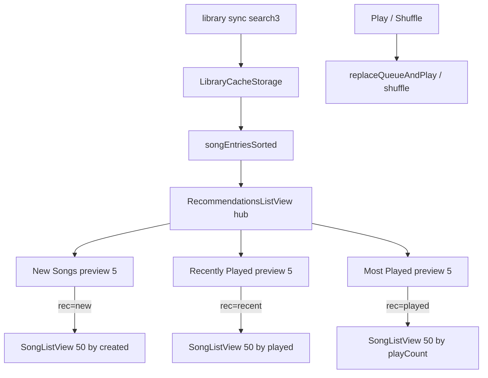

# Recommendations

Library **Recommendations** tab: a scrollable **hub** with three cache-derived sections — **New Songs**, **Recently Played**, and **Most Played** — plus nested full lists (top **50** each). Same offline-first browse model as Songs / Favorites — **no live Subsonic catalog calls**.

**Out of scope:** Personalized / ML recommendations, `getAlbumList2` / `getRandomSongs` / similar-song APIs, album grids of “recently added,” auto-refresh when the server scans, play-count badges on list rows, and playback queue behavior ([`nowPlayingQueue.md`](./nowPlayingQueue.md)). Catalog sync that fills the cache: [`librarySync.md`](./librarySync.md). Play-count scrobble / optimistic bumps: [`playCount.md`](./playCount.md).

## Mental model

| Concept | Meaning |
|---------|---------|
| **Hub** | `tab=recommendations` with no `rec` — three sections stacked, page scrolls |
| **New Songs** | Tracks sorted by `Child.created` desc (`albumCreatedMs`), capped at 50 |
| **Recently Played** | Tracks with a `Child.played` timestamp, sorted by `played` desc (`songPlayedMs`), capped at 50 |
| **Most Played** | Tracks sorted by `Child.playCount` desc (`songPlayCount`), tie-break `created` desc, capped at 50 |
| **Preview** | Each section shows **5** `SongItem` rows (no search) + Play / Shuffle on the **full 50** |
| **View more** | Pushes `rec=new`, `rec=recent`, or `rec=played`; full searchable `SongListView` of that top 50 |
| **Offline** | Works from library cache; empty until the user syncs (Recently Played also empty until something has been played) |

There is **no** server round-trip when opening the tab. Newest / play rankings update after library sync (and Recently / Most Played also after local optimistic play increments).

| Capability | Status |
|------------|--------|
| Hub with New Songs + Recently Played + Most Played | Done |
| Preview 5 + Play / Shuffle (full 50) | Done |
| Nested full list (50) via `rec=` | Done |
| Multi-library merge | Done — sort across combined `songEntriesSorted`, then slice |
| Loose / empty-album tracks as songs | Done |
| Live Subsonic “frequent” / newest album APIs | **Not used** |
| Configurable preview / full limits | **Gap** (constants 5 / 50) |
| Play-count on list rows | **Gap** (see playCount.md) |

## Architecture



## Selection

```ts
// packages/ui/.../catalog/recommendations/recommendationSelectors.ts
selectNewestSongEntries(entries, 50)         // albumCreatedMs desc
selectRecentlyPlayedSongEntries(entries, 50) // songPlayedMs > 0, then desc
selectMostPlayedSongEntries(entries, 50)     // songPlayCount desc, then created
// Preview: .slice(0, 5)
```

`albumCreatedMs` / `songPlayCount` / `songPlayedMs` live in `packages/core/src/library/libraryIndexFromSongs.ts`.

## Navigation / URL

| URL | UI |
|-----|-----|
| `tab=recommendations` | Hub |
| `tab=recommendations&rec=new` | Full New Songs list |
| `tab=recommendations&rec=recent` | Full Recently Played list |
| `tab=recommendations&rec=played` | Full Most Played list |

- Constant: `LIBRARY_URL_REC_SECTION` (`rec`).
- `LibraryBrowserView.recommendations: { section: 'new' \| 'recent' \| 'played' } \| null`.
- Back / selecting Recommendations while nested → `navigate(-1)` (same pattern as album/playlist detail).
- Leaving the tab clears `rec`.

## Playback

| Control | API |
|---------|-----|
| Section / intent Play | `replaceQueueAndPlayAllSongEntries` (queue order = list order) |
| Shuffle | `shufflePlayAllSongEntries` |
| Row tap | `playSongEntryNow` (same as Songs) |

Section buttons use the **full top-50** set for that section, not only the 5 preview rows.

## UI entry points

| Surface | Role |
|---------|------|
| `HomePageAppBar` | Tab `recommendations` |
| `LibraryBrowser` | Hub vs nested via `view.recommendations`; open/back helpers |
| `RecommendationsListView` | Orchestrator: hub vs nested |
| `RecommendationsHubView` | Hub section previews |
| `RecommendationsNestedListView` | Full list + back |
| `RecommendationSection` | One hub preview section |
| `recommendationSelectors.ts` | Sort + caps |

### i18n

- `home.appBar.recommendations`
- `library.recommendations.newSongs` / `.recentlyPlayed` / `.mostPlayed` / `.viewMore`
- `.search` / `.searchRecentlyPlayed` / `.searchMostPlayed` / `.empty` / `.emptyRecentlyPlayed` / `.noMatch`

## Multi-library / multi-server

Same as Songs: all active slices merge into `songEntriesSorted`; row keys stay `serverKey|libraryId|songId`.

## Edge cases

- **Missing `created`:** epoch `0` → end of New Songs.
- **Missing / invalid `played`:** excluded from Recently Played.
- **`playCount` 0 / missing:** sorts last within Most Played; still listed if the library has fewer than 50 tracks.
- **View more** only when the capped set has more than 5 tracks.
- Nested **search** filters within the 50 only.
- Cover art may still fetch on demand if uncached (shared browse behavior).

## Key files

| Path | Role |
|------|------|
| `packages/ui/src/views/home/library/catalog/recommendations/RecommendationsListView.tsx` | Hub vs nested |
| `packages/ui/src/views/home/library/catalog/recommendations/RecommendationsHubView.tsx` | Hub previews |
| `packages/ui/src/views/home/library/catalog/recommendations/RecommendationsNestedListView.tsx` | Nested full list |
| `packages/ui/src/views/home/library/catalog/recommendations/RecommendationSection.tsx` | Preview section |
| `packages/ui/src/views/home/library/catalog/recommendations/recommendationSelectors.ts` | Sort / limits |
| `packages/ui/src/views/home/library/catalog/recommendations/recommendationTypes.ts` | Shared props |
| `packages/ui/src/views/home/library/LibraryBrowser.tsx` | Wiring |
| `packages/ui/src/views/home/library/browser/libraryNavigationUrl.ts` | `rec` URL |
| `packages/ui/src/views/home/library/browser/useLibraryBrowserTabBar.ts` | Tab / back |
| `packages/ui/src/views/home/library/browser/useLibraryBrowserPlayback.ts` | Play-all entries |
| `packages/core/src/library/libraryIndexFromSongs.ts` | `albumCreatedMs`, `songPlayCount`, `songPlayedMs` |

## Related

- Favorites: [`favorites.md`](./favorites.md)
- Play counts: [`playCount.md`](./playCount.md)
- Library sync: [`librarySync.md`](./librarySync.md)
