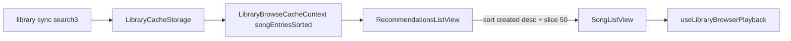

# Recommendations

Library **Recommendations** tab: the **50 newest tracks** from the local song cache, ordered by Subsonic `created` (newest first). Same offline-first browse model as Songs / Favorites — **no live Subsonic catalog calls**.

**Out of scope:** Personalized / ML recommendations, `getAlbumList2` / `getRandomSongs` / similar-song APIs, album grids of “recently added,” auto-refresh when the server scans, and playback queue behavior ([`nowPlayingQueue.md`](./nowPlayingQueue.md)). Catalog sync that fills the cache is documented in [`librarySync.md`](./librarySync.md).

## Mental model

| Concept | Meaning |
|---------|---------|
| **Data source** | Active-library song slices already loaded into `LibraryBrowseCacheContext` (`songEntriesSorted`) |
| **Ordering** | Descending `Child.created` via `albumCreatedMs` (Date or ISO string → ms) |
| **Cap** | Hard limit **50** (`NEWEST_TRACK_LIMIT` in `RecommendationsListView`) |
| **UI** | Reuses `SongListView` (search, play / queue / star / view artist·album) |
| **Offline** | Works whenever the library cache has songs; empty until the user syncs |

There is **no** server round-trip when opening the tab. Newest tracks only update after a library sync refreshes the song mirror.

| Capability | Status |
|------------|--------|
| Top 50 by track `created` | Done |
| Multi-library merge (all active scopes) | Done — sort across combined entries, then slice |
| Loose / empty-album tracks as individual songs | Done — not bucketing into “Unknown Album” |
| Live `getAlbumList2` type `newest` | **Not used** (would break offline-first / sync-only catalog rule) |
| Infinite scroll / “load more” past 50 | **Gap** |
| Configurable limit | **Gap** (constant only) |
| Tie-break when `created` missing/equal | **Gap** — `albumCreatedMs` → `0`; sort order among ties is unstable relative to title |

## Architecture



## Types / selection

```ts
// SongListEntry from SongListView — same shape as Songs / Favorites rows
type SongListEntry = {
  song: Child;
  rowKey: string;
  serverId: string;
  artworkScope: LibraryCacheScope;
};

// Selection (conceptual)
[...songEntries]
  .sort((a, b) => albumCreatedMs(b.song) - albumCreatedMs(a.song))
  .slice(0, 50);
```

`albumCreatedMs` lives in `packages/core/src/library/libraryIndexFromSongs.ts` (also used when deriving album `created` as max track `created` for the Albums index — unrelated to this tab’s list).

## Sync / persistence

- **No** dedicated Recommendations storage or preference beyond the shared library browser tab preference (`asmusic-library-browser-tab-v1` may persist `recommendations`).
- Scroll restoration key: `lb:recommendations`.
- Freshness = last successful library sync for active scopes ([`librarySync.md`](./librarySync.md)).

## Mutations

None specific to this tab. Star / unstar and queue actions use the same paths as the Songs tab (`setTrackStarred`, `useLibraryBrowserPlayback`).

## UI entry points

| Surface | Role |
|---------|------|
| `HomePageAppBar` | Tab toggle `value="recommendations"` (between Songs and Playlists), icon `AutoAwesome`, id `library-tab-recommendations` |
| `LibraryBrowser` | Renders `RecommendationsListView` when `tab === 'recommendations'` |
| `RecommendationsListView` | Sort + cap; passes entries and playback handlers into `SongListView` |

### Deep links / URL

- Query: `tab=recommendations` (`LIBRARY_URL_TAB`).
- Validated in `LibraryBrowserTab` / `isTab` / `libraryBrowserTabPreference` `VALID_TABS`.
- No album/artist/playlist deep-link params for this tab; switching away clears detail scopes like other top-level tabs (`useLibraryBrowserTabBar.selectTab`).

### i18n

- `home.appBar.recommendations`
- `library.recommendations.search` / `.empty` / `.noMatch`

## Multi-library / multi-server

- Entries come from **all** active library slices merged in `songEntriesSorted`.
- Sort is global across those slices, then the first 50 after sort.
- Row keys remain `serverKey|libraryId|songId`; artwork and play resolve per entry scope (same as Songs).

## Edge cases

- **Missing `created`:** Treated as epoch `0` → sorts to the end of “newest.”
- **Empty album / Unknown Album:** Still one **song** row; Recommendations does not use `albumsFromCachedSongs` for its list.
- **Search:** Filters only within the capped 50, not the full library.
- **Cover art:** May still fetch on demand if not cached (shared browse behavior; not a Recommendations-specific catalog API).

## Key files

| Path | Role |
|------|------|
| `packages/ui/src/views/home/library/catalog/RecommendationsListView.tsx` | Sort, cap 50, wrap `SongListView` |
| `packages/ui/src/views/home/library/LibraryBrowser.tsx` | Tab branch + playback wiring |
| `packages/ui/src/views/home/HomePageAppBar.tsx` | Tab control |
| `packages/ui/src/views/home/library/browser/libraryNavigationUrl.ts` | `LibraryBrowserTab` + URL |
| `packages/ui/src/preferences/libraryBrowserTabPreference.ts` | Persist last tab |
| `packages/core/src/library/libraryIndexFromSongs.ts` | `albumCreatedMs` |
| `packages/ui/src/contexts/LibraryBrowseCacheContext.tsx` | `songEntriesSorted` source |
| `doc/features/librarySync.md` | How the song mirror is filled |

## Related

- Favorites tab: same `SongListView` pattern, filter by starred instead of newest.
- Albums tab: derived album index (including synthetic “Unknown Album” buckets) — **not** used here.
